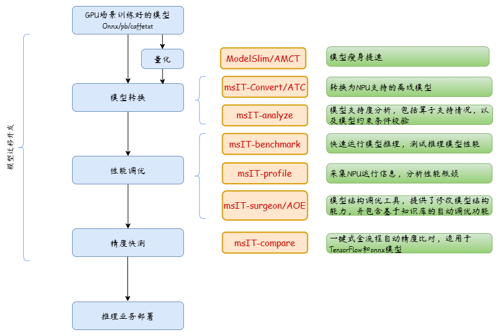
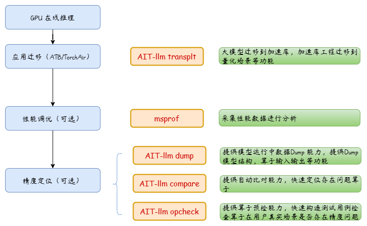

# msIT

## 最新消息
- [2025.12.31]：昇腾平台MindStudio推理工具链全面开源。

## 介绍

MindStudio Inference Tools，昇腾推理工具链。 【Powered by MindStudio】

**请根据自己的需要进入对应文件夹获取工具，或者点击下面的说明链接选择需要的工具进行使用。**

### 模型推理迁移全流程

### 大模型推理迁移全流程

## 功能介绍
- [msProf（MindStudio Profiler）](https://gitcode.com/Ascend/msprof) 
构建昇腾全场景性能调优基础能力，支持采集CANN和NPU性能数据，提升昇腾设备性能调优效率。
- [msprof-analyze（MindStudio Profiler Analyze）](https://gitcode.com/Ascend/msprof-analyze) 
昇腾性能分析工具，基于采集的性能数据进行分析，提供昇腾设备性能瓶颈快速识别能力。
- [msMemScope（MindStudio MemScope）](https://gitcode.com/Ascend/msmemscope) 
针对昇腾显存调试调优场景的专用工具，提供整网级多维度显存数据采集、自动诊断、优化分析能力。
- [msServiceProfiler（MindStudio Service Profiler）](https://gitcode.com/Ascend/msserviceprofiler) 
昇腾亲和的服务化性能调优工具，支持请求调度、模型执行过程可视化，提升服务化性能分析效率。
- [msMonitor（MindStudio Monitor）](https://gitcode.com/Ascend/msmonitor) 
一站式在线监控工具，支持落盘和在线性能数据采集，提供集群场景性能监测及定位能力。
- [msModelSlim（MindStudio ModelSlim）](https://gitcode.com/Ascend/msmodelslim) 
昇腾模型压缩工具，一个以加速为目标、压缩为技术、昇腾为根本的亲和压缩工具。包含量化和压缩等一系列推理优化技术，支持大语言稠密模型、MoE模型、多模态理解模型、多模态生成模型等。
- [msInsight（MindStudio Insight）](https://gitcode.com/Ascend/msinsight) 
MindStudio Insight可视化工具，支持系统级、算子级、服务化等多场景多维度性能分析，深度剖析性能数据，帮助开发者完成性能诊断。
- [msProbe（MindStudio Probe）](https://gitcode.com/Ascend/msprobe) 
模型开发精度调试环节使用的工具包，是针对昇腾提供的全场景精度工具链，帮助用户提高模型精度定位效率。
- [msprechecker（MindStudio Prechecker Tool）](https://gitcode.com/Ascend/msit/tree/master/msprechecker) 
msprechecker 提供推理场景的预检能力，支持环境预检，连通性预检，推理过程中的落盘和比对功能。帮助用户在推理业务部署前，提前发现异常问题。推理时，提高推理性能，快速复现基线。

#### 许可证
[Apache License 2.0](LICENSE)
