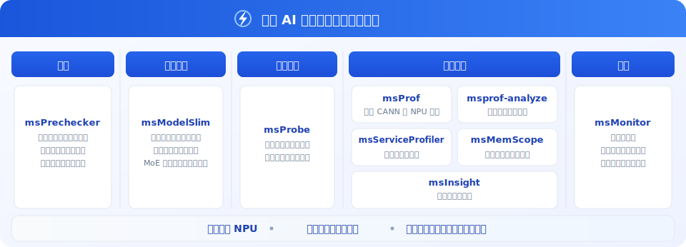

<h1 align="center">MindStudio Inference Tools</h1>

<h2>昇腾 AI 推理开发工具链</h2>

  
 

## ✨ 最新消息

  
🔹 **[2026.03.30]**：msit 仓库精度调试、推理服务调优、模型量化模块日落公告，详情请参见[公告](https://gitcode.com/Ascend/msit/discussions/2)  
🔹 **[2026.01.12]**：本仓库许可证（License）变更，详情请参见 [公告](https://gitcode.com/Ascend/msit/discussions/1)    
🔹 **[2025.12.31]**：MindStudio 推理开发工具链全面开源

## ℹ️ 简介

MindStudio Inference Tools（msIT）推理开发工具链，聚焦大模型与传统模型推理开发中的关键挑战，通过提供模型压缩、调试与调优等能力，高效解决推理效率低、资源开销大等问题，助力用户实现最优推理性能。

## ⚙️ 功能介绍

推理开发工具链提供以下系列化工具：

| 类别 | 工具名称                                                                         | 功能简介                                               |
|:--:|:-----------------------------------------------------------------------------|:---------------------------------------------------|
| 预检 | [**msPrechecker**](https://gitcode.com/Ascend/msit/tree/master/msprechecker) | **【预检工具】** 支持环境预检、连通性预检及推理过程落盘和比对，帮助用户在部署前发现异常问题。  |
| 量化 | [**msModelSlim**](https://gitcode.com/Ascend/msmodelslim)                    | **【模型压缩】** 包含量化和压缩等推理优化技术，支持大语言稠密模型、MoE 模型、多模态模型等。 |
| 精度 | [**msProbe**](https://gitcode.com/Ascend/msprobe)                            | **【精度调试】** 昇腾全场景精度工具，用于精度调试与问题定位。                  |
| 性能 | [**msProf**](https://gitcode.com/Ascend/msprof)                              | **【模型调优】** 全场景性能调优底座，采集软硬件全栈性能数据，提升设备调优效率。    |
| 性能 | [**msprof-analyze**](https://gitcode.com/Ascend/msprof-analyze)              | **【性能分析】** 基于采集数据做性能分析，快速识别性能瓶颈。                   |
| 性能 | [**msServiceProfiler**](https://gitcode.com/Ascend/msserviceprofiler)        | **【服务调优】** 支持请求调度、模型执行过程可视化，提升服务化性能分析效率。           |
| 性能 | [**msMemScope**](https://gitcode.com/Ascend/msmemscope)                      | **【内存调优】** 内存调优专用工具：整网级多维度内存采集，支持自动诊断与优化分析。        |
| 性能 | [**msInsight**](https://gitcode.com/Ascend/msinsight)                        | **【可视调优】** 可视化性能分析，覆盖系统、算子、服务化等场景，辅助完成性能诊断。        |
| 监控 | [**msMonitor**](https://gitcode.com/Ascend/msmonitor)                        | **【在线监控】** 一站式监控，支持落盘与在线采集，面向集群的监测与问题定位。           |

## 🚀 快速入门

以简易模型为例，演示大模型推理工具链中量化、数据转储（Dump）、精度比对与性能调优等工具的使用，请参见 《[快速入门](docs/zh/quick_start/msit_quick_start.md)》。

## 📦 安装指南

介绍 msIT 工具的环境依赖与安装方法，请参见 《[msIT 安装指南](./docs/zh/install_guide/msit_install_guide.md)》。

## 📘 使用指南

各工具的详细使用说明请参阅其源码仓库中的 README 文件，也可通过上方功能介绍表格中的链接直接跳转。

## 🛠️ 贡献指南

欢迎参与项目贡献，请参见 《[贡献指南](./docs/zh/contributing/contributing_guide.md)》。

## ⚖️ 相关说明

🔹 《[版本说明](./docs/zh/release_notes/release_notes.md)》    
🔹 《[许可证声明](./docs/zh/legal/license_notice.md)》     
🔹 《[安全声明](./docs/zh/legal/security_statement.md)》     
🔹 《[免责声明](./docs/zh/legal/disclaimer.md)》     

## 🤝 建议与交流

欢迎大家为社区做贡献。如果有任何疑问或建议，请提交 [Issues](https://gitcode.com/Ascend/msit/issues)，我们会尽快回复。感谢您的支持。

|                                      📱 关注 MindStudio 公众号                                       | 💬 更多交流与支持                                                                                                                                                                                                                                                                                                                                                                                                                     |
|:-----------------------------------------------------------------------------------------------:|:-------------------------------------------------------------------------------------------------------------------------------------------------------------------------------------------------------------------------------------------------------------------------------------------------------------------------------------------------------------------------------------------------------------------------------|
|  *扫码关注获取最新动态* | 💡 **加入微信交流群**： 关注公众号，回复“交流群”即可获取入群二维码。  🛠️ **其他渠道**： 👉 昇腾助手： 👉 昇腾论坛： |

## 🙏 致谢

msIT 由华为公司的下列部门联合贡献：    
🔹 昇腾计算MindStudio开发部  
🔹 昇腾计算生态使能部  
🔹 华为云昇腾云服务  
🔹 2012分布式并行计算实验室  
🔹 2012网络技术实验室  
感谢来自社区的每一个 PR，欢迎贡献 msIT！
