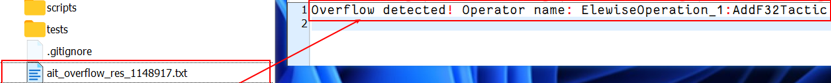

# 异常检测

提供模型推理过程中出现的异常检测能力，如算子预算溢出、内存踩踏等，1.0 版本仅支持溢出检测。

## 使用方式：

```shell
ait llm errcheck --exec xxx [可选参数]
```

## 参数说明

| 参数名       | 描述                                                           | 是否必选 |
| ------------ | -------------------------------------------------------------- | -------- |
| --exec       | 执行模型推理的命令                                             | 是       |
| --type       | 异常检测类型，可选值['overflow']，当前仅支持溢出检测           | 否       |
| --exit       | 检测到异常后进程是否退出，默认关闭                             | 否       |
| --output, -o | 检测结果输出目录，默认为当前目录，如果没有异常则不输出结果文件 | 否       |


## 结果查看
在用户 `-o` 指定路径下，会生成 `.txt` 格式文件，文件命名格式为 `ait_overflow_res_<pid>.txt`

文件内容为 `Overflow detected! Operator name: <Op 名称>:<算子名称>`

参考：
