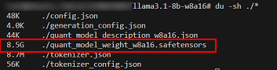
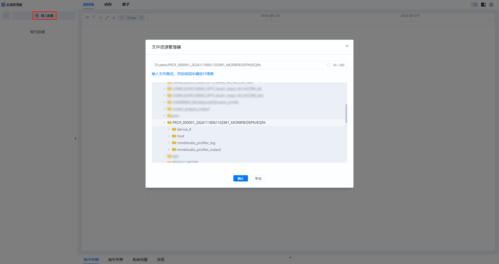
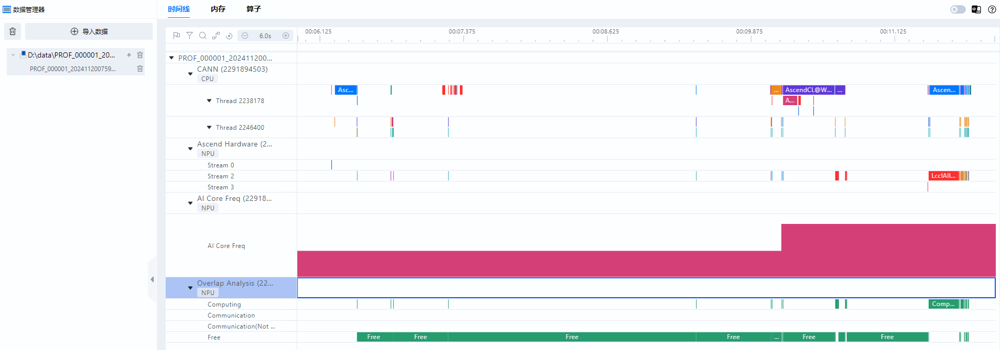

# **快速入门**

## 概述

MindStudio推理工具链为开发者提供一站式推理开发工具，致力于加速模型问题定位效率，提升模型推理性能。

本文档以Llama-3.1-8B-Instruct模型为例，介绍针对大模型推理工具链中的模型量化、推理数据dump、自动精度比对、性能调优、服务化调优等工具的应用。

**使用说明**

在大模型推理过程中，各工具的功能说明如下表所示。

| 工具 | 功能说明 |
|-----------------------|-----------------------|
| 模型量化（msModelSlim）| 提供模型压缩技术，通过降低模型权重和激活值的数值精度，有效减少模型的存储内存占用和计算需求。通常会将高位浮点数转换为低位定点数，从而直接减少模型权重的体积。模型量化工具的输入为能够正常运行的模型和数据，输出为一个可以使用的量化权重和量化因子。|
| 数据落盘（msit llm dump）| 提供加速库模型推理过程中产生的中间数据的dump能力，落盘的数据用于进行后续的精度比对。|
| 精度比对（msit llm compare）| 提供一键式精度比对功能，支持快速实现推理场景的整网精度比对。|
| 性能调优工具| 采集和分析运行在昇腾AI处理器上的AI任务各个运行阶段的关键性能指标。|
| 服务化调优工具（msServiceProfiler）| 提供服务化推理场景下的性能数据采集与分析能力，支持定位框架调度、模型推理等环节的性能问题。|
| MindStudio Insight | 将通过性能调优工具和服务化调优工具采集到的性能数据，使用MindStudio Insight进行可视化呈现，快速定位软、硬件性能瓶颈，提升性能分析效率。|

**环境准备**

- 部署开发环境，可参见《MindIE安装指南》的“安装MindIE > [方式一：镜像部署方式](https://www.hiascend.com/document/detail/zh/mindie/230/envdeployment/instg/mindie_instg_0021.html)”章节内容部署。

- 安装msit工具包，安装过程请参见[msit工具安装](https://gitcode.com/Ascend/msit/tree/master/msit/docs/install)文档进行安装，推荐使用源代码安装方式。

- 安装msModelSlim软件，请参见[msModelSlim安装指南](https://gitcode.com/Ascend/msmodelslim/blob/master/docs/zh/getting_started/install_guide.md)进行安装。

- 安装大模型推理精度工具，请参见[大模型推理精度工具（Large Language Model Debug Tool）](https://gitcode.com/Ascend/msit/tree/master/msit/docs/llm)进行安装。

- 安装服务化调优工具，请参见[msServiceProfiler工具安装指南](https://gitcode.com/Ascend/msserviceprofiler/blob/master/docs/zh/msserviceprofiler_install_guide.md)进行安装。

- 安装配套版本的CANN Toolkit开发套件包和ops算子包并配置CANN环境变量，请参见《[CANN 软件安装指南](https://www.hiascend.com/document/detail/zh/canncommercial/850/softwareinst/instg/instg_0000.html?Mode=PmIns&InstallType=netconda&OS=openEuler)》。

- 安装MindStudio Insight工具，请参见[《MindStudio Insight安装指南》](https://gitcode.com/Ascend/msinsight/blob/master/docs/zh/user_guide/mindstudio_insight_install_guide.md)进行安装。

## 模型推理

### 模型量化

1. 下载Llama-3.1-8B-Instruct权重和模型文件至本地，如下图所示，单击[链接](https://huggingface.co/meta-llama/Llama-3.1-8B-Instruct)下载。<a id="1"></a>

    

2. 执行以下命令，进入Llama目录。

    ```bash
    cd ${HOME}/msmodelslim/example/Llama
    ```

    其中HOME为用户自定义安装msmodelslim的路径。

3. 执行量化脚本，生成量化权重文件，并存入自定义存储路径中。示例命令为w8a16量化命令。

    ```bash
    python3 quant_llama.py --model_path ${model_path} --save_directory ${save_directory} --device_type npu --w_bit 8 --a_bit 16
    ```
 
    其中--model_path为已下载的模型文件所在路径；--save_directory为生成的量化权重文件的存储路径。其它模型文件量化案例可参见[LLAMA量化案例](https://gitcode.com/Ascend/msmodelslim/blob/master/example/Llama/README.md#llama-%E9%87%8F%E5%8C%96%E8%AF%B4%E6%98%8E)。

    > [!NOTE] 说明  
    > 如果量化后的权重文件需要在MindIE 2.1.RC1及之前版本上部署，需要在执行原量化命令时增加--mindie_format参数，参考命令如下：
    ```python3 quant_llama.py --model_path ${model_path} --save_directory ${save_directory} --device_type npu --w_bit 8 --a_bit 16 --mindie_format```
    
4. 量化完成后，结果如下图所示，safetensors文件大小由15.1G压缩至8.5G。

    

5. 生成的w8a16量化权重文件如下所示。

    ```tex
    ├── config.json                          # 配置文件
    ├── generation_config.json               # 配置文件
    ├── quant_model_description.json         # w8a16量化后的权重描述文件
    ├── quant_model_weight_w8a16.safetensors # w8a16量化后的权重文件
    ├── tokenizer.json                       # 模型文件的tokenizer
    ├── tokenizer_config.json                # 模型文件的tokenizer配置文件
    ```

### 精度调试

**前提条件**

- 已参见[模型量化](#模型量化)章节完成模型量化。
- 已参见模型量化章节的[1](#1)准备好浮点模型。

**量化模型dump**

1. 执行以下命令，确认量化模型是否可以推理。

    ```bash
    bash ${ATB_SPEED_HOME_PATH}/examples/models/llama3/run_pa.sh ${save_directory} ${max_output_length}
    ```

    其中参数解释如下：

    - ATB_SPEED_HOME_PATH：默认路径为“/usr/local/Ascend/atb-models”，在source模型仓中set_env.sh脚本时已配置；
    - max_output_length：对话测试中最大输出token数。

    执行完命令后，回显信息有如下内容，说明量化模型可以进行推理。

    ```tex
    Question[0]: What's deep learning?
    Answer[0]:  Deep learning is a subset of machine learning that uses artificial neural networks to analyze data. It's called
    Generate[0] token num: (0, 20)
    ```

2. 执行以下命令，对量化模型进行dump，结果保存至用户指定dump数据的输出路径。以下命令中的参数说明请参见下表。此处以指定dump第二个token为例。如果需要了解更多的参数信息，请参见[加速库模型数据dump](https://gitcode.com/Ascend/msit/blob/master/msit/docs/llm/%E5%B7%A5%E5%85%B7-DUMP%E5%8A%A0%E9%80%9F%E5%BA%93%E6%95%B0%E6%8D%AE%E4%BD%BF%E7%94%A8%E8%AF%B4%E6%98%8E.md)。

    ```bash
    msit llm dump --exec "bash ${ATB_SPEED_HOME_PATH}/examples/models/llama3/run_pa.sh ${save_directory} ${max_output_length}" --type model tensor -er 2,2 -o ${quant_dump_path}
    ```

    | 参数 | 说明 | 使用示例 |
    |------------|------------------|------------|
    | --exec | 指定包含ATB的程序执行命令。<br> 命令中不支持重定向字符，如果需要重定向输出，建议将执行命令写入shell脚本，然后启动shell脚本。| --exec "bash run.sh patches/models"|
    |--type |dump类型，默认为['tensor', 'model']。<br> 常用可选项如下：<br> -model：模型拓扑信息（默认），当dump类型为model时，layer会跟着model一起dump下来。<br> -layer：Operation维度拓扑信息。<br>-tensor：tensor数据（默认）。|--type layer tensor|
    |-er, --execute-range|指定dump的token编号范围，区间左右全闭，可以支持多个区间序列，默认为第0个。<br>请确保输入多区间时的总输入长度不超过500个字符。|-er 2,2 <br> -er 3,5,7,7：代表区间[3,5],[7,7]，也就是第3，第4，第5，第7个token|
    |-o, --output|指定dump数据的输出目录，默认为./。|-o /home/projects/output|

3. 量化模型dump成功后，落盘数据目录结构如下。

    ```tex
    ├── {quant_dump_path}/              # 数据保存路径   
    │    └── msit_dump_{timestamp}/     # 数据落盘时间戳目录
        │    ├── layer/                 # 网络结构子目录
        │    ├── model/                 # 模型信息目录
        │    ├── tensors/               # tensor子目录
    ```

**浮点模型dump**

1. 执行以下命令，确认浮点模型是否可以推理。

    ```bash
    bash ${ATB_SPEED_HOME_PATH}/examples/models/llama3/run_pa.sh --model_path ${model_path} ${max_output_length}
    ```

    回显信息有如下内容，说明浮点模型可以进行推理。

    ```tex
    Question[0]: What's deep learning?
    Answer[0]:  Deep learning is a subset of machine learning that uses artificial neural networks to analyze data. It's called
    Generate[0] token num: (0, 20)
    ```

2. 执行浮点模型dump，结果保存至用户指定dump数据的输出路径。此处以指定dump第二个token为例。

    ```bash
    msit llm dump --exec "bash ${ATB_SPEED_HOME_PATH}/examples/models/llama3/run_pa.sh --model_path ${model_path} ${max_output_length}" --type model tensor -er 2,2 -o ${float_dump_path}
    ```

3. 浮点模型dump成功后，会在float_dump文件夹下生成msit_dump_{timestamp}文件夹，落盘数据目录结构如下。

    ```tex
    ├── {float_dump_path}/              # 数据保存路径   
    │    └── msit_dump_{timestamp}/     # 数据落盘时间戳目录
        │    ├── layer/                 # 网络结构子目录
        │    ├── model/                 # 模型信息目录
        │    ├── tensors/               # tensor子目录
    ```

**精度比对**

1. 执行以下命令，对量化模型dump后的结果文件和浮点模型dump后的结果文件进行精度比对。命令中参数解释如下表所示。

    ```bash
    msit llm compare -gp ${float_dump_path}/msit_dump_{timestamp}/tensors/{device_id}_{process_id}/2/ -mp ${quant_dump_path}/msit_dump_{timestamp}/tensors/{device_id}_{process_id}/2/ -o ${compare_result_dir}
    ```

    |参数|说明|
    |--------|-----------------|
    |-gp|用于指定标杆数据路径的参数，即浮点模型dump数据所在目录。|
    |-mp|用于指定待比对的数据路径的参数，即量化模型dump数据所在目录。|
    |-o|用于指定比对结果保存路径。|

2. 精度比对回显信息如下，比对结果文件中的参数说明可参见[精度比对结果参数说明](https://gitcode.com/Ascend/msit/blob/master/msit/docs/llm/%E7%B2%BE%E5%BA%A6%E6%AF%94%E5%AF%B9%E7%BB%93%E6%9E%9C%E5%8F%82%E6%95%B0%E8%AF%B4%E6%98%8E.md)，做进一步分析。

    ```tex
    msit_llm_logger - INFO - golden_layer_type: Prefill_layer
    msit_llm_logger - INFO - my_layer_type: Prefill_layer
    msit_llm_logger - INFO - golden_layer_type: Decoder_layer
    msit_llm_logger - INFO - my_layer_type: Decoder_layer
    msit_llm_logger - INFO - Saved comparing results: ./msit_cmp_report_{timestamp}.csv
    ```

### 性能调优

**前提条件**

在使用性能调优工具前，请先阅读《性能调优工具用户指南》中的“[使用前准备](https://www.hiascend.com/document/detail/zh/mindstudio/830/T&ITools/Profiling/atlasprofiling_16_0002.html)”章节的使用约束，了解相关约束条件。

**性能数据采集**

性能调优工具的msprof命令行提供了AI任务运行性能数据、昇腾AI处理器系统数据等性能数据的采集和解析能力。

1. 登录CANN-Toolkit开发套件包所在环境，进入CANN软件安装目录/cann/tools/profiler/bin。

2. 执行以下命令，采集性能数据。此处对浮点模型进行性能数据采集。

    ```shell
    msprof --output=${output_dir} bash ${ATB_SPEED_HOME_PATH}/examples/models/llama3/run_pa.sh --model_path ${model_path} ${max_output_length}
    ```

    其中--output为采集到的性能数据的存放路径；max_output_length为对话测试中最大输出token数。

3. 命令执行后，回显中包含如下内容，表示采集完成。

    ```tex
    [INFO] Start export data in PROF_000001_20241118061102981_MORBFBJDEPNJEQPA.
    [INFO] Export all data in PROF_000001_20241118061102981_MORBFBJDEPNJEQPA done.
    [INFO] Start query data in PROF_000001_20241118061102981_MORBFBJDEPNJEQPA.
    Job Info Device ID Dir Name Collection Time            Model ID Iteration Number Top Time Iteration Rank ID 

    NA                host     2024-11-18 06:11:02.985433 N/A      N/A              N/A                1       

    NA       1         device_1 2024-11-18 06:11:07.222675 N/A      N/A              N/A                1 

    [INFO] Query all data in PROF_000001_20241118061102981_MORBFBJDEPNJEQPA done.   
    [INFO] Profiling finished.
    [INFO] Process profiling data complete. Data is saved in {output_dir}/PROF_000001_20241118061102981_MORBFBJDEPNJEQPA
    ```

4. 采集完成后，在--output指定的目录下生成了PROF_000001_20241118061102981_MORBFBJDEPNJEQPA目录，存放采集到的性能数据。
PROF_000001_20241118061102981_MORBFBJDEPNJEQPA目录下的mindstudio_profiler_output目录，存放的是解析后的性能数据，文件结构如下。<a id="4"></a>

    ```tex
    ├── host   # 保存原始数据，用户无需关注
    │    └── data
    ├── device_{id}   # 保存原始数据，用户无需关注
    │    └── data
    ├── mindstudio_profiler_log   # 采集日志
    │    └── log
    └── mindstudio_profiler_output
        ├── msprof_20241118061314.json        # timeline数据总表
        ├── op_summary_20241118061317.csv     # AI Core和AI CPU算子数据
        ├── task_time_20241118061317.csv      # Task Scheduler任务调度信息
        ├── op_statistic_20241118061317.csv   # AI Core和AI CPU算子调用次数及耗时统计
        ├── api_statistic_20241118061317.csv  # CANN层的API执行耗时信息统计
        └── README.txt
    ```

**性能数据分析**

为了方便分析采集到的性能数据，可使用MindStudio Insight工具将性能数据可视化展示，便于直观地分析性能瓶颈。

1. 打开MindStudio Insight工具。

2. 将[4](#4)采集到的性能数据拷贝至本地。

3. 单击MindStudio Insight界面左上方“导入数据”，在弹框中选择性能数据文件或目录，然后单击“确认”进行导入，如下图所示。

    

4. 根据MindStudio Insight工具的可视化呈现性能数据，如下图所示。

    

5. 分析性能数据。

    MindStudio Insight工具将性能数据可视化呈现后，可以更直观地分析性能瓶颈，详细分析方法请参见《[MindStudio Insight工具用户指南](https://www.hiascend.com/document/detail/zh/mindstudio/830/GUI_baseddevelopmenttool/msascendinsightug/Insight_userguide_0002.html)》。

### 服务化调优

msServiceProfiler（服务化调优工具）用于采集和分析服务化推理场景下的性能数据，可用于定位框架调度、模型推理等环节的性能问题。
工具支持MindIE Motor、vLLM-ascend和SGLang框架。

**前提条件**  

- 在使用服务化调优工具前，请先阅读《[msServiceProfiler工具安装指南](https://gitcode.com/Ascend/msserviceprofiler/blob/master/docs/zh/msserviceprofiler_install_guide.md)》中的“约束”章节，了解相关使用约束。

- 已完成对应服务框架的安装与配置，并通过基本可用性验证。

**操作步骤**

1. 配置环境变量。<a id="服务化调优步骤1"></a>  
    在启动服务前，需先设置环境变量`SERVICE_PROF_CONFIG_PATH`，用于指定性能采集配置文件。若未提前配置，则不会采集性能数据。

    ```shell
    export SERVICE_PROF_CONFIG_PATH="./ms_service_profiler_config.json"
    ```

    `SERVICE_PROF_CONFIG_PATH`需要指定到json文件名。该json文件用于控制性能数据采集行为，例如采集开关、数据输出路径、算子采集开关等。若路径下不存在该配置文件，工具会自动生成默认配置文件。

    > [!CAUTION]<br>
    > 在多机部署时，通常不建议将配置文件或其指定的数据存储路径放置在共享目录（如网络共享位置）。由于数据写入方式可能涉及额外的网络或缓冲环节，而非直接落盘，此类配置在某些情况下可能导致预期外的系统行为或结果。

2. 运行服务。

    各框架可按原有方式启动服务。若环境变量配置正确，服务启动过程中会输出如下以`[msservice_profiler]`开头的日志，表示msServiceProfiler已生效。以下日志以MindIE Motor为例。

    ```tex
    [msservice_profiler] [PID:225] [INFO] [ParseEnable:179] profile enable_: false
    [msservice_profiler] [PID:225] [INFO] [ParseAclTaskTime:264] profile enableAclTaskTime_: false
    [msservice_profiler] [PID:225] [INFO] [ParseAclTaskTime:265] profile msptiEnable_: false
    [msservice_profiler] [PID:225] [INFO] [LogDomainInfo:357] profile enableDomainFilter_: false
    ```

    如果`SERVICE_PROF_CONFIG_PATH`指定的配置文件不存在，工具会自动创建，日志如下。

    ```tex
    [msservice_profiler] [PID:225] [INFO] [SaveConfigToJsonFile:588] Successfully saved profiler configuration to: ./ms_service_profiler_config.json
    ```

3. 数据采集。<a id="服务化调优步骤3"></a> 

    服务启动后，可通过修改配置文件中的字段控制采集行为。以下仅列出常用配置项。

    ```json
    {
        "enable": 1,
        "prof_dir": "${PATH}/prof_dir/",
        "acl_task_time": 0
    }
    ```

    表1 参数说明  

    |参数|说明|是否必选|
    |-----|-----|-----|
    |enable|性能数据采集总开关。取值为：<br> - 0：关闭。<br> - 1：开启。<br> 即便其他开关开启，该开关不开启，仍然不会进行任何数据采集；如果只有该开关开启，只采集服务化性能数据。|是|
    |prof_dir|采集到的性能数据的存放路径，默认值为${HOME}/.ms_server_profiler。<br> 该路径下存放的是性能原始数据，需要继续执行后续解析步骤，才能获取可视化的性能数据文件进行分析。<br> 在enable为0时，对prof_dir进行自定义修改，随后修改enable为1时生效；在enable为1时，直接修改prof_dir，则修改不生效。|否|
    |acl_task_time|开启采集算子下发耗时、算子执行耗时数据的开关，取值为：<br> - 0：关闭。默认值，配置为0或其他非法值均表示关闭。<br> - 1：开启。<br> 该功能开启时会占用一定的设备性能，导致采集的性能数据不准确，建议在模型执行耗时异常时开启，用于更细致的分析。<br> 算子采集数据量较大，一般推荐集中采集3 ~ 5s，时间过长会导致占用额外磁盘空间，消耗额外的解析时间，从而导致性能定位时间拉长。<br> 默认算子采集等级为L0，如果需要开启其他算子采集等级，请参见[《服务化调优工具》](https://www.hiascend.com/document/detail/zh/canncommercial/83RC1/devaids/Profiling/mindieprofiling_0001.html)的完整参数介绍。|否|
    
    建议仅在关键时间段开启`enable`。若持续开启，工具会在请求处理期间持续写入数据，`prof_dir`目录会不断增长。

    `enable`字段变更后，工具会输出对应日志。

    ```tex
    [msservice_profiler] [PID:3259] [INFO] [DynamicControl:407] Profiler Enabled Successfully!
    ```

    或者：

    ```tex
    [msservice_profiler] [PID:3057] [INFO] [DynamicControl:411] Profiler Disabled Successfully!
    ```

    当`enable`由0改为1时，配置文件中的字段会重新加载。

4. 数据解析。

    安装环境依赖如下：

    ```shell
    python >= 3.10
    pandas >= 2.2
    numpy >= 1.24.3
    psutil >= 5.9.5
    ```

    执行以下命令解析性能数据：

    ```shell
    python3 -m ms_service_profiler.parse --input-path=${PATH}/prof_dir
    ```

    其中，`--input-path`指定为[3](#服务化调优步骤3)中`prof_dir`参数对应的路径。解析完成后，默认在命令执行目录下生成解析后的性能数据文件。

5. 调优分析。

    解析后的性能数据包含db、csv和json格式。用户可以基于csv进行请求、调度等维度的分析，也可以使用MindStudio Insight导入db文件或json文件进行可视化分析。详细操作请参见[MindStudio Insight服务化调优](https://www.hiascend.com/document/detail/zh/mindstudio/830/GUI_baseddevelopmenttool/msascendinsightug/Insight_userguide_0112.html)。

    vLLM-ascend和SGLang场景下的详细接入与采集说明，请分别参见[vLLM 服务化性能采集工具使用指南](https://gitcode.com/Ascend/msserviceprofiler/blob/master/docs/zh/vLLM_service_oriented_performance_collection_tool.md)和[SGLang 服务化性能采集工具使用指南](https://gitcode.com/Ascend/msserviceprofiler/blob/master/docs/zh/SGLang_service_oriented_performance_collection_tool.md)。

## 进阶开发

如果您想体验大模型推理工具更丰富的功能，请参见各工具使用文档阅读了解。

- msModelSlim工具：请前往[msModelSlim](https://gitcode.com/Ascend/msmodelslim)阅读了解。

- 大模型推理精度工具：请前往[大模型推理精度工具（Large Language Model Debug Tool）](https://gitcode.com/Ascend/msit/blob/master/msit/docs/llm/v1.0/%E5%A4%A7%E6%A8%A1%E5%9E%8B%E6%8E%A8%E7%90%86%E7%B2%BE%E5%BA%A6%E5%B7%A5%E5%85%B7%E8%AF%B4%E6%98%8E%E6%96%87%E6%A1%A3.md)阅读了解。

- 性能调优工具：请前往《[性能调优工具用户指南](https://www.hiascend.com/document/detail/zh/mindstudio/830/T&ITools/Profiling/atlasprofiling_16_0001.html)》阅读了解。

- 服务化调优工具：请前往[msServiceProfiler](https://gitcode.com/Ascend/msserviceprofiler)阅读了解。

- MindStudio Insight工具：请前往《[MindStudio Insight](https://gitcode.com/Ascend/msinsight/blob/14f56b2a945c848c9a92487ce94b2f9dfc90ee02/README.md)》阅读了解。
