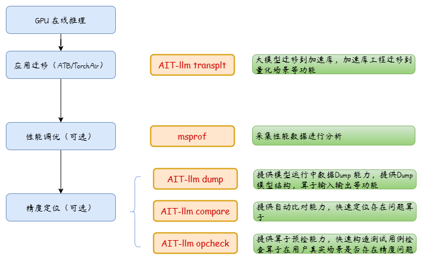

### 公告
```
为了符合MindStudio对工具命名的统一规范，AIT将改名为msIT。
相关工具命令行和python库名也会做相应变更，如对您业务有影响，请及时适配，并向各位业务组或项目组内的同事传达。
以下是具体修改信息：

1.命令行变更：原ait命令行将变更为msit。为了业务兼容与稳定，我们会保留ait命令行直到2024年9月30日；
2.python库名变更：原ait_llm将变更为msit_llm，同样地，ait_llm的对外接口也会保留到2024年9月30日。
3.ait命令下线：10月30日起，所有ait相关的命令已经下线，请使用msit进行替代。

请知悉以上修改内容，如有任何疑问或需要进一步协助，请通过以下方式随时与我们联系。谢谢！
```
[Issue](https://gitee.com/ascend/msit/issues) | [昇腾社区MindStudio问题求助](https://www.hiascend.com/forum/forum-0106101385921175006-1.html?filterCondition=1&topicClassId=0606101390016536003) | [昇腾社区工单系统](https://www.hiascend.com/feedback/add)

#  msIT

## 目录
- [msIT](#msit)
  - [目录](#目录)
  - [介绍](#介绍)
    - [模型推理迁移全流程](#模型推理迁移全流程)
    - [大模型推理迁移全流程](#大模型推理迁移全流程)
    - [msIT各子功能介绍](#msit各子功能介绍)
  - [工具安装](#工具安装)
  - [工具使用](#工具使用)
    - [命令行格式说明](#命令行格式说明)
  - [参考](#参考)
    - [msIT资源](#msit资源)
    - [常见问题FAQ](#常见问题faq)
  - [许可证](#许可证)
  - [免责声明](#免责声明)

## 介绍
msIT(MindStudio Inference Tools)作为昇腾统一推理工具，提供客户一体化开发工具，用于辅助用户进行模型迁移以及性能与精度的调试调优，当前包括benchmark、debug、analyze、llm等组件。

### 模型推理迁移全流程


### 大模型推理迁移全流程


### msIT各子功能介绍
| 任务类型                                  | 子功能                                 | 说明                                       |
|---------------------------------------|-------------------------------------|------------------------------------------|
| [benchmark](./docs/benchmark)     | -                                   | 用来针对指定的推理模型运行推理程序，并能够测试推理模型的性能（包括吞吐率、时延） |
| debug(一站式调试)                          | [surgeon](./docs/debug/surgeon) | 使能ONNX模型在昇腾芯片的优化，并提供基于ONNX的改图功能          |
| debug(一站式调试)                          | [compare](./docs/debug/compare) | 提供自动化的推理场景精度比对，用来定位问题算子                  |
| debug(一站式调试)                          | [dump](./docs/debug/dump)       | 提供传统模型的数据dump功能                          |
| debug(一站式调试)                          | [opcheck](./docs/debug/opcheck)       | 提供基于GE推理后dump数据的算子精度预检能力          |
| [analyze](./docs/analyze)   | -                                   | 提供其他平台模型迁移至昇腾平台的支持度分析功能                  |
| [convert](./docs/convert)   | -                                   | 提供推理模型转换功能                               |
| [profile](./docs/profile)         | -                                   | 提供profiling，提供整网详细的性能数据及相关信息             |
| [llm](./docs/llm/README.md)       | -                                   | 提供加速库（atb）大模型推理调试工具，包括数据dump功能和数据比对功能    |
| [tensor-view](./docs/tensor_view) | -                                   | 提供查看、切片、转置、保存tensor的接口                   |


## 工具安装
[一体化安装指导](./docs/install/README.md)


## 工具使用

### 命令行格式说明

msit工具可通过msit可执行文件方式启动，若安装工具时未提示Python的PATH变量问题，或手动将Python安装可执行文件的目录加入PATH变量，则可以直接使用如下命令格式：

```bash
msit <TASK> <SUB_TASK> [OPT] [ARGS]
```


其中，```<TASK>```为任务类型，当前支持debug、benchmark、analyze、convert、profile、llm、tensor-view，后续可能会新增其他任务类型，可以通过如下方式```查看当前支持的任务列表```：

```bash
msit -h
```

```<SUB_TASK>```为子任务类型，当前在debug任务下面，有surgeon、compare，当前在profile任务下面，有msprof;
当前benchmark、analyze、convert任务没有子任务类型。后续其他任务会涉及扩展子任务类型，可以通过如下方式查看每个任务支持的```子功能列表```：

```bash
msit debug -h
```


```[OPT]```和```[ARGS]```为可选项以及参数，每个任务下面的可选项和参数都不同，以```debug任务下面的compare子任务```为例，可以通过如下方式```获取可选项和参数```


```bash
msit debug compare -h
```
msit的其他参数可参考 [一体化安装指导](/msit/docs/install/README.md)
## 参考

### msIT资源

* [msIT benchmark 快速入门指南](/msit/docs/benchmark/README.md)
* [msIT debug surgeon 快速入门指南](/msit/docs/debug/surgeon/README.md)
* [msIT debug compare 快速入门指南](/msit/docs/debug/compare/README.md)
* [msIT analyze 快速入门指南](/msit/components/analyze/README.md)
* [msIT convert 快速入门指南](/msit/components/convert/README.md)
* [msIT profile 快速入门指南](/msit/docs/profile/README.md)
* [msIT llm 快速入门指南](/msit/components/llm/)

### 常见问题FAQ

* [msIT使用以及安装常见问题](https://gitee.com/ascend/msit/wikis/Home)
* [msIT安全拦截报错解决](https://gitee.com/ascend/msit/wikis/ait_security_error_log_solution)

## 许可证

[Apache License 2.0](/LICENSE)

## 免责声明

msit仅提供在昇腾设备上的一体化开发工具，支持一站式调试调优，不对其质量或维护负责。
如果您遇到了问题，Gitee/Ascend/msit提交issue，我们将根据您的issue跟踪解决。
衷心感谢您对我们社区的理解和贡献。
