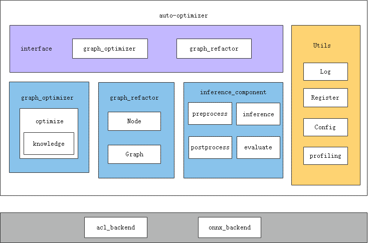

# auto-optimizer工具指南

## 介绍

auto-optimizer（自动调优工具）使能ONNX模型在昇腾芯片的优化，并提供基于ONNX的改图功能。

**软件架构**



auto-optimizer主要通过graph_optimizer、graph_refactor接口提供ONNX模型自动调优能力。

接口详细介绍请参见如下手册：

- [x]  graph_optimizer：基于知识库的自动改图优化。同时支持自定义知识库，详细接口请参考[knowledge](docs/knowledge_optimizer/knowledge_optimizer_framework.md)
- [x]  graph_refactor：改图API。[graph_refactor](auto_optimizer/graph_refactor/README.md)


## 工具安装

```shell
git clone https://gitee.com/ascend/msit.git
cd msit/msit/components/debug/surgeon

# it's recommended to upgrade pip and install wheel

# is's also recommended to use conda/venv/... to manage python enviornments
# for example: `python3 -m venv .venv && source .venv/bin/activate`

# is's also recommended to use `python3 -m pip` to avoid python env issue

python3 -m pip install --upgrade pip
python3 -m pip install wheel

# installation
# optional features: inference, simplify

# without any optional feature
python3 -m pip install .

# with inference and simplify feature
python3 -m pip install .[simplify]
```

- simplify：提供onnx.simplify接口。

## 工具使用

### 命令格式说明

auto-optimizer工具可通过auto_optimizer可执行文件方式启动，若安装工具时未提示Python的HATH变量问题，或手动将Python安装可执行文件的目录加入PATH变量，则可以直接使用如下命令格式：

```bash
auto_optimizer <COMMAND> [OPTIONS] [ARGS]
```

或直接使用如下命令格式：

```bash
python3 -m auto_optimizer <COMMAND> [OPTIONS] [ARGS]
```

其中<COMMAND>为auto_optimizer执行模式参数，取值为list、evaluate、optimize和extract；[OPTIONS]和[ARGS]为evaluate和optimize命令的额外参数，详细介绍请参见后续“evaluate命令”和“optimize命令”章节。

### 使用流程

auto-optimizer工具建议按照list、evaluate和optimize的顺序执行。如需切分子图，可使用extract命令导出子图。

操作流程如下：

1. 执行**list**命令列举当前支持自动调优的所有知识库。
2. 执行**evaluate**命令搜索可以被指定知识库优化的ONNX模型。
3. 执行**optimize**命令使用指定的知识库来优化指定的ONNX模型。
4. 执行**extract**命令对模型进行子图切分。

### list命令

命令示例如下：

```bash
python3 -m auto_optimizer list
```

输出示例如下：

```bash
Available knowledges:
   0 KnowledgeConv1d2Conv2d
   1 KnowledgeMergeConsecutiveSlice
   2 KnowledgeTransposeLargeInputConv
   3 KnowledgeMergeConsecutiveConcat
   4 KnowledgeTypeCast
   5 KnowledgeSplitQKVMatmul
   6 KnowledgeSplitLargeKernelConv
   7 KnowledgeResizeModeToNearest
   8 KnowledgeTopkFix
   9 KnowledgeMergeCasts
  10 KnowledgeEmptySliceFix 
  11 KnowledgeDynamicReshape
  12 KnowledgeGatherToSplit
  13 KnowledgeAvgPoolSplit
  14 KnowledgeBNFolding
  15 KnowledgeModifyReflectionPad
  16 KnowledgeBigKernel
```

列举的知识库按照“序号”+“知识库名称”的格式展示，**evaluate**或**optimize**命令通过**knowledges**参数指定知识库时，可指定知识库序号或名称。关于具体知识库的详细信息，请参见[知识库文档](docs/knowledge_optimizer/knowledge_optimizer_rules.md)。

注意：序号是为了方便手动调用存在的，由于知识库可能存在被删除或修改等情况，序号可能会变化。

### evaluate命令

命令格式如下：

```bash
python3 -m auto_optimizer evaluate [OPTIONS] PATH
```

evaluate可简写为eva。

参数说明：

| 参数    | 说明                                                         | 是否必选 |
| ------- | ------------------------------------------------------------ | -------- |
| OPTIONS | 额外参数。可取值：<br/>    -k/--knowledges：知识库列表。可指定知识库名称或序号，以英文逗号“,”分隔。默认启用除修复性质以外的所有知识库。<br/>    -r/--recursive：在PATH为文件夹时是否递归搜索。默认关闭。<br/>    -v/--verbose：打印更多信息，目前只有搜索进度。默认关闭。<br/>    -p/--processes: 使用multiprocess并行搜索，指定进程数量。默认1。<br/>    --help：工具使用帮助信息。 | 否       |
| PATH    | evaluate的搜索目标，可以是.onnx文件或者包含.onnx文件的文件夹。 | 是       |

命令示例及输出如下：

```bash
python3 -m auto_optimizer evaluate aasist_bs1_ori.onnx
```

```
2023-04-27 14:37:10,364 - auto-optimizer-logger - INFO - aasist_bs1_ori.onnx    KnowledgeConv1d2Conv2d,KnowledgeMergeConsecutiveSlice,KnowledgeTransposeLargeInputConv,KnowledgeTypeCast,KnowledgeMergeCasts
```

### optimize命令

命令格式如下：

```bash
python3 -m auto_optimizer optimize [OPTIONS] INPUT_MODEL OUTPUT_MODEL
```

optimize可简写为opt。

参数说明：

| 参数         | 说明                                                         | 是否必选 |
| ------------ | ------------------------------------------------------------ | -------- |
| OPTIONS      | 额外参数。可取值：<br/>    -k/--knowledges：知识库列表。可指定知识库名称或序号，以英文逗号“,”分隔。默认启用除修复性质以外的所有知识库。<br/>    -bk/--big-kernel：transform类模型大kernel优化的开关，当开关开启时会启用大kernel优化知识库。关于大kernel优化的介绍请参考[示例](../../../examples/cli/debug/surgeon/06_big_kernel_optimize/README.md)<br/>    -as/--attention-start-node：第一个attention结构的起始节点，与-bk配合使用，当启用大kernel优化开关时，需要提供该参数。<br/>    -ae/--attention-end-node：第一个attention结构的结束节点，与-bk配合使用，当启用大kernel优化开关时，需要提供该参数。<br/>    -t/--infer-test：当启用这个选项时，通过对比优化前后的推理速度来决定是否使用某知识库进行调优，保证可调优的模型均为正向调优。启用该选项需要安装额外依赖[inference]，并且需要安装CANN。<br/>    -s/--soc：使用的昇腾芯片版本。仅当启用infer-test选项时有意义。<br/>    -d/--device：NPU设备ID。默认为0。仅当启用infer-test选项时有意义。<br/>    -l/--loop：测试推理速度时推理次数。仅当启用infer-test选项时有意义。默认为100。<br/>    --threshold：推理速度提升阈值。仅当知识库的优化带来的提升超过这个值时才使用这个知识库，可以为负，负值表示接受负优化。默认为0，即默认只接受推理性能有提升的优化。仅当启用infer-test选项时有意义。<br/>    --input-shape：静态Shape图输入形状，ATC转换参数，可以省略。仅当启用infer-test选项时有意义。<br/>    --input-shape-range：动态Shape图形状范围，ATC转换参数。仅当启用infer-test选项时有意义。<br/>    --dynamic-shape：动态Shape图推理输入形状，推理用参数。仅当启用infer-test选项时有意义。<br/>    --output-size：动态Shape图推理输出实际size，推理用参数。仅当启用infer-test选项时有意义。<br/>    --help：工具使用帮助信息。 | 否       |
| INPUT_MODEL  | 输入ONNX待优化模型，必须为.onnx文件。                        | 是       |
| OUTPUT_MODEL | 输出ONNX模型名称，用户自定义，必须为.onnx文件。优化完成后在当前目录生成优化后ONNX模型文件。 | 是       |

命令示例及输出如下：

```bash
python3 -m auto_optimizer optimize aasist_bs1_ori.onnx aasist_bs1_ori_out.onnx
```

```bash
2023-04-27 14:31:33,378 - 984068 - msit_debug_logger - INFO - Optimization success
2023-04-27 14:31:33,378 - 984068 - msit_debug_logger - INFO - Applied knowledges:
2023-04-27 14:31:33,378 - 984068 - msit_debug_logger - INFO -   KnowledgeConv1d2Conv2d
2023-04-27 14:31:33,378 - 984068 - msit_debug_logger - INFO -   KnowledgeMergeConsecutiveSlice
2023-04-27 14:31:33,378 - 984068 - msit_debug_logger - INFO -   KnowledgeTransposeLargeInputConv
2023-04-27 14:31:33,378 - 984068 - msit_debug_logger - INFO -   KnowledgeTypeCast
2023-04-27 14:31:33,378 - 984068 - msit_debug_logger - INFO -   KnowledgeMergeCasts
2023-04-27 14:31:33,378 - 984068 - msit_debug_logger - INFO - Path: aasist_bs1_ori.onnx -> aasist_bs1_ori_out.onnx
```

### extract命令
命令格式如下：

```bash
python3 -m auto_optimizer extract [OPTIONS] INPUT_MODEL OUTPUT_MODEL START_NODE_NAME1,START_NODE_NAME2 END_NODE_NAME1, END_NODE_NAME2
```

extract 可简写为ext

参数说明：

| 参数                    | 说明                                                                                  | 是否必选 |
|-----------------------|-------------------------------------------------------------------------------------|------|
| OPTIONS               | 额外参数。可取值：<br/>    -c/--is-check-subgraph：是否校验子图。启用这个选项时，会校验切分后的子图。 <br/>SUBGRAPH_INPUT_SHAPE：可指定截取子图之后的输入shape。多节点的输入shape指定按照以下格式，"input1:n1,c1,h1,w1;input2:n2,c2,h2,w2"。<br/>SUBGRAPH_INPUT_DTYPE：可指定截取子图之后的输入dtype。多节点的输入dtype指定按照以下格式，"input1:dtype1;input2:dtype2"。                   | 否    |
| INPUT_MODEL           | 输入ONNX待优化模型，必须为.onnx文件。                                                             | 是    |
| OUTPUT_MODEL          | 切分后的子图ONNX模型名称，用户自定义，必须为.onnx文件。                                                    | 是    |
| START_NODE_NAME1,2... | 起始节点名称。可指定多个输入节点，节点之间使用","分隔。                                                       | 是    |
| END_NODE_NAME1,2...   | 结束节点名称。可指定多个输出节点，节点之间使用","分隔                                                        | 是    |

使用特别说明：为保证子图切分功能正常使用且不影响推理性能，请勿指定存在**父子关系**的输入或输出节点作为切分参数。

命令示例及输出如下：

```bash
python3 -m auto_optimizer extract origin_model.onnx sub_model.onnx "s_node1,s_node2" "e_node1,e_node2" --subgraph_input_shape="input1:1,3,224,224" --subgraph_input_dtype="input1:float16"
```

```bash
2023-04-27 14:32:33,378 - 984068 - msit_debug_logger - INFO - Extract the model completed, model was saved in sub_model.onnx
```
## 许可证

[Apache License 2.0](/LICENSE)

## 免责声明

auto-optimizer仅提供基于ONNX的改图及调优参考，不对其质量或维护负责。
如果您遇到了问题，Gitee/Ascend/auto-optimizer提交issue，我们将根据您的issue跟踪解决。
衷心感谢您对我们社区的理解和贡献。
