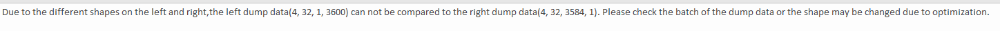

# msit debug compare常见问题 FAQ
  - [1.运行时出现Inner Error类错误](#1运行时出现inner-error类错误)
  - [2.设置--locat参数为True后，出现 Object arrays cannot be loaded when allow_pickle=False](#2设置--locat参数为true后出现object-arrays-cannot-be-loaded-when-allow_picklefalse)
  - [3.使用单算子比对功能时执行atc出现fail](#3使用单算子比对功能时执行atc出现fail)
  - [4.onnx模型改图后，比对结果表格中I列的shape信息和om模型的dump数据的shape不一致](#4onnx模型改图后比对结果表格中i列的shape信息和om模型的dump数据的shape不一致)


## 1.运行时出现`Inner Error`类错误
出现Inner类错误多半是内核或者内存出现错误导致的。
* 内存类：
```
output size:90000000 from user add align:64 < op_size:xxxxxxxxxxx
```
这个错误是由于工具运行时默认`output size`为90000000而模型输出大小超出该值导致的。
解决方法：执行命令中加入`--output-size`并指定足够大小（如500000000），每个输出对应一个值。
**注意**：指定的大小不要过大，否则会导致内存不足无法分配。
* 内核类
```
TsdOpen failed, devId=0, tdt error=1[FUNC:startAicpuExecutor][FILE:runtime.cc][LINE:1673]
```
这个错误是AI Core使用失败导致的，解决方法是：
```
unset ASCEND_AICPU_PATH
```

## 2.设置--locat参数为True后，出现`Object arrays cannot be loaded when allow_pickle=False`
- 该错误是由于模型执行时onnxruntime对onnx模型使用了算子融合导致某些中间节点没有真实dump数据导致的。
- **解决方法**是增加参数`--onnx-fusion-switch False`,关闭算子融合，使所有数据可用。

## 3.使用单算子比对功能时执行`atc`出现fail
一般是模型由于存在`reshape`算子导致的shape缺失从而`atc`转换失败，如果reshape的shape输入为某个网络算子，可能导致单算子atc转换失败，例如图中的reshape：


可以通过`msit debug surgeon`或者`onnxsim`对`onnx`模型进行优化，去除`reshape`算子。

## 4.`onnx`模型改图后，比对结果表格中`I`列的`shape`信息和om模型的dump数据的`shape`不一致
进行onnx和om比对时，如果对onnx中的算子进行了修改，需要密切注意比对结果表格中，算子输出tensor的shape信息。该信息在比对表格中的`T`列（`CompareFailReason`）中会显示，如下图所示：

如果对onnx算子进行修改后出现精度问题，可优先通过`T`列的信息进行排查。若两边`shape`的乘积不一致，则说明该算子可能存在问题。