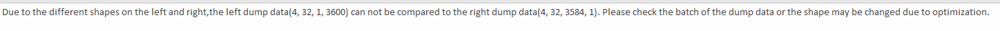

# msit debug compare常见问题 FAQ
  - [1.运行时出现Inner Error类错误](#1运行时出现inner-error类错误)
  - [2.设置--locat参数为True后，出现 Object arrays cannot be loaded when allow_pickle=False](#2设置--locat参数为true后出现object-arrays-cannot-be-loaded-when-allow_picklefalse)
  - [3.如何安装Docker](#3如何安装docker)
  - [4.Dockerfile构建时报错 ERROR: cannot verify xxx.com's certificate](#4dockerfile构建时报错-error-cannot-verify-xxxcoms-certificate)
  - [5.使用单算子比对功能时执行atc出现fail](#5使用单算子比对功能时执行atc出现fail)
  - [6.onnx模型改图后，比对结果表格中I列的shape信息和om模型的dump数据的shape不一致](#6onnx模型改图后比对结果表格中i列的shape信息和om模型的dump数据的shape不一致)


## 1.运行时出现`Inner Error`类错误
出现Inner类错误多半是内核或者内存出现错误导致的。
* 内存类：
```
output size:90000000 from user add align:64 < op_size:xxxxxxxxxxx
```
这个错误是由于工具运行时默认`output size`为90000000而模型输出大小超出该值导致的。
解决方法：执行命令中加入`--output-size`并指定足够大小（如500000000），每个输出对应一个值。
**注意**：指定的大小不要过大，否则会导致内存不足无法分配。
* 内核类
```
TsdOpen failed, devId=0, tdt error=1[FUNC:startAicpuExecutor][FILE:runtime.cc][LINE:1673]
```
这个错误是AI Core使用失败导致的，解决方法是：
```
unset ASCEND_AICPU_PATH
```

## 2.设置--locat参数为True后，出现`Object arrays cannot be loaded when allow_pickle=False`
- 该错误是由于模型执行时onnxruntime对onnx模型使用了算子融合导致某些中间节点没有真实dump数据导致的。
- **解决方法**是增加参数`--onnx-fusion-switch False`,关闭算子融合，使所有数据可用。

## 3.如何安装Docker

如果操作系统中没有安装docker，可以参考如下步骤手动进行安装。

> 以下docker安装指引以x86版本的Ubuntu22.04操作系统为基准，其他系统需要自行修改部分内容。
> a) 更新软件包索引，并且安装必要的依赖软件

```shell
sudo apt update
sudo apt install apt-transport-https ca-certificates curl wget gnupg-agent software-properties-common lsb-release
```

b) 导入docker源仓库的 GPG key

```shell
curl -fsSL https://download.docker.com/linux/ubuntu/gpg | sudo apt-key add -
```

> 注意：如果当前机器采用proxy方式联网，上面的命令有可能会遇到```curl: (60) SSL certificate problem: self signed certificate in certificate chain``` 的报错问题。遇到这种情况，可以在将curl的运行参数从```curl -fsSL```修改成```curl -fsSL -k```。需要注意的是，这会跳过检查目标网站的证书信息，有一定的安全风险，用户需要谨慎使用并自行承担后果。

c) 将 Docker APT 软件源添加到系统

```shell
sudo add-apt-repository "deb [arch=amd64] https://download.docker.com/linux/ubuntu $(lsb_release -cs) stable"
```

> 注意：如果上面的命令运行失败了，用户也可以采用如下命令手动将docker apt源添加到系统
>
> ```shell
> sudo echo "deb [arch=amd64] https://download.docker.com/linux/ubuntu $(lsb_release -cs) stable" >> /etc/apt/sources.list
> ```

d) 安装docker

```shell
sudo apt install docker-ce docker-ce-cli containerd.io
```

如果想安装指定版本的docker，可以在上面的命令中添加docker版本信息，如下所示

```shell
sudo apt install docker-ce=<VERSION> docker-ce-cli=<VERSION> containerd.io
```

e) 启动docker服务
一旦安装完成，Docker 服务将会自动启动，可以输入下面的命令查看docker服务的状态

```shell
sudo systemctl status docker
```

如果docker服务没有启动，可以尝试手动启动docker服务

```shell
sudo systemctl start docker
```

f) 以非root用户运行docker命令

默认情况下，只有 root 或者 有 sudo 权限的用户可以执行 Docker 命令。如果想要以非 root 用户执行 Docker 命令，则需要将你的用户添加到 Docker 用户组，如下所示：

```shell
sudo usermod -aG docker $USER
```

其中$USER代表当前用户。

## 4.Dockerfile构建时报错 `ERROR: cannot verify xxx.com's certificate`

可在Dockerfile中每个wget命令后加--no-check-certificate，有安全风险，由用户自行承担。

## 5.使用单算子比对功能时执行`atc`出现fail
一般是模型由于存在`reshape`算子导致的shape缺失从而`atc`转换失败，如果reshape的shape输入为某个网络算子，可能导致单算子atc转换失败，例如图中的reshape：


可以通过`msit debug surgeon`或者`onnxsim`对`onnx`模型进行优化，去除`reshape`算子。

## 6.`onnx`模型改图后，比对结果表格中`I`列的`shape`信息和om模型的dump数据的`shape`不一致
进行onnx和om比对时，如果对onnx中的算子进行了修改，需要密切注意比对结果表格中，算子输出tensor的shape信息。该信息在比对表格中的`T`列（`CompareFailReason`）中会显示，如下图所示：

如果对onnx算子进行修改后出现精度问题，可优先通过`T`列的信息进行排查。若两边`shape`的乘积不一致，则说明该算子可能存在问题。