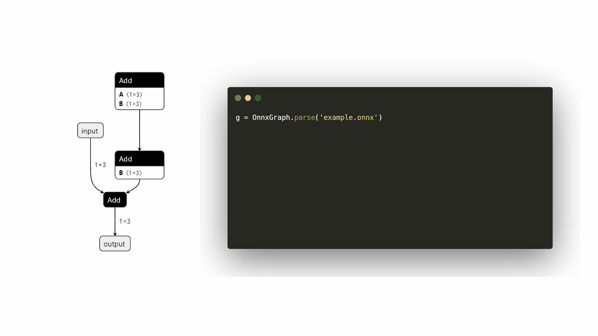
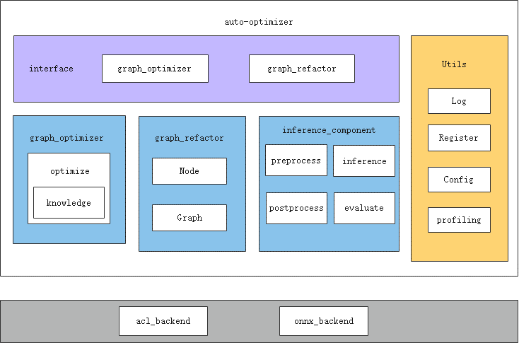

# msit debug surgeon功能使用指南

## 简介
surgeon（自动调优）使能ONNX模型在昇腾芯片的优化，并提供基于ONNX的改图功能。
## 工具安装
- 工具安装请见 [msit一体化工具使用指南](../../../README.md)

## 功能介绍

surgeon工具包含两大功能模块--面向昇腾设备的ONNX模型自动改图优化和丰富易用的ONNX改图接口。

- 工具的自动改图优化功能：基于[graph_optimizer](../../../components/debug/surgeon/docs/knowledge_optimizer/knowledge_optimizer_framework.md)图优化组件，集成业界先进的可泛化性图优化策略，构建17个改图知识库，识别模型中对应模式或子图，从而进行自动改图优化
- 工具的ONNX改图接口：基于[graph_refactor](../../../components/debug/surgeon/auto_optimizer/graph_refactor/README.md)基础改图组件，提供简易的改图接口，提供用户对ONNX图进行“增删改查”等多种改图需求的支持

## 1. 图优化工具命令行使用入口

surgeon功能可以直接通过msit命令行形式启动模型测试。启动方式如下：

```bash
msit debug surgeon COMMAND [OPTIONS] [REQUIRED]
```
**COMMAND**为surgeon工具提供的五个功能选项：**list**、**evaluate**、**optimize**、**extract**和**concatenate**。
```[OPTIONS]```和```[REQUIRED]```为可选项和必选项参数，每个子任务下面的可选项和必选项不同。

建议使用流程：
  1. 执行**list**命令列举当前支持自动调优的所有知识库。
  2. 执行**evaluate**命令搜索可以被指定知识库优化的ONNX模型。
  3. 执行**optimize**命令使用指定的知识库来优化指定的ONNX模型。
  4. (可选)执行**extract**命令对模型进行子图切分。
  5. (可选)执行**concatenate**命令对模型进行拼接。


### list命令

命令示例如下：

```bash
msit debug surgeon list
```

输出示例如下：

```bash
Available knowledges:
   0 KnowledgeConv1d2Conv2d
   1 KnowledgeMergeConsecutiveSlice
   2 KnowledgeTransposeLargeInputConv
   3 KnowledgeMergeConsecutiveConcat
   4 KnowledgeTypeCast
   5 KnowledgeSplitQKVMatmul
   6 KnowledgeSplitLargeKernelConv
   7 KnowledgeResizeModeToNearest
   8 KnowledgeTopkFix
   9 KnowledgeMergeCasts
  10 KnowledgeEmptySliceFix 
  11 KnowledgeDynamicReshape
  12 KnowledgeGatherToSplit
  13 KnowledgeAvgPoolSplit
  14 KnowledgeBNFolding
  15 KnowledgeModifyReflectionPad
  16 KnowledgeBigKernel
```

列举的知识库按照“序号”+“知识库名称”的格式展示，**evaluate**或**optimize**命令通过**knowledges**参数指定知识库时，可指定知识库序号或名称。关于具体知识库的详细信息，请参见[知识库文档](../../../components/debug/surgeon/docs/knowledge_optimizer/knowledge_optimizer_rules.md)。

注意：序号是为了方便手动调用存在的，由于知识库可能存在被删除或修改等情况，序号可能会变化。

### evaluate命令

命令格式如下：

```bash
msit debug surgeon evaluate [OPTIONS] [REQUIRED]
```

evaluate可简写为eva。

参数说明：

| 参数名             | 使用说明                                                     | 是否必选 |
| ------------------ | ------------------------------------------------------------ | -------- |
| --path             | evaluate的搜索目标，可以是.onnx文件或者包含.onnx文件的文件夹。 | 是       |
| -know/--knowledges | 知识库列表。可指定知识库名称或序号，以英文逗号“,”分隔。默认启用除修复性质以外的所有知识库。 | 否       |
| -r/--recursive     | 在PATH为文件夹时是否递归搜索。默认关闭。                     | 否       |
| -v/--verbose       | 打印更多信息，目前只有搜索进度。默认关闭。                   | 否       |
| -p/--processes     | 使用multiprocess并行搜索，指定进程数量。默认1。              | 否       |
| -h/--help          | 工具使用帮助信息。                                           | 否       |

### optimize命令

命令格式如下：

```bash
msit debug surgeon optimize [OPTIONS] [REQUIRED]
```

optimize可简写为opt。

参数说明：

| 参数名                     | 使用说明                                                     | 是否必选 |
| -------------------------- | ------------------------------------------------------------ | -------- |
| -in/--input                | 输入ONNX待优化模型，必须为.onnx文件。                        | 是       |
| -of/--output-file          | 输出ONNX模型名称，用户自定义，必须为.onnx文件。优化完成后在当前目录生成优化后ONNX模型文件。 | 是       |
| -know/--knowledges         | 知识库列表。可指定知识库名称或序号，以英文逗号“,”分隔。默认启用除修复性质以外的所有知识库。 | 否       |
| -bk/--big-kernel           | transform类模型大kernel优化的开关，当开关开启时会启用大kernel优化知识库。关于大kernel优化的介绍请参考[示例](../../../examples/cli/debug/surgeon/06_big_kernel_optimize/README.md) | 否       |
| -as/--attention-start-node | 第一个attention结构的起始节点，与-bk配合使用，当启用大kernel优化开关时，需要提供该参数。 | 否       |
| -ae/--attention-end-node   | 第一个attention结构的结束节点，与-bk配合使用，当启用大kernel优化开关时，需要提供该参数。 | 否       |
| -t/--infer-test            | 当启用这个选项时，通过对比优化前后的推理速度来决定是否使用某知识库进行调优，保证可调优的模型均为正向调优。启用该选项需要安装[CANN](https://www.hiascend.com/developer/download/commercial)。 | 否       |
| -soc/--soc-version         | 使用的昇腾芯片版本。仅当启用infer-test选项时有意义。 | 否       |
| -d/--device                | NPU设备ID。默认为0。仅当启用infer-test选项时有意义。         | 否       |
| --loop                     | 测试推理速度时推理次数。仅当启用infer-test选项时有意义。默认为100。 | 否       |
| --threshold                | 推理速度提升阈值。仅当知识库的优化带来的提升超过这个值时才使用这个知识库，可以为负，负值表示接受负优化。默认为0，即默认只接受推理性能有提升的优化。仅当启用infer-test选项时有意义。 | 否       |
| -is/--input-shape              | 静态Shape图输入形状，ATC转换参数，可以省略。仅当启用infer-test选项时有意义。 | 否       |
| --input-shape-range        | 动态Shape图形状范围，ATC转换参数。仅当启用infer-test选项时有意义。 | 否       |
| --dynamic-shape            | 动态Shape图推理输入形状，benchmark推理时用的参数，含义同benchmark参数[--dym-shape](https://gitee.com/ascend/msit/tree/master/msit/docs/benchmark#%E9%AB%98%E7%BA%A7%E5%8A%9F%E8%83%BD%E5%8F%82%E6%95%B0)。仅当启用infer-test选项时有意义。 | 否       |
| -outsize/--output-size              | 动态Shape图推理输出实际size，benchmark推理时用的参数。含义同benchmark参数[--output-size](https://gitee.com/ascend/msit/tree/master/msit/docs/benchmark#%E9%AB%98%E7%BA%A7%E5%8A%9F%E8%83%BD%E5%8F%82%E6%95%B0)。仅当启用infer-test选项时有意义。 | 否       |
| -h/--help                  | 工具使用帮助信息。                                           | 否       |


### extract命令
命令格式如下：

```bash
msit debug surgeon extract [OPTIONS] [REQUIRED]
```

extract 可简写为ext

参数说明：

| 参数                        | 使用说明                                                     | 是否必选 |
| --------------------------- | ------------------------------------------------------------ | -------- |
| -in/--input                 | 输入ONNX待优化模型，必须为.onnx文件。                        | 是       |
| -of/--output-file           | 切分后的子图ONNX模型名称，用户自定义，必须为.onnx文件。      | 是       |
| -snn/--start-node-names     | 起始算子名称。可指定多个输入算子名称，节点之间使用","分隔。  | 否       |
| -enn/--end-node-names       | 结束算子名称。可指定多个输出算子名称，节点之间使用","分隔。  | 否       |
| -ck/--is-check-subgraph     | 是否校验子图。启用这个选项时，会校验切分后的子图。           | 否       |
| -sis/--subgraph-input-shape | 额外参数。可指定截取子图之后的输入shape。多节点的输入shape指定按照以下格式，"input1:n1,c1,h1,w1;input2:n2,c2,h2,w2"。 | 否       |
| -sit/--subgraph_input_dtype | 额外参数。可指定截取子图之后的输入dtype。多节点的输入dtype指定按照以下格式，"input1:dtype1;input2:dtype2"。 | 否       |
| -h/--help                   | 工具使用帮助信息。                                           | 否       |


**使用特别说明**：为保证子图切分功能正常使用且不影响推理性能，请勿指定存在**父子关系**的输入或输出节点作为切分参数。


### concatenate命令
命令格式如下：

```bash
msit debug surgeon concatenate [OPTIONS]
```
concatenate 可简写为 concat

参数说明：

| 参数                       | 使用说明                                                     | 是否必选 |
| -------------------------- | ------------------------------------------------------------ | -------- |
| -g1/--graph1               | 输入的第一个ONNX模型，必须为.onnx文件。                      | 是       |
| -g2/--graph2               | 输入的第二个ONNX模型，必须为.onnx文件。                      | 是       |
| -io/--io-map               | 拼接时第一幅图的输出与第二幅图的输入的映射关系。例如“g1_out1,g2_in1;g1_out2,g2_in2” | 是       |
| -cgp/--combined-graph-path | 拼接之后结构图的名称。默认为以下划线连接的两幅图的名称       | 否       |
| -pref/--prefix             | 添加到第一幅ONNX图的前缀字符串，默认为"pre_"                 | 否       |
| -h/--help                  | 工具使用帮助信息。                                           | 否       |


## 2. 改图工具API使用入口

### 简介

graph_refactor 是 AutoOptimizer 工具的一个基础组件，提供简易的改图接口，解决用户改图难度大、学习成本高的问题。目前支持 onnx 模型的以下改图功能：

- [x] 加载和保存模型
- [x] 查询和修改单个节点信息
- [x] 新增节点，根据条件插入节点
- [x] 删除指定节点
- [x] 选定起始节点和结束节点，切分子图

### 快速上手

构造用例。

```python
import onnx
import numpy as np
from onnx import helper, TensorProto, numpy_helper

# 输入节点
input1 = helper.make_tensor_value_info('input1', TensorProto.FLOAT, [1, 3, 224, 224])
input2 = helper.make_tensor_value_info('input2', TensorProto.FLOAT, [1, 3, 64, 64])
output = helper.make_tensor_value_info('final_output', TensorProto.FLOAT, [1, 3, 64, 64])

# 添加常量
const1 = numpy_helper.from_array(np.ones((1, 3, 224, 224), dtype=np.float32), name='const1')
const2 = numpy_helper.from_array(np.ones((1, 3, 64, 64), dtype=np.float32), name='const2')

# start_node_name1: Add(input1 + const1)
start_node1 = helper.make_node(
    'Add', ['input1', 'const1'], ['out1'], name='start_node_name1'
)

# start_node_name2: Add(input2 + const2)
start_node2 = helper.make_node(
    'Add', ['input2', 'const2'], ['out2'], name='start_node_name2'
)

# end_node_name1: Mul(out1 * out2)
end_node = helper.make_node(
    'Mul', ['out1', 'out2'], ['final_output'], name='end_node_name1'
)

# 组装图
graph = helper.make_graph(
    [start_node1, start_node2, end_node],
    'DemoGraph',
    inputs=[input1, input2],
    outputs=[output],
    initializer=[const1, const2]
)

# 生成模型
model = helper.make_model(graph, producer_name='demo-model')
onnx.save(model, "layernorm.onnx")


# 输入和输出
input_tensor = helper.make_tensor_value_info('g1_input', TensorProto.FLOAT, [1, 3, 32, 32])
output_tensor = helper.make_tensor_value_info('g1_output', TensorProto.FLOAT, [1, 3, 32, 32])

# 常量
const = numpy_helper.from_array(np.ones((1, 3, 32, 32), dtype=np.float32), name='g1_const')

# 节点
add_node = helper.make_node(
    'Add', ['g1_input', 'g1_const'], ['g1_output'], name='g1_add'
)

# 图
graph = helper.make_graph(
    [add_node],
    'g1_graph',
    inputs=[input_tensor],
    outputs=[output_tensor],
    initializer=[const]
)

# g1.onnx
model = helper.make_model(graph, producer_name='g1-demo')
onnx.save(model, 'g1.onnx')

# g2.onnx
input_tensor = helper.make_tensor_value_info('g2_input', TensorProto.FLOAT, [1, 3, 32, 32])
output_tensor = helper.make_tensor_value_info('g2_output', TensorProto.FLOAT, [1, 3, 32, 32])

relu_node = helper.make_node(
    'Relu', ['g2_input'], ['g2_output'], name='g2_relu'
)

graph = helper.make_graph(
    [relu_node],
    'g2_graph',
    inputs=[input_tensor],
    outputs=[output_tensor]
)

model = helper.make_model(graph, producer_name='g2-demo')
onnx.save(model, 'g2.onnx')
```



以下是一个简单的改图脚本示例，包括加载 -> 修改 -> 保存三个基本步骤：

```python
import numpy as np
from auto_optimizer import OnnxGraph

# 加载 onnx 模型
g = OnnxGraph.parse('layernorm.onnx')

# 增加一个整网输入节点
dummy_input = g.add_input('dummy_input', 'int32', [2, 3, 4])

# 增加一个 add 算子节点和一个 const 常量节点
add = g.add_node('dummy_add', 'Add')
add_ini = g.add_initializer('add_ini', np.array([[2, 3, 4]]))
add.inputs = ['dummy_input', 'add_ini'] # 手动连边
add.outputs = ['add_out']
g.update_map() # 手动连边后需更新连边关系


# 在 add 算子节点前插入一个 argmax 节点
argmax = g.add_node('dummy_ArgMax',
                      'ArgMax',
                      attrs={'axis': 0, 'keepdims': 1, 'select_last_index': 0})
g.insert_node('dummy_add', argmax, mode='before') # 由于 argmax 为单输入单输出节点，可以不手动连边而是使用 insert 函数

# 保存修改好的 onnx 模型
g.save('layernorm_add.onnx', save_as_external_data=False, all_tensors_to_one_file=True)

# 切分子图
g.extract_subgraph(
    ["start_node_name1", "start_node_name2"],
    ["end_node_name1", "end_node_name1"],
    "sub.onnx", 
    input_shape="input1:1,3,224,224;input2:1,3,64,64",
    input_dtype="input1:float16;input2:int8"
)
g.save('layernorm_subgraph.onnx', save_as_external_data=False, all_tensors_to_one_file=True)

# 拼接子图
g1 = OnnxGraph.parse("g1.onnx")
g2 = OnnxGraph.parse("g2.onnx")
combined_graph = OnnxGraph.concat_graph(
  graph1=g1,
  graph2=g2,
  io_map=[("g1_output", "g2_input")]  # 两幅图的映射关系按照实际边的名称指定
)
g.save('layernorm_concat.onnx', save_as_external_data=False, all_tensors_to_one_file=True)
```

### 详细使用方法


- 接口详见 [API 说明和示例](../../../components/debug/surgeon/docs/graph_refactor/graph_refactor_API.md)
- BaseNode 使用方法参见 [BaseNode 说明](../../../components/debug/surgeon/docs/graph_refactor/graph_refactor_BaseNode.md)
- BaseGraph 使用方法参见 [BaseGraph 说明](../../../components/debug/surgeon/docs/graph_refactor/graph_refactor_BaseGraph.md)


## 使用示例

请移步[surgeon使用示例](../../../examples/cli/debug/surgeon/)

  | 使用示例                                                                                 | 使用场景                    |
  |--------------------------------------------------------------------------------------|-------------------------|
  | [01_basic_usage](../../../examples/cli/debug/surgeon/01_basic_usage)                 | 基础示例，介绍surgeon各功能       | 
  | [02_list_command](../../../examples/cli/debug/surgeon/02_list_command)               | 列举当前支持自动调优的所有知识库        | 
  | [03_evaluate_command](../../../examples/cli/debug/surgeon/03_evaluate_command)       | 搜索可以被指定知识库优化的ONNX模型     | 
  | [04_optimize_command](../../../examples/cli/debug/surgeon/04_optimize_command)       | 使用指定的知识库优化ONNX模型        | 
  | [05_extract_command](../../../examples/cli/debug/surgeon/05_extract_command)         | 对ONNX模型进行子图切分           | 
  | [06_big_kernel_optimize](../../../examples/cli/debug/surgeon/06_big_kernel_optimize) | Transformer类模型大kernel优化 |
  | [07_concatenate_command](../../../examples/cli/debug/surgeon/07_concatenate_command) | 对两幅ONNX图进行拼接            |
  | [08_custom_op](../../../examples/cli/debug/surgeon/08_custom_op)                     | 添加自定义算子                 |
  


# auto-optimizer工具指南

## 介绍

auto-optimizer（自动调优工具）使能ONNX模型在昇腾芯片的优化，并提供基于ONNX的改图功能。

**软件架构**



auto-optimizer主要通过graph_optimizer、graph_refactor接口提供ONNX模型自动调优能力。

接口详细介绍请参见如下手册：

- [x]  graph_optimizer：基于知识库的自动改图优化。同时支持自定义知识库，详细接口请参考[knowledge](../../../components/debug/surgeon/docs/knowledge_optimizer/knowledge_optimizer_framework.md)
- [x]  graph_refactor：改图API。[graph_refactor](../../../components/debug/surgeon/auto_optimizer/graph_refactor/README.md)

## 工具使用

### 命令格式说明

auto-optimizer工具可通过auto_optimizer可执行文件方式启动，若安装工具时未提示Python的PATH变量问题，或手动将Python安装可执行文件的目录加入PATH变量，则可以直接使用如下命令格式：

```bash
auto_optimizer <COMMAND> [OPTIONS] [ARGS]
```

或直接使用如下命令格式：

```bash
python3 -m auto_optimizer <COMMAND> [OPTIONS] [ARGS]
```

其中<COMMAND>为auto_optimizer执行模式参数，取值为list、evaluate、optimize和extract；[OPTIONS]和[ARGS]为evaluate和optimize命令的额外参数，详细介绍请参见后续“[evaluate命令](#evaluate命令)”和“[optimize命令](#optimize命令)”章节。

### 使用流程

auto-optimizer工具建议按照list、evaluate和optimize的顺序执行。如需切分子图，可使用extract命令导出子图。

操作流程如下：

1. 执行**list**命令列举当前支持自动调优的所有知识库。
2. 执行**evaluate**命令搜索可以被指定知识库优化的ONNX模型。
3. 执行**optimize**命令使用指定的知识库来优化指定的ONNX模型。
4. 执行**extract**命令对模型进行子图切分。

### list命令

命令示例如下：

```bash
python3 -m auto_optimizer list
```

输出示例如下：

```bash
Available knowledges:
   0 KnowledgeConv1d2Conv2d
   1 KnowledgeMergeConsecutiveSlice
   2 KnowledgeTransposeLargeInputConv
   3 KnowledgeMergeConsecutiveConcat
   4 KnowledgeTypeCast
   5 KnowledgeSplitQKVMatmul
   6 KnowledgeSplitLargeKernelConv
   7 KnowledgeResizeModeToNearest
   8 KnowledgeTopkFix
   9 KnowledgeMergeCasts
  10 KnowledgeEmptySliceFix 
  11 KnowledgeDynamicReshape
  12 KnowledgeGatherToSplit
  13 KnowledgeAvgPoolSplit
  14 KnowledgeBNFolding
  15 KnowledgeModifyReflectionPad
  16 KnowledgeBigKernel
```

列举的知识库按照“序号”+“知识库名称”的格式展示，**evaluate**或**optimize**命令通过**knowledges**参数指定知识库时，可指定知识库序号或名称。关于具体知识库的详细信息，请参见[知识库文档](docs/knowledge_optimizer/knowledge_optimizer_rules.md)。

注意：序号是为了方便手动调用存在的，由于知识库可能存在被删除或修改等情况，序号可能会变化。

### evaluate命令

命令格式如下：

```bash
python3 -m auto_optimizer evaluate [OPTIONS] PATH
```

evaluate可简写为eva。

参数说明：

| 参数    | 说明                                                         | 是否必选 |
| ------- | ------------------------------------------------------------ | -------- |
| OPTIONS | 额外参数。可取值：<br/>    -k/--knowledges：知识库列表。可指定知识库名称或序号，以英文逗号“,”分隔。默认启用除修复性质以外的所有知识库。<br/>    -r/--recursive：在PATH为文件夹时是否递归搜索。默认关闭。<br/>    -v/--verbose：打印更多信息，目前只有搜索进度。默认关闭。<br/>    -p/--processes: 使用multiprocess并行搜索，指定进程数量。默认1。<br/>    --help：工具使用帮助信息。 | 否       |
| PATH    | evaluate的搜索目标，可以是.onnx文件或者包含.onnx文件的文件夹。 | 是       |

命令示例及输出如下：

```bash
python3 -m auto_optimizer evaluate aasist_bs1_ori.onnx
```

```
2023-04-27 14:37:10,364 - auto-optimizer-logger - INFO - aasist_bs1_ori.onnx    KnowledgeConv1d2Conv2d,KnowledgeMergeConsecutiveSlice,KnowledgeTransposeLargeInputConv,KnowledgeTypeCast,KnowledgeMergeCasts
```

### optimize命令

命令格式如下：

```bash
python3 -m auto_optimizer optimize [OPTIONS] INPUT_MODEL OUTPUT_MODEL
```

optimize可简写为opt。

参数说明：

| 参数         | 说明                                                         | 是否必选 |
| ------------ | ------------------------------------------------------------ | -------- |
| OPTIONS      | 额外参数。可取值：<br/>    -k/--knowledges：知识库列表。可指定知识库名称或序号，以英文逗号“,”分隔。默认启用除修复性质以外的所有知识库。<br/>    -bk/--big-kernel：transform类模型大kernel优化的开关，当开关开启时会启用大kernel优化知识库。关于大kernel优化的介绍请参考[示例](../../../examples/cli/debug/surgeon/06_big_kernel_optimize/README.md)<br/>    -as/--attention-start-node：第一个attention结构的起始节点，与-bk配合使用，当启用大kernel优化开关时，需要提供该参数。<br/>    -ae/--attention-end-node：第一个attention结构的结束节点，与-bk配合使用，当启用大kernel优化开关时，需要提供该参数。<br/>    -t/--infer-test：当启用这个选项时，通过对比优化前后的推理速度来决定是否使用某知识库进行调优，保证可调优的模型均为正向调优。启用该选项需要安装额外依赖[inference]，并且需要安装CANN。<br/>    -s/--soc：使用的昇腾芯片版本，可通过npu-smi info查看。仅当启用infer-test选项时有意义。<br/>    -d/--device：NPU设备ID。默认为0。仅当启用infer-test选项时有意义。<br/>    -l/--loop：测试推理速度时推理次数。仅当启用infer-test选项时有意义。默认为100。<br/>    --threshold：推理速度提升阈值。仅当知识库的优化带来的提升超过这个值时才使用这个知识库，可以为负，负值表示接受负优化。默认为0，即默认只接受推理性能有提升的优化。仅当启用infer-test选项时有意义。<br/>    --input-shape：静态Shape图输入形状，ATC转换参数，可以省略。仅当启用infer-test选项时有意义。<br/>    --input-shape-range：动态Shape图形状范围，ATC转换参数。仅当启用infer-test选项时有意义。<br/>    --dynamic-shape：动态Shape图推理输入形状，推理用参数。仅当启用infer-test选项时有意义。<br/>    --output-size：动态Shape图推理输出实际size，推理用参数。仅当启用infer-test选项时有意义。<br/>    --help：工具使用帮助信息。 | 否       |
| INPUT_MODEL  | 输入ONNX待优化模型，必须为.onnx文件。                        | 是       |
| OUTPUT_MODEL | 输出ONNX模型名称，用户自定义，必须为.onnx文件。优化完成后在当前目录生成优化后ONNX模型文件。 | 是       |

命令示例及输出如下：

```bash
python3 -m auto_optimizer optimize aasist_bs1_ori.onnx aasist_bs1_ori_out.onnx
```

```bash
2023-04-27 14:31:33,378 - 984068 - msit_debug_logger - INFO - Optimization success
2023-04-27 14:31:33,378 - 984068 - msit_debug_logger - INFO - Applied knowledges:
2023-04-27 14:31:33,378 - 984068 - msit_debug_logger - INFO -   KnowledgeConv1d2Conv2d
2023-04-27 14:31:33,378 - 984068 - msit_debug_logger - INFO -   KnowledgeMergeConsecutiveSlice
2023-04-27 14:31:33,378 - 984068 - msit_debug_logger - INFO -   KnowledgeTransposeLargeInputConv
2023-04-27 14:31:33,378 - 984068 - msit_debug_logger - INFO -   KnowledgeTypeCast
2023-04-27 14:31:33,378 - 984068 - msit_debug_logger - INFO -   KnowledgeMergeCasts
2023-04-27 14:31:33,378 - 984068 - msit_debug_logger - INFO - Path: aasist_bs1_ori.onnx -> aasist_bs1_ori_out.onnx
```

### extract命令
命令格式如下：

```bash
python3 -m auto_optimizer extract [OPTIONS] INPUT_MODEL OUTPUT_MODEL START_NODE_NAME1,START_NODE_NAME2 END_NODE_NAME1, END_NODE_NAME2
```

extract 可简写为ext

参数说明：

| 参数                    | 说明                                                                                  | 是否必选 |
|-----------------------|-------------------------------------------------------------------------------------|------|
| OPTIONS               | 额外参数。可取值：<br/>    -c/--is-check-subgraph：是否校验子图。启用这个选项时，会校验切分后的子图。 <br/>SUBGRAPH_INPUT_SHAPE：可指定截取子图之后的输入shape。多节点的输入shape指定按照以下格式，"input1:n1,c1,h1,w1;input2:n2,c2,h2,w2"。<br/>SUBGRAPH_INPUT_DTYPE：可指定截取子图之后的输入dtype。多节点的输入dtype指定按照以下格式，"input1:dtype1;input2:dtype2"。                   | 否    |
| INPUT_MODEL           | 输入ONNX待优化模型，必须为.onnx文件。                                                             | 是    |
| OUTPUT_MODEL          | 切分后的子图ONNX模型名称，用户自定义，必须为.onnx文件。                                                    | 是    |
| START_NODE_NAME1,2... | 起始节点名称。可指定多个输入节点，节点之间使用","分隔。                                                       | 是    |
| END_NODE_NAME1,2...   | 结束节点名称。可指定多个输出节点，节点之间使用","分隔                                                        | 是    |

使用特别说明：为保证子图切分功能正常使用且不影响推理性能，请勿指定存在**父子关系**的输入或输出节点作为切分参数。

命令示例及输出如下：

```bash
python3 -m auto_optimizer extract origin_model.onnx sub_model.onnx "s_node1,s_node2" "e_node1,e_node2" --subgraph_input_shape="input1:1,3,224,224" --subgraph_input_dtype="input1:float16"
```

```bash
2023-04-27 14:32:33,378 - 984068 - msit_debug_logger - INFO - Extract the model completed, model was saved in sub_model.onnx
```
## 许可证

[Apache License 2.0](../../../../LICENSE)
