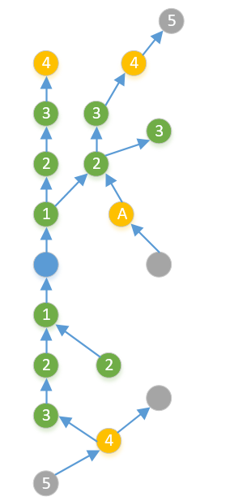
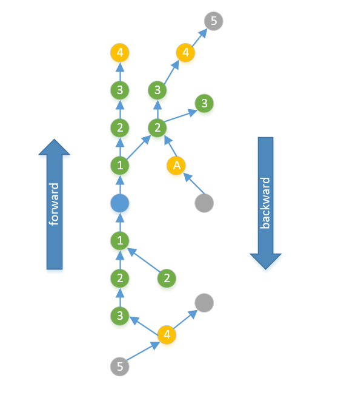

# msit graph 使用说明

msit graph 是基于GE（Graph Engine，图引擎）的图性能分析工具，当前提供了如下几种功能：

* stats（统计）：查看图的节点统计信息（每种类型节点的数量）；
* extract（抽取）：抽取整图中特定子图，包括**扩散抽取**和**区间抽取**两种模式；
* strip（压缩）：部分传统模型图上节点非常多，使用可视化工具查看模型结构往往会卡顿，该功能可以去掉图上的常量、节点的attribute，将图大小压缩为原本的1/10左右，便于查看图结构；
* fuse（识别重复结构）：分析图上重复结构次数，并结合profiling数据，进一步分析某“重复结构”的耗时情况，通常用于分析图上的融合机会。
* inspect(图扫描)：为了提高训推性能，需要将 GE 图中的动态shape算子替换，得到全静态图。因此，首先需要筛选图中的动态 shape 算子。

## 安装方法

```bash
# 1. 源码安装：先下载源码，进到源码目录
```sh
git clone https://gitcode.com/Ascend/msit.git
cd msit/msit
pip install .

# 2.1 安装 graph 工具
msit install graph

# 2.2 安装 whl 包
cd ./components/graph

python setup.py bdist_wheel
cd ./dist
pip install msit*.whl
```
2.1 和 2.2 任选一种即可。

## 统计节点信息

统计图的每种类型节点的数量，例如dump图的文件名为`ge_onnx_00449_graph_101_Build.pbtxt` [DUMP图描述信息](https://www.hiascend.com/document/detail/zh/canncommercial/80RC3/apiref/envvar/envref_07_0011.html) ，则查看图的统计信息的命令为：

```bash
msit graph stats --input ge_onnx_00449_graph_101_Build.pbtxt
load from ge_onnx_00449_graph_101_Build.pbtxt
graph stat:
        ge:Add = 11
        ge:AddN = 102
        ge:ApplyMomentumD = 269
        ge:ArgMaxD = 24
        ge:AssignAdd = 1
        ge:AtomicAddrClean = 1
        ge:BNTrainingReduceGrad = 97
        ge:BNTrainingUpdate = 97
        ge:BNTrainingUpdateGrad = 97
        ge:BiasAdd = 13
...

```

显示出来的内容分别为节点类型和该类型节点在图上的数量，通过此命令，可以快速拿到一幅图的概要信息。
可通过概要信息快速确认两张图是否一致，融合规则是否生效。

## 抽取图

当图中节点数量非常多时，使用可视化工具分析图结构通常会卡顿，若只需要查看图中一部分，则可以按需抽取图的一小部分。

抽取子图的命令为`extract`，总体来说，抽取子图的方法分为两类，基于节点名的扩散抽取，以及基于起始和结束节点的区间抽取。
扩散抽取和区间抽取可以单独使用，也可以共同使用。

### 扩散抽取

#### 默认方式

可以通过指定一个中心节点名的方式，并基于节点向前或向后做扩散，做子图的抽取，
例如图的文件名为`ge_onnx_00449_graph_101_Build.pbtxt`，以节点`MatMul_1/v2`为中心，向前后各扩散3层，执行命令：

```bash
msit graph extract --input=ge_onnx_00449_graph_101_Build.pbtxt --center-node "MatMul_1/v2" --layer-number 3
```

输入该命令后，工具执行如下任务：

1. 加载图文件`ge_onnx_00449_graph_101_Build.pbtxt`
2. 从图上查找名称为`MatMul_1/v2`的节点
3. 以节点`MatMul_1/v2`为中心，向输入方向、输出方向，循环查找所有的输入、输出节点，以3层为范围，将所有找到的节点去重、保存下来
4. 将所有找到的节点dump成图
5. 查找所有找到的节点的输入输出节点，同样将其dump到图中

执行完成后，在`ge_onnx_00449_graph_101_Build.pbtxt`同级目录，会生成一个`ge_onnx_00449_graph_101_Build_*.pbtxt`的文件，此文件即为抽取出的子图。

关于抽取规则，通过下图的举例做详细说明。下图中(抽取示意图)，指定了蓝色为需要抽取的节点：



绿色部分是第3步中，向输入、输出扩散3层找到的所有节点。
蓝色、绿色可以认为是我们需要抽取的图的“骨干”，黄色部分则是这些骨干节点的叶子节点，也会被一起抽取下来。
灰色节点不属于骨干节点，也没有与骨干节点直接相连，则不会被抽取下来。

值得注意的是黄色的节点A，此节点距离蓝色节点的距离也是3，但此节点却不属于骨干上的节点。
原因是节点A是“输出方向分支上的一个输入节点“，而循环查找时，输出方向的骨干节点只会继续向输出方向查找，所以A不在骨干节点中。
但由于A直连了骨干节点（节点2），因此A仍然会出现在抽取图中。

#### 取消dump叶子节点

在[默认方式](#默认方式)中提到的，叶子节点会跟随其直连的骨干节点一起被dump到抽取的图中。
如果不希望此行为发生，可以通过`--without-leaves`选项来杜绝叶子节点被dump到抽取图中。
从[抽取示意图](image/extract.PNG)来看，指定了该选项后，只有蓝色和绿色节点会被抽取出来。

#### 中止抽取

在进行图数据抽取的过程中，有时会遇到特定类型的节点，这些节点的存在可能会显著影响抽取结果的规模和复杂性。为了确保抽取过程的有效性和可控性，当检测到以下情况时，通常希望停止进一步的抽取操作：
**高连通性节点：**
* 这类节点的特点是具有极高的入度和出度。在某些网络结构中，单个节点的入度或出度可能超过数千。若在抽取过程中经过了此类节点，即便限制了抽取的层数，也可能会导致最终抽取出的子图异常庞大。
**特定类型节点：**
* 在某些应用场景下，用户可能希望在遇到某一类特定类型的节点或某个明确指定的节点后，中止图的抽取过程。这种需求可能是出于对特定业务逻辑的关注，或者是为了解决性能优化的问题。无论动机如何，一旦识别到预定义的节点类型或具体节点，抽取操作应当即刻停止，从而确保生成的子图符合预期的边界条件和分析要求。

此时可以通过`--stop-name`指定中止抽取，例如`--stop-name "allreduce_1"`，可指定停止的节点名字。

#### 单向抽取

如果只希望从某个节点开始，只向前或向后做单向抽取，可以通过`--only-forward`或`--only-backward`指定，forward和backward的方向为：



### 区间抽取的方法
该方法需指定一组起始节点和终止节点，dump出起始到终止节点中间的所有节点。

命令示例：

```bash
msit graph extract --input=ge_onnx_00449_graph_101_Build.pbtxt --start-node "MatMul_1/v2" --end-node "Mul_4" --without-leaves
```

此外，需要说明的是，扩散抽取和区间抽取每次仅支持生成一份子图，即只支持输入一个中心节点或者一组起始终止节点，不支持两种抽取方式同时使用。

## 压缩图
当pbtxt非常大时，使用可视化工具将其打开会十分耗时，甚至无法打开，此时如果想要快速的查看图结构，可以使用strip命令，命令示例如下：

```bash
msit graph strip --input ge_onnx_00449_graph_101_Build.pbtxt --level 3
```

其中，不同level对应着不同的压缩等级，1压缩等级最小，保留的图上信息最多，3压缩等级最大，仅保留基本的图结构信息，默认值为3，各等级详细介绍请参考参数详解。

## 识别重复结构
部分传统模型图上节点非常多，人工识别图上融合机会困难且耗时较长，该功能提供了自动计算了图中所有可能的结构出现的次数，并基于profiling数据给出了每个重复结构总的耗时，命令示例如下：

```bash
msit graph fuse --source ge_onnx_00449_graph_101_Build.pbtxt --profile op_summary_*.csv --max-nodes 8
```

其中，--profile 为profiling文件，获取方式参考：[离线推理场景性能分析](https://www.hiascend.com/document/detail/zh/canncommercial/80RC3/devaids/devtools/profiling/atlasprofiling_16_0005.html)， 
--max-nodes为“重复结构”允许包含的最大节点数，由于当前计算方式考虑了图中所以可能性，该方式时间复杂度高，因此当前仅支持配置`--max-nodes`<=10。
命令执行结束后，会生成一个名为 fuse_duration_{timestamp}的csv文件，其表头如下所示：

|Subgraph         | Count             | Root Nodes Index                                  |Task Sum Duration(us)| Total Duration(us)    |
|----------------|-------------------|-----------------------------------------------------|-------------------|------------------------|
|图中出现的重复结构| 重复结构出现的次数 | 重复节奏根节点Index值，以便于在图中找到具体的节点位置   |单个重复结构耗时     | 该重复结构总耗时         |

需要说明的是，“重复结构”是以算子类型而非算子名称组成，如果想要在图中找到某重复结构的位置，将重复结构的根节点和“ Root Nodes Index”值拼接几位节点名称，重复结构的第一个节点即为根节点。

## 图扫描

为了提高训推性能，需要将 GE 图中的动态shape算子替换，得到全静态图。因此，首先需要筛选图中的动态 shape 算子。

```sh
msit graph inspect <options>
```
命令示例：

```sh
msit graph inspect -i ./test_pbgraph.pbtxt -t dshape -o ./output
```


## 参数详解

### 通用参数

|参数名| 参数作用        |  是否必选  |
|----|-------------|----------------|
|--input| 读取的.pbtxt文件 |    是  |
|--log-level, -l|日志等级，debug、info、warning、error、fatal、critical。|否|

### extract 参数

|参数名| 参数作用                         |  是否必选  |
|----|------------------------------|----------------|
|--start-node| 区间抽取的起始节点                    |  否   |
|--end-node| 区间抽取的终止节点                    |  否   |
|--center-node| 基于该中心节点名做扩散抽取                |  否   |
|--layer-number| 中心节点向前/向后抽取的层数               |  否   |
|--only-forward| 只向前抽取                        |  否   |
|--only-backward| 只向后抽取                        |  否   |
|--without-leaves| 不抽取叶子节点                      |  否   |
|--stop-name| 搜索到该node name时，终止抽取          |  否   |
|--output| 生成的.pbtxt子图 |   否  |

### strip 参数

| 参数名    | 参数作用                  |是否必选  |
|--------|-----------------------|----------------|
| --level | 压缩等级，可取值：<br>1：去除图中去除Const  Data节点；<br>2：去除 Const Data节点和除shape信息以外的所有节点的attribute；<br>3：去除 Const Data节点和所有节点的attribute |   否   |
|--output| 生成的.pbtxt子图 |   否  |

### fuse参数

|参数名| 参数作用        | 是否必选  |
|----|-------------|------------|
|--source| 读取的.pbtxt文件 |   是  |
|--profile| 读取的profiling .csv文件|   是  |
|--max-nodes| 重复结构允许包含的最大节点个数|  否   |
|--min-nodes| 重复结构允许包含的最少节点个数|  否   |
|--min-times| 仅呈现重复结构出现次数不小于该值的结果|  否   |
|--output| 生成的.csv文件 |   否  |

### inspect参数

|参数名|参数作用|是否必选|
|-----|-----|-----|
|--type, -t|指定具体的扫描类别，目前仅支持“动态 shape”（dshape）。|是|
|--output, -o|输出目录，当前输出表头为 Graph_Name, Node_Name, Input, Output的csv文件，默认是 “./”。|否|

## 免责声明

- 本工具仅供调试和开发之用，不适用于生产环境。使用者需自行承担使用风险，并理解以下内容：

  - [X] 仅限调试开发使用：此工具设计用于辅助开发人员进行调试，不适用于生产环境或其他商业用途。对于因误用本工具而导致的数据丢失、损坏，本工具及其开发者不承担责任。
  - [X] 数据处理及删除：用户在使用本工具过程中产生的数据（包括但不限于dump的数据）属于用户责任范畴。建议用户在使用完毕后及时删除相关数据，以防泄露或不必要的信息泄露。
  - [X] 数据保密与传播：使用者了解并同意不得将通过本工具产生的数据随意外发或传播。对于由此产生的信息泄露、数据泄露或其他不良后果，本工具及其开发者概不负责。
  - [X] 用户输入安全性：用户需自行保证输入的命令行的安全性，并承担因输入不当而导致的任何安全风险或损失。对于由于输入命令行不当所导致的问题，本工具及其开发者概不负责。
- 免责声明范围：本免责声明适用于所有使用本工具的个人或实体。使用本工具即表示您同意并接受本声明的内容，并愿意承担因使用该功能而产生的风险和责任，如有异议请停止使用本工具。
- 在使用本工具之前，请**谨慎阅读并理解以上免责声明的内容**。对于使用本工具所产生的任何问题或疑问，请及时联系开发者。
