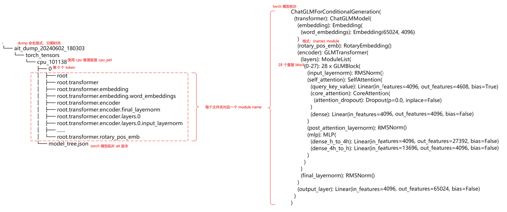

# 目录

- [目录](#目录)
- [介绍](#介绍)
- [前置知识](#前置知识)
- [精度定位流程](#精度定位流程)
  - [bad case 分析](#bad-case-分析)
  - [比较和落盘](#比较和落盘)
    - [同一个 `token` 比较](#同一个-token-比较)
    - [多个 `token` 比较](#多个-token-比较)
    - [单个算子比较](#单个算子比较)
  - [算子精度预检](#算子精度预检)
- [demo](#demo)
  - [准备](#准备)
  - [推理](#推理)
  - [落盘](#落盘)
  - [比较](#比较)
- [Appendix](#appendix)
  - [Before and After Tensor](#before-and-after-tensor)
  - [量化精度定位](#量化精度定位)


# 介绍

本文主要介绍了大模型推理场景下，如何通过 `msit` 工具来进行一键式精度比对，从而快速定位问题，提高开发和实际生产效率。内容上可能与其他文档存在些许重复，一些工具的详细使用说明在本文中不会做过多赘述。

本文采取通俗易懂的语言去尝试解释复杂的定义，对于基础薄弱的读者是比较友好的。对于高水平开发者，如果只是想掌握工具使用，可以通过目录来进行跳跃型阅读，或者可以参考 `msit` 工具的其他文档。

本文先是描述一个简单的数学问题，借助这个问题来模拟实际业务开发场景中的精度定位过程，通过类比的方法介绍大模型推理场景中的一些术语，帮助没有经验的读者感受一下精度比对工具的使用场景和基本工作逻辑。之后，由这个数学问题回到实际业务开发场景中，详细介绍了精度比对的全流程，包括如何发现 `bad case`，如何使用 `msit` 工具进行数据比对和落盘等。在本文的最后，介绍了实际业务场景下，使用 `msit` 工具对 `chatglm2-6b` 进行 `torch` 模型和 `atb` 模型的精度比对，读者可以跟随案例来进行实际分析，能够对 `msit` 工具有一个更加全面的了解和认识。一些其他的介绍和注意事项放在 `Appendix` 中，感兴趣的读者可以进行阅读。

# 前置知识
此内容仅针对于 **完全不了解** 模型推理和不清楚精度比对过程的读者，如果对这块已经了然于胸，可以直接进入下一个章节。

我们定义两个简单的函数 $f_1(x)$，$f_2(x)$ 如下：

$$
    \begin{align*}
        f_1(x) := 2x + 1 \\
        f_2(x) := 3x + 2.
    \end{align*}
$$

我们对两个函数进行一个包装，就可以得到一个另一个函数，在这里我们称之为一个模型 $m_1(x)$：

$$
    m_1(x) := 4 \cdot f_2(f_1(f_2(f_1(x)))) + 3.
$$

现在，考虑到业务场景需求，我们要将此模型中的两个函数 $f_1(x)$ 和 $f_2(x)$，替换成另外两个相同功能的函数 $g_1(x)$ 和 $g_2(x)$，即，做一个函数间的映射。替换的原因是这两个函数更亲和我们的实际业务场景。那么此时我们有了另一个映射之后的模型 $m_2(x)$，其定义如下：

$$
    m_2(x) := 4 \cdot g_2(g_1(g_2(g_1(x)))) + 3.
$$

现在我们想要知道，这个迁移之后的模型 $m_2(x)$，是不是和原来的模型 $m_1(x)$ 表现一致。

因此我们打算对其进行测试。首先我们坚定地，无条件地相信标杆模型，也就是原模型 $m_1(x)$ 的结果，并希望我们的测试模型 $m_2(x)$ 的结果，与其是一致的。测试方案如下：

1. 我们随便选一个数字作为输入，让两个模型同时进行运算，然后比较其结果。如果结果不一致，则说明测试模型 $m_2(x)$ 存在问题。
2. 如果结果一致，我们再准备 `1000` 个不重复数字作为输入，并手算结果作为标准答案。之后让两个模型对 `1000` 个数字进行运算，比较两个模型结果的正确率。

然而，我们在进行第一个测试时，就发现了结果不一致的情况。我们首先随便选了一个数字 $x=2$ 作为输入，然后比对结果发现，标杆模型 $m_1(2) = 431$，而测试模型 $m_2(2) = 171$。毫无疑问，映射之后的模型存在问题。

由于我们只是对函数进行了一个变更，按照控制变量法，一定是替换的函数有问题。但是具体是哪个函数的问题呢？我们目前只知道输出结果，对于中间的计算结果并不感知。如果在计算 $g_2(g_1(2))$ 的时候就已经和 $f_2(f_1(2))$ 不一致了，那么这个误差后续肯定会被无限的传播和放大，最终得到错误的结果是必然的。

为了找到问题的源头，我们得想办法储存中间的数据。一筹莫展之际，我们偶然发现，使用 `msit` 工具可以帮我们获取中间结果信息。我们在此工具的帮助下，再次让两个模型对 $x=2$ 进行计算，不过这次，我们除了最终结果之外，两个模型的中间结果也都保存了下来，如下（编撰内容，请以实物为主）：

<center>

| 第一层 | $f_1(x)$ | $g_1(x)$ |
| :----: | :------: | :------: |
| param  | 2        | 2        |
| retval | 5        | 5        |

| 第二层 | $f_2(x)$ | $g_2(x)$      |
| :----: | :------: | :------:     |
| param  | 5        | 5            |
| retval | 17       | $\boxed{10}$ |

| 第三层 | $f_1(x)$   | $g_1(x)$     |
| :----: | :------:  | :------:     |
| param  | 17        | $\boxed{10}$ |
| retval | 35        | $\boxed{21}$ |

| 第四层 | $f_2(x)$ | $g_2(x)$ |
| :----: | :------: | :------: |
| param  | 35       | $\boxed{21}$ |
| retval | 107      | $\boxed{42}$ |

| 第五层 | $m_1(x)$ | $m_2(x)$ |
| :----: | :------: | :------: |
| param  | 107      | $\boxed{42}$ |
| retval | 431      | $\boxed{171}$ |

<caption> Table 1. 使用 msit 工具储存的中间计算结果数据。每一层代表模型中一个函数的计算，其中 param 是函数的入参，retval 是函数的返回值 </caption>

</center>

这个表格将两个模型的每一个中间计算结果都进行了保存。我们通过肉眼比较发现，测试模型在第二层，计算 $g_2(x)$ 的时候，与标杆模型的 $f_2(x)$ 结果产生了差异。之后，这个误差在后面的计算中进行传播，导致映射之后的模型输出存在问题。大功告成！我们通过 `msit` 工具定位到了出现问题的映射函数！

在这个 `example` 中，我们定位到了出现问题的函数。有可能是该函数在实现上和原函数相比有些出入，导致对于相同的输入参数，其返回值出现了问题。在实际的大模型推理场景中，上述的函数又称为 **算子（operation，缩写 op）**。函数的入参，叫做算子的 `in tensor`，函数的返回值，叫做算子的 `out tensor`。所以，大模型推理场景下的精度比对，实际上就是通过比较每个算子的 `in tensor` 和 `out tensor`，发现存在问题的算子，而我们的 `msit` 工具可以出色地完成。

# 精度定位流程

通过一个简单的例子，想必读者已经对精度定位的本质有了一些了解。接下来，我会根据实际业务场景来详细介绍一下大模型场景下的精度定位流程和 `msit` 工具在流程中的位置。

<center>


</center>

全流程如上图。

## bad case 分析
在使用精度比对工具之前，首先我们需要确定，模型是否 **真的** 存在精度问题。回想我们在 [前置知识](#前置知识) 中的定位过程，我们在使用精度比对工具之前，首先是源于发现了一个 $x = 2$，能够让 $m_1(x) \ne m_2(x)$，也就是让两个模型的输出不一致。在实际的业务场景中，我们称 $m_1(x)$ 为标杆模型，$m_2(x)$ 为测试模型，$x$ 被叫做 **bad case**。

如果我们找不到一个 `bad case`，使得测试模型和标杆模型输出结果不一致，那么就无法证明这个测试模型存在精度问题。此时的测试模型可以不严谨地被认为不存在精度问题。不存在精度问题，使用精度比对工具就毫无意义，模型直接交付就行。注意，我们说测试模型不存在精度问题是相较于标杆模型的表现而言。

这篇文章详细介绍了如何 [识别 `bad case`](./如何识别%20Bad%20Case.md)，以及如何使用我们的工具来识别 `bad case`。这块内容是精度定位的开始，也是重中之重。需要认真理解。

## 比较和落盘

定位到了 `bad case` 之后，下一步就是使用 `msit` 工具进行数据落盘和比较。

如何使用 `msit` 工具进行落盘和比较，此处不做赘述，这里只讲精度比对的思路，如果不知道如何使用 `msit` 工具进行落盘和比较，先阅读：
  
- [昇腾大模型数据落盘使用说明](./工具-DUMP加速库数据使用说明.md)
- [torch 模型数据落盘使用说明](./工具-Pytorch场景数据dump.md)
- [自动精度比对使用说明](./工具-大模型精度比对.md)

我们保存模型所有的中间结果，其实都是为了最后的比较而服务的。`msit llm dump` 落盘参数众多，考虑的场景也十分全面，但是往往我们的实际精度比对场景只用到了其中微不足道的一部分资源。如果不清楚哪些数据是 `msit llm compare` 所需要的，而额外保存了很多其他的内容，对于整个精度比对流程而言是很没有效率的。

### 同一个 `token` 比较

如果我们想要比较测试模型的第 `3` 个 `token`，与标杆模型的第 `3` 个 `token` 是否存在精度问题，实际上比较的，是两个模型在计算第 `3` 个 `token` 时的所有中间结果。此时对于 `msit llm compare` 而言，是对同一个 `token` 下的每一个 `layer` 进行比较。这在流程图中属于 `block` 级别精度比对。 那么，`msit llm compare` 所需要的资源有：

- 两个模型的拓扑信息
- 两个模型在计算第 `3` 个 `token` 的时候，每一层的 `tensor` 信息。目前工具只比较 `after tensor` 中的 `out tensor`。

那么根据 `msit llm compare` 的需求，我们使用 `msit llm dump` 的思路就很清晰了。如果两个模型都是 `atb` 模型，那么落盘命令如下：

```sh
msit llm dump --exec <模型推理命令> --type model tensor -stp 1 -er 3,3 -o <保存地址> -l error
```

**注意**：用户需自行保证模型推理命令的安全性，并承担因输入不当而导致的任何安全风险或损失

其中：
- `--type model tensor` 会保存模型的拓扑信息，每一层的拓扑信息和 `tensor` 信息
- `-stp 1` 表示只保存 `out tensor`，不保存 `in tensor`
- `-er 3,3` 表示只保存第 `3` 个 `token` 的中间计算信息
- `-l error` 表示只有当 `error` 或者更严重的日志才会打屏。减少打屏可以加快模型落盘速度

`msit llm dump` 模型默认只保存 `after tensor`。

如果是 `torch` 模型需要落盘，那么就不能使用命令行的方式进行数据落盘，得对源码进行插桩，如下：

```py
# ...
# model initialization
model = AutoModel.from_pretrained(...)

from msit_llm import DumpConfig, register_hook
dump_config = DumpConfig(token_range=[3], tensor_part=1, dump_path=<保存地址>)
register_hook(model, dump_config)

# model inference
# ...
```

`DumpConfig` 是一些落盘相关的参数设置，`register_hook` 则通过 `torch` 自带的 `register_forward_pre_hook` 来进行插桩，[详情请戳](https://pytorch.org/docs/stable/generated/torch.nn.modules.module.register_module_forward_pre_hook.html)。其中：
- `token_range=[3]` 表示只保存第 `3` 个 `token` 的中间计算信息
- `tensor_part=1` 表示只保存 `out tensor`，不保存 `in tensor`

默认保存模型拓朴信息。

两个模型的数据都保存之后，使用[`msit llm compare`](./工具-大模型精度比对.md)即可进行比对。

如果不清楚落盘下的数据目录结构，不知道应该放入哪个路径到 `msit llm compare` 中，在 [demo](#demo) 有详细介绍。同时可以参考 [整网精度比对](./工具-大模型精度比对.md)

### 多个 `token` 比较

除了比较同一个 `token` 每一层的计算结果之外，`msit llm compare` 还支持多个 `token` 同时比较，以便于定位有问题的 `token`，这在流程图上属于 **输出 token 比对**。目前多个 `token` 自动比对仅适用于 `torch` 和 `atb` 大模型比对场景。

具体的细节可以参考 [多个 `token` 比较场景](./加速库场景-输出Token的logits精度比对.md)，介绍的十分详细。

需要注意的是，实际保存的 `token` 数取决于 `msit llm dump -er` 之外，还跟模型的实际输出 `token` 有关，比如 `max_new_tokens` 等配置，或者不同的提示词，会让模型产生不同的 `token`。

### 单个算子比较

单个算子比较其实就是把两个算子的输出 `tensor` 的 `pth` 或者 `bin` 文件进行比较，`msit llm compare` 仍然支持，思路不变。

## 算子精度预检

详情[请戳](./工具-精度预检使用说明.md)。

# demo

该案例以 `chatglm2-6b` 模型来详细介绍一下 `torch` 模型和 `atb` 模型的精度比对流程。该案例假设 `Where is the capital of China?` 是 `bad case`。以下称标杆模型为 `torch` 模型，称 `atb` 模型为测试模型。

## 准备
1. 模型权重文件
2. `torch` 模型相关配置文件
3. `atb` 模型相关配置文件

## 推理
在使用 `msit` 工具之前，首先必须检验 `torch` 模型和 `atb` 模型推理脚本是否能够正常运行。有时， `atb` 模型存在算子未正常接入的问题，一定要查看日志来进行排查。这里不做校验。

`torch` 模型的推理推荐使用 `cpu` 进行推理。如下是一个模拟脚本 `run_torch.py`

```py
# run_torch.py
import torch
from transformers import AutoTokenizer, AutoModel

# 需自行保证"tokenizer_config"文件安全可靠。在确保其安全性的前提下，可以使用以下代码。否则，请将'trust_remote_code'置为False
tokenizer = AutoTokenizer.from_pretrained("tokenizer_config", trust_remote_code=True)

# 需自行保证"model_weights"文件安全可靠。在确保其安全性的前提下，可以使用以下代码。否则，请将'trust_remote_code'置为False
model = AutoModel.from_pretrained("model_weights", trust_remote_code=True, torch_dtype=torch.float).eval()

with torch.no_grad():
    inputs = tokenizer(
                "Where is the capital of China?", # bad case input
                padding="max_length",
                return_tensors="pt",
                truncation=True,
                max_length=1024)

    outputs = model.generate(**inputs, do_sample=False, max_new_tokens=1)

print(tokenizer.decode(outputs.tolist()[0]))
```
`tokenizer_config` 是模型加载 `tokenizer` 的目录，`model_weights` 是模型加载权重的目录。

读取模型，然后对于我们的 `bad case` 进行推理。最后输出推理结果。推理命令如下

```sh
$ python3 run_torch.py
Where is the capital of China? Beijing
```
`atb` 模型的推理这里不做演示，详细请参考 [MindIE](https://gitcode.com/Ascend/MindIE-LLM/)（需要联系相应的华为工程师开通访问权限）。

## 落盘
确认推理过程无误之后，我们便可以使用 `msit` 工具来保存中间数据，进而进行比对，发现问题。

`torch` 模型的落盘方法需要修改源代码。在模型定位完之后，在执行推理之前，使用 `msit` 工具进行设置插桩。如下：

```py
# run_torch.py
import torch
from transformers import AutoTokenizer, AutoModel

# 需自行保证"tokenizer_config"文件安全可靠。在确保其安全性的前提下，可以使用以下代码。否则，请将'trust_remote_code'置为False
tokenizer = AutoTokenizer.from_pretrained("tokenizer_config", trust_remote_code=True)

# 需自行保证"model_weights"文件安全可靠。在确保其安全性的前提下，可以使用以下代码。否则，请将'trust_remote_code'置为False
model = AutoModel.from_pretrained("model_weights", trust_remote_code=True, torch_dtype=torch.float).eval()

from msit_llm import DumpConfig, register_hook
dump_config = DumpConfig(tensor_part=1, dump_path="/home/torch_dump")
register_hook(model, dump_config)

with torch.no_grad():
    inputs = tokenizer(
                "Where is the capital of China?", # bad case input
                padding="max_length",
                return_tensors="pt",
                truncation=True,
                max_length=1024)

    outputs = model.generate(**inputs, do_sample=False, max_new_tokens=1)

print(tokenizer.decode(outputs.tolist()[0]))
```

上述脚本中，我们定义了落盘位置为 `/home/torch_dump`，在执行完毕之后，我们能够在 `/home/torch_dump` 文件夹下，找到我们保存的中间结果。目录结构如下图：

<center>



</center>

其中，`pid` 为 `process id` 缩写，为进程号，为了针对多进程的情况而命名。对于 `atb` 模型，我们使用命令行的方式进行数据落盘：

```sh
msit llm dump --exec "python3 run_atb.py" --type model tensor -stp 1 -o /home/atb_dump -l error
```

**注意**：用户需自行保证 run_atb.py 文件的安全性，并承担因程序文件不安全而导致的任何安全风险或损失

执行完毕之后，在 `/home/atb_dump` 目录下，我们能够找到我们的结果。目录结构如下图：

<center>


</center>

## 比较

以第 `0` 个 `token` 的精度比对为例，我们通过 `msit llm compare` 来比较第 `0` 个 `token` 就行，标杆模型和测试模型都选择第 `0` 个 `token` 所在的目录下，放入 `msit llm compare` 中即可：
```sh
msit llm compare -gp /home/torch_dump/ait_dump_20240602_180303/torch_tensors/cpu_101138/0 -mp /home/ait_dump/ait_dump/tensors/0_119258/0 -o . -l debug
```
注：不同版本cann包可能会导致数据落盘文件夹名称格式不同，请根据实际情况调整。

因为我们是 `torch` 模型和 `atb` 模型进行比较，有时可能会出现找不到映射关系的情况，此时需要通过 `msit llm compare -mf` 来进行添加。开启 `-l debug` 会提示没有比对上的算子信息。

比对完成之后，会在当前目录下（通过 `-o .` 指定）生成一个 `csv` 文件，截图如下：


我们主要是通过查看红框内的数据来比较算子，上述截图中所有算子均不存在精度问题。指标的范围请参考 [精度比对结果参数说明](./精度比对结果参数说明.md)

后续还可以进行算子级别比较和[算子预检](./工具-精度预检使用说明.md)。

# Appendix

## Before and After Tensor
在 `atb` 模型进行数据落盘之后，会发现 `tensor` 目录下，每一个 `block` 都存在一个 `after`，这个 `after` 就是 `after tensor` 。在 `msit llm dump` 的可选参数中，也有一个控制 `before tensor` 和 `after tensor` 的选项。那么何为 `after tensor`呢？

实际上，这里的 `after` 是关于推理过程而言的。举个例子，我们可以把每个算子理解为一个函数，考虑如下函数：
```py
def add_one_operation(ls):
    for i in range(len(ls)):
        ls[i] += 1
        
    return ls
```
这个函数很简单，就是将传入的列表中所有的元素加上 `1`。

现在我们来模拟 `dump` 采集的场景。假设在执行 `add_one_operation([1, 2, 3])` 这个命令之前，我们采集一下数据，我们可以得到：

<center>

| param / inTensor | retval / outTensor |
| :---: | :---: |
| [1, 2, 3] | undefined |

</center>

此时函数输入已经拿到，为 `[1, 2, 3]`，输出还没有得到，因为我们还没有执行这个函数。

如果在函数执行完毕之后采集，我们可以收集到

<center>

| param / inTensor | retval / outTensor |
| :---: | :---: |
| [2, 3, 4] | [2, 3, 4] |

</center>

发现了什么？此时输入和输出结果一致了，因为函数本身是对传入数据进行了原地修改（in-place）。那么同理，如果一个算子是原地修改一块内存的数据，那么在推理完之后再进行信息采集，就会得到输入和输出相同的情况。这在某些场景下，可能会导致精度定位的困难。然而这种情况特别不常见。

## 量化精度定位

量化模型在精度定位上的流程可能存在些许差异。一般来说，浮点模型在通过 `modelslim` 进行权重量化时，会直接进行伪量化来判断其结果是否符合预期。如果模型出现胡言乱语，则证明量化过程出现问题，需要对算法和参数进行进一步的定位和研究。如果模型不存在胡言乱语，下一步是接入 `atb` 进行数据集测试，流程与上面描述的一样。但是需要注意的是，`modelslim` 对 `bad case` 的处理是放入 `calibration set` 中，详情请参考 [modelslim](https://www.hiascend.com/document/detail/zh/canncommercial/80RC1/devaids/auxiliarydevtool/modelslim_0004.html).
