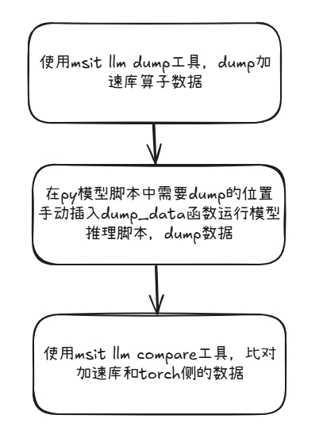

# 手动映射比对使用说明

## 使用方式

使用方式分为三步：

1. dump 加速库数据。
2. 在模型脚本中手动插入工具提供的 dump_data 函数，运行模型推理脚本 dump 数据。
3. 将手动 dump 结束后生成的路径作为入参输入到 msit llm compare 中完成比对

## 第一步：使用命令行 dump 加速库侧算子数据

### 使用方式

Synopsis:

`msit llm dump --exec <command> [options]`

Explanation:
- `<command>` 为推理大模型推理命令。如下列示例，使用模型仓 modeltest 的推理脚本：`--exec "bash run.sh pa_fp16 precision_single [[256,256]] '["hello", "what is your name"]' 1 chatglm2_6b /data/chatglm2_6b 1"`
- `[options]` 为其他 dump 功能，详情请见 [工具-DUMP加速库数据使用说明](./工具-DUMP加速库数据使用说明.md)

注意：dump 默认落盘路径为当前目录，自定义指定落盘路径需要使用 `--output` 选项，具体请参考 [工具-DUMP加速库数据使用说明](./工具-DUMP加速库数据使用说明.md)

## 第二步：在模型推理脚本中使用 dump_data dump 算子数据 

### 函数原型

`dump_data(token_id, data_id, golden_data, my_path, output_path)`

### 参数说明

| 参数名      | 说明                                                             | 是否必选 |
| ----------- | ---------------------------------------------------------------- | -------- |
| token_id    | 用于标识 token 的轮次                                              | 是       |
| data_id     | 数据的**唯一标识**，用于与加速库侧数据匹配，以实现数据比对 | 是       |
| golden_data | 需要dump的数据，格式为 torch tensor                               | 是       |
| my_path     | 需要与dump数据作比对的加速库侧.bin 文件的路径                     | 是       |
| output_path | dump数据保存的路径                                               | 否       |

### 功能说明

* 此函数将需要 dump 的数据落盘，落盘路径为 `output_path`。
* token_id，data_id，golden_data，my_path 由用户手动指定。
* dump 默认落盘路径 `{DUMP_DIR}`在当前目录下，如果指定 output 目录，落盘路径则为指定的 `{OUTPUT_DIR}`。
* tensor 信息会生成在默认落盘路径的 `msit_dump_{TIMESTAMP}/tensors/` 目录下，具体路径是 `{DUMP_DIR}/msit_dump_{TIMESTAMP}/tensors/{PID}_{DEVICE_ID}/golden_tensor`目录下。
* `{DUMP_DIR}/msit_dump_{TIMESTAMP}/tensors/{PID}_{DEVICE_ID}/golden_tensor` 目录下包含 dump 的数据和 `metadata.json`文件，`metadata.json` 中保存了加速库和手动 dump 数据的映射关系。

### 使用注意

* data_id 是数据匹配的唯一标识，需与加速库侧数据匹配对应。
* token_id 只用作数据区分不用作数据标识

### 示例

#### 1. 模型代码添加

* 在模型py文件中文件开头导入dump_data函数

  `from msit_llm.dump.manual_dump import dump_data`
* 在需要dump比对的数据位置插入dump_data代码，5个参数由用户手动指定

  `dump_data(token_id, data_id, golden_data, my_path, output_path)`

#### 2. 运行模型推理dump数据

* `python main.py --mode precision_single --model_path /data/chatglm2_6b --batch 1`

#### 3. 模型推理完成

* 模型推理脚本运行结束后会在 `{DUMP_DIR}/msit_dump_{TIMESTAMP}/tensors/{PID}_{DEVICE_ID}/golden_tensor` 目录中保存dump的数据和记录映射关系的 `metadata.json`。

## 第三步：使用 msit llm compare 工具比对加速库侧和模型侧的数据

### 使用方式

`msit llm compare --golden-path <golden path> --my-path <my path> --output <output dir>`

### 功能说明

* msit llm compare 提供有精度问题的数据与标杆数据之间的比对能力，详情可参考 [自动比对功能使用说明](./工具-自动比对功能使用说明.md)
* `<golden path>` 为第二步中 `golden_tensor` 所在目录，即：`{DUMP_DIR}/msit_dump_{TIMESTAMP}/{PID}_{DEVICE_ID}/`
* 完成比对后会在 `<output dir>` 下生成一个 `msit_cmp_report_{TIMESTAMP}.csv`，保存比对的最终结果。
* csv 报告查看参考 [精度比对结果参数说明](/msit/docs/llm/精度比对结果参数说明.md)

### 参数说明
* 参数详情可参考 [自动比对功能使用说明](./工具-自动比对功能使用说明.md)
### 使用示例

`msit llm compare -gp msit_dump_20240630_093252/tensors/160451_0 -mp my_tensor_path -o arbitrary_dir`