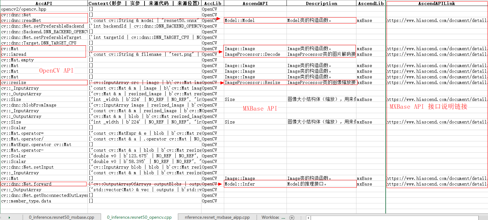

# OpenCV ResNet50 推理迁移
- 示例将 OpenCV 上 ResNet50 的 onnx 模型推理迁移到昇腾平台 MXBase 推理

## 导出 ResNet50 onnx 文件
- 需要 `resnet50.onnx` 文件用于后续推理以及迁移，使用 `torchvision` 中预定义的模型导出
  ```py
  import torchvision, torch
  mm = torchvision.models.resnet50(pretrained=True)
  torch.onnx.export(mm, torch.ones([1, 3, 224, 224]), 'resnet50.onnx')
  ```
## 准备测试图片
- 使用 `scikit-image` 中的测试图片，也可使用自行获取的图片，**本样例中限定输入图片大小 `256 x 256`**
  ```py
  import cv2
  from skimage.data import chelsea
  cv2.imwrite('test.png', cv2.resize(chelsea(), [256, 256])[:, :, ::-1])
  ```
## OpenCV ResNet50 推理
- **相关依赖** 需要 `opencv4`
  ```
  sudo apt install libopencv-dev
  ```
  如安装失败，可使用源码编译
  ```
  git clone https://github.com/opencv/opencv.git
  cd opencv
  mkdir build && cd build && cmake .. && make
  cd -
  ```
- **编译执行**
  ```sh
  g++ -O3 resnet50_opencv.cpp -o resnet50_opencv `pkg-config --cflags --libs opencv4`
  ./resnet50_opencv
  # Image process time duration: 4.31935ms
  # Model inference time duration: 230.819ms
  # index: 285
  # score: 17.6409
  ```
## AIT Tranplt 迁移分析
  - 安装 ait 工具后，针对待迁移项目执行 transplt 迁移分析
  ```sh
  ait transplt -s .
  # INFO - scan_api.py[123] - Scan source files...
  # ...
  # INFO - csv_report.py[46] - Report generated at: ./output.xlsx
  # INFO - scan_api.py[113] - **** Project analysis finished <<<
  ```
  最终分析结果文件位于当前执行路径下 `./output.xlsx`，该结果中重点关注有对应关系的接口，并参照 `AscendAPILink` 中相关接口说明辅助完成迁移

  
## MXBase ResNet50 推理 + OpenCV 图像处理
- **完成该部分迁移，可使用 OpenCV 处理图像 -> MXBase 在昇腾 NPU 上执行模型推理**
- 分析结果中，模型推理相关 API
  | AccAPI               | AscendAPI    | Description       |
  | -------------------- | ------------ | ----------------- |
  | cv::dnn::readNet     | Model::Model | Model类的构造函数 |
  | cv::dnn::Net.forward | Model::Infer | Model的推理接口   |
- [MindX SDK 社区版](https://gitee.com/link?target=https%3A%2F%2Fwww.hiascend.com%2Fzh%2Fsoftware%2Fmindx-sdk%2Fcommunity) 下载安装 Ascend-mindxsdk-mxvision.
  ```sh
  ./Ascend-mindxsdk-mxvision_5.0.RC2_linux-aarch64.run --install
  source ./mxVision/set_env.sh
  ```
  安装成功并 source 后，`echo $MX_SDK_HOME` 不为空
- **转出 om 模型**
  ```sh
  SOC_VERSION=`python3 -c 'import acl; print(acl.get_soc_name())'`  # Ascend310 / Ascend310P3 or others
  atc --model resnet50.onnx --output resnet50 --framework 5 --soc_version $SOC_VERSION
  ```
- **`MXBas::Model` 模型构造** 参照 `AscendAPILink` 中链接 [mxVision 用户指南 Model](https://www.hiascend.com/document/detail/zh/mind-sdk/300/vision/mxvisionug/mxmanufactureug_0827.html)
  ```cpp
  // `modelPath` 输入模型的路径，最大仅支持至4G的模型且要求模型属主为当前用户，模型文件的权限应小于或等于“640”
  // `deviceId` 输入模型部署的芯片，默认为0号芯片（-1表示模型部署在Host侧，为保留字段，请勿使用）
  Model(std::string &modelPath, const int32_t deviceId = 0)
  ```
  对应 OpenCV 部分
  ```cpp
  // 模型初始化
  cv::dnn::Net net = cv::dnn::readNet("resnet50.onnx");
  net.setPreferableBackend(cv::dnn::DNN_BACKEND_OPENCV);
  net.setPreferableTarget(cv::dnn::DNN_TARGET_CPU);
  ```
  完成对应模型初始化迁移实现
  ```cpp
  uint32_t device_id = 0;
  std::string modelPath = "resnet50.om";
  MxBase::Model net(modelPath, device_id);
  ```
- **`Model::Infer` 模型推理** 参照 `AscendAPILink` 中链接 [mxVision 用户指南 Infer](https://www.hiascend.com/document/detail/zh/mind-sdk/300/vision/mxvisionug/mxmanufactureug_0829.html)
  ```cpp
  // `inputTensors` 输入模型需要的Tensor输入
  // `outputTensors` 输出模型的Tensor输出
  std::vector<Tensor> Infer(std::vector<Tensor>& inputTensors)
  ```
  对应 OpenCV 部分
  ```cpp
  // 模型推理
  net.setInput(blob);
  std::vector<cv::Mat> outputs;
  net.forward(outputs, net.getUnconnectedOutLayersNames());
  ```
  完成对应模型推理迁移实现
  ```cpp
  std::vector<MxBase::Tensor> mx_inputs = {tensor};
  std::vector<MxBase::Tensor> outputs = net.Infer(mx_inputs);  
  outputs[0].ToHost();
  ```
- **MXBas::Tensor 数据** 模型推理使用 `Tensor` 类型作为输入，参照 [mxVision 用户指南 Tensor](https://www.hiascend.com/document/detail/zh/mind-sdk/300/vision/mxvisionug/mxmanufactureug_0814.html) 将 OpenCV 的 `Mat` 数据迁移到 `Tensor`
  ```cpp
  // usrData 输入用户构造的输入内存，该内存由用户管理申请和释放
  // shape 输入Tensor的shape属性
  // dataType 输入Tensor的数据类型，具体请参见TensorDType
  // deviceId 输入Tensor所在的设备ID，默认为-1，在Host侧
  Tensor(void* usrData,const std::vector<uint32_t> &shape, const MxBase::TensorDType &dataType, const int32_t &deviceId = -1)
  ```
  对应 OpenCV 部分
  ```cpp
  // Mat 数据
  cv::Mat blob;
  cv::dnn::blobFromImage(resized_image, blob, 1.0, cv::Size(224, 224), cv::Scalar(), true, false);
  ```
  对应迁移实现
  ```cpp
  const std::vector<uint32_t> shape = {1, 3, 224, 224};
  MxBase::Tensor tensor = MxBase::Tensor((void *)blob.data, shape, MxBase::TensorDType::FLOAT32, device_id);
  ```
- **编译执行** 迁移完成后可使用 `g++` 编译，也可自行编写 `cmake` 文件，修改调整至可编译通过并正确执行，参考迁移后实现 [resnet50_mxbase.cpp](https://gitee.com/ascend/ait/tree/master/ait/examples/cli/transplt/02_resnet50_inference/resnet50_mxbase.cpp)
  ```sh
  g++ -O3 resnet50_mxbase.cpp -o resnet50_mxbase -lmxbase -lopencv_world \
  -L ${MX_SDK_HOME}/lib -L ${MX_SDK_HOME}/opensource/lib -D_GLIBCXX_USE_CXX11_ABI=0 \
  -I ${MX_SDK_HOME}/include/ -I ${MX_SDK_HOME}/opensource/include/opencv4 -I ${MX_SDK_HOME}/opensource/include

  ./resnet50_mxbase
  # Image process time duration: 8.45735ms
  # Model inference time duration: 3.30807ms
  # index: 285
  # score: 17.6406
  ```
  其中在 NPU 上执行时模型推理时间 **3.30807ms** 远小于 CPU 上 OpenCV 调用时的 `230.819ms`，且输出结果 `score` 相近
## MXBase ResNet50 推理 + AIPP 数据处理
- **完成该部分迁移，可完全在昇腾 NPU 执行图像处理 -> 模型推理**
- **由于实现差异，Ascend310 上 resize 只能用于 NV12 或 NV21 格式输入，Ascend310P3 上可正常处理 RGB_888 图片**
- 分析结果中，图像处理相关 API
  | AccAPI     | AscendAPI              | Description                    |
  | ---------- | ---------------------- | ------------------------------ |
  | cv::imread | ImageProcessor::Decode | ImageProcessor类的图片解码接口 |
  | cv::resize | ImageProcessor::Resize | ImageProcessor类的图像缩放接口 |
- **AIPP** 详细介绍参照 [CANN AIPP使能](https://www.hiascend.com/document/detail/zh/CANNCommunityEdition/63RC2alpha003/infacldevg/atctool/atlasatc_16_0018.html)，对于 `resnet50` 的参考实现 `aipp.config`
  ```java
  aipp_op{
      aipp_mode:static
      input_format : RGB888_U8

      src_image_size_w: 256
      src_image_size_h: 256
      crop: true
      load_start_pos_w: 16
      load_start_pos_h: 16
      crop_size_w: 224
      crop_size_h: 224

      min_chn_0 : 123.675
      min_chn_1 : 116.28
      min_chn_2 : 103.53
      var_reci_chn_0: 0.0171247538316637
      var_reci_chn_1: 0.0175070028011204
      var_reci_chn_2: 0.0174291938997821
  }
  ```
- **转出带 AIPP 前处理的 om 模型**，其中 AIPP 负责将输入的 `256 x 256` 图像裁剪为 `224 x 224`，以及数值规范化
  ```sh
  SOC_VERSION=`python3 -c 'import acl; print(acl.get_soc_name())'`  # Ascend310 / Ascend310P3 or others
  atc --model resnet50.onnx --output resnet50_aipp --framework 5 --soc_version $SOC_VERSION --insert_op_conf aipp.config
  ```
- **ImageProcessor::Decode 图像解码** 参照 `AscendAPILink` 中链接 [mxVision 用户指南 Decode](https://www.hiascend.com/document/detail/zh/mind-sdk/300/vision/mxvisionug/mxmanufactureug_0856.html)
  ```cpp
  // inputPath 输入待解码的图片路径
  // outputImage 输出解码后的Image类，图片宽高和对齐后的宽高会自动合入进“outputImage”内
  // decodeFormat 输入解码后图片的格式，JPG/JPEG默认参数为YUV_SP_420，PNG图片无需设置，按图片源格式进行解码
  APP_ERROR Decode(const std::string inputPath, Image& outputImage,
                   const ImageFormat decodeFormat = ImageFormat::YUV_SP_420);
  ```
  对应 OpenCV 部分
  ```cpp
  cv::Mat image = cv::imread("test.png", 1);
  ```
  完成对应图像解码迁移实现
  ```cpp
  std::string img_file = "test.png";
  MxBase::ImageProcessor processor;
  MxBase::Image decoded_image;
  processor.Decode(img_file, decoded_image, MxBase::ImageFormat::RGB_888);
  ```
- **ImageProcessor::Resize 图像缩放，在 Ascend310 上不做迁移** 参照 `AscendAPILink` 中链接 [mxVision 用户指南 Resize](https://www.hiascend.com/document/detail/zh/mind-sdk/300/vision/mxvisionug/mxmanufactureug_0858.html)
  ```cpp
  // inputImage 输入缩放前的Image类
  // resize 输入图像缩放的宽高
  // interpolation 输入图像的缩放方式
  // outputImage 输出缩放后的Image类
  APP_ERROR Resize(const Image& inputImage, const Size& resize, Image& outputImage,
                   const Interpolation interpolation = Interpolation::HUAWEI_HIGH_ORDER_FILTER);
  ```
  对应 OpenCV 部分
  ```cpp
  cv::resize(image, resized_image, cv::Size(224, 224));
  ```
  完成对应图像缩放迁移实现，其中 `256` 对应 AIPP 中定义的模型输入大小
  ```cpp
  MxBase::Image resized_image;
  processor.Resize(decoded_image, MxBase::Size(256, 256), resized_image);
  ```
- **编译执行** 迁移完成后可使用 `g++` 编译，也可自行编写 `cmake` 文件，修改调整至可编译通过并正确执行，参考迁移后实现 [resnet50_mxbase_aipp.cpp](https://gitee.com/ascend/ait/tree/master/ait/examples/cli/transplt/02_resnet50_inference/resnet50_mxbase_aipp.cpp)
  ```sh
  g++ -O3 resnet50_mxbase_aipp.cpp -o resnet50_mxbase_aipp -lmxbase -lopencv_world \
  -L ${MX_SDK_HOME}/lib -L ${MX_SDK_HOME}/opensource/lib -D_GLIBCXX_USE_CXX11_ABI=0 \
  -I ${MX_SDK_HOME}/include/ -I ${MX_SDK_HOME}/opensource/include/opencv4 -I ${MX_SDK_HOME}/opensource/include

  ./resnet50_mxbase_aipp
  # Image process time duration: 16.2752ms
  # Model inference time duration: 2.8023ms
  # index: 285
  # score: 17
  ```
  其中图像处理时间基本为读取图片时间，在 NPU 上执行时模型推理时间 **2.8023ms** 远小于 CPU 上 OpenCV 调用时的 `230.819ms`，且输出结果 `score` 相近
