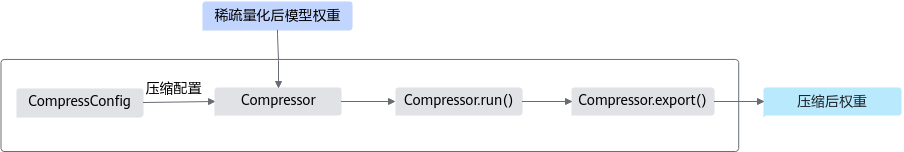

# 大模型稀疏量化和权重压缩

## Pytorch
目前支持对表1中的大模型进行量化（包括但不限于）。

表1 已验证模型列表  

| 模型名称 | 框架 |  
|----------|-------|
| ChatGLM2-6B | PyTorch |  
| LLaMA2-7B | PyTorch |  
| LLaMA-13B | PyTorch |  

### 前提条件

稀疏和量化工具支持在以下产品中使用：

Atlas 推理系列产品。

Atlas 训练系列产品。

Atlas A2 训练系列产品/Atlas 800I A2 推理产品/A200I A2 Box 异构组件。

权重压缩工具仅支持在Atlas 推理系列产品上使用。

已参考[安装指南](../../../../安装指南.md)完成开发环境配置。

大模型稀疏和压缩前须执行命令安装如下依赖。

如下命令如果使用非root用户安装，需要在安装命令后加上--user，例如：pip3 install onnx --user。
```
pip3 install numpy==1.25.2
pip3 install transformers       #需大于等于4.29.1版本，LLaMA模型需指定安装4.29.1版本
pip3 install torch==2.1.0       #安装PyTorch 2.1.0版本
pip3 install accelerate==0.21.0 #若需要使用NPU多卡并行方式对模型进行量化，需大于等于0.28.0版本
pip3 install tqdm==4.66.1 
pip3 install tensorboard      #需大于等于2.11.2版本 
pip3 install typepy           #需大于等于1.3.1版本 
pip3 install sacrebleu        #需大于等于2.3.1版本 
pip3 install datasets         #需大于等于2.13.1版本 
pip3 install sqlitedict       #需大于等于2.1.0版本 
pip3 install omegaconf        #需大于等于2.3.0版本
pip3 install pycountry        #需大于等于22.3.5版本 
pip3 install rouge_score      #需大于等于0.1.2版本 
pip3 install peft             #需大于等于0.5.0版本
```
（可选）如果需要在大模型量化工具中使用NPU多卡并行的方式对模型进行量化，需关闭NPU设备中的虚拟内存，并手动配置量化将会执行的设备序列环境。
```
export PYTORCH_NPU_ALLOC_CONF=expandable_segments:False # 关闭NPU的虚拟内存
export ASCEND_RT_VISIBLE_DEVICES=0,1,2,3 #配置量化将会执行的设备序列环境
```

说明

仅Atlas 训练系列产品和Atlas A2 训练系列产品/Atlas 800I A2 推理产品/A200I A2 Box 异构组件支持此功能。

### 功能实现流程

大模型压缩工具共分为稀疏、量化和权重压缩三大环节，用户需连续运行方可实现大模型压缩。

大模型稀疏量化工具关键步骤说明如下：

图1 稀疏量化接口调用流程


用户准备原始模型和校准数据。

使用QuantConfig生成稀疏量化配置。

根据原始模型、稀疏量化配置和校准数据，调用Calibrator接口构建稀疏和量化校准对象。

调用生成的稀疏和量化校准对象的run()方法，对原始模型进行稀疏和量化处理。

调用生成的稀疏和量化校准对象的save()接口，保存量化后的模型，包括模型稀疏量化的权重和模型相关参数。其中，模型权重文件quant_weight.npy将会用于权重压缩。

权重压缩工具关键步骤说明如下：

图2 量化接口调用流程



使用CompressConfig生成权重压缩配置。

用户准备经过稀疏和量化处理后的模型权重文件quant_weight.npy。

根据模型权重文件和压缩配置，调用Compressor接口构建权重压缩对象。

调用权重压缩对象的run()方法，对模型权重进行压缩处理。

调用权重压缩对象的export()方法，保存压缩结果，用于后续模型的推理部署任务。

说明

权重压缩工具在加载输入的权重文件时，存在一定的反序列化攻击安全风险。权重压缩工具通过界面提示操作存在反序列化攻击的安全风险，在加载前用户交互确认加载的权重文件无风险后，才开始进行对文件的操作。

### 稀疏量化步骤（以ChatGLM2-6B为例）

用户自行准备模型、权重文件和校准数据，本样例以ChatGLM2-6B为例，单击Link自行下载权重文件，并上传至服务器文件夹内，如上传至“chatglm2”文件夹，目录示例如下：
```
├── config.json
├── configuration chatglm.py
├── modeling_chatglm.py
├── pytorch_model-00001-of-00007.bin
├── pytorch_model-00002-of-00007.bin
├── pytorch_model-00003-of-00007.bin
├── pytorch_model-00004-of-00007.bin
├── pytorch_model-00005-of-00007.bin
├── pytorch_model-00006-of-00007.bin
├── pytorch_model-00007-of-00007.bin
├── pytorch_model.bin.index.json
├── quantization.py
├── README.md
├── tokenization_chatglm.py
├── tokenizer.model
├── tokenizer_config.json
```
说明

大模型量化工具建议在大模型下游任务评估流程打通的前提下使用，请自行调试源码后进行以下量化配置。

ChatGLM2-6B为模型进行量化前请执行如下命令安装所需依赖，若运行量化工具过程中提示缺失某个依赖，请根据提示安装。
```
pip3 install protobuf==4.24.1
pip3 install sentencepiece==0.1.99
pip3 install sympy==1.11.1
```
新建模型的稀疏量化脚本sparse_quant.py，编辑sparse_quant.py文件。

稀疏量化场景导入样例代码如下，lowbit算法稀疏量化场景导入的代码样例请参考[lowbit算法稀疏量化场景](../../../../案例集/量化及稀疏量化场景导入代码样例.md)，请参考信息提示，根据实际情况进行修改。

```python
# 导入相关依赖
import torch
import torch_npu   # 若需要在cpu上进行量化，可忽略此步骤
import torch.utils.data
from transformers import AutoTokenizer, AutoModel
# for local path
tokenizer = AutoTokenizer.from_pretrained(
    pretrained_model_name_or_path='./chatglm2', 
    local_files_only=True
) 
model = AutoModel.from_pretrained(
    pretrained_model_name_or_path='./chatglm2',
    torch_dtype=torch.float16, 
    local_files_only=True
  ).npu()    # 如果需要在npu上进行多卡量化，需要先参考前提条件进行配置，并配置以下参数device_map='auto', torch_dtype为当前使用模型的默认数据类型；在npu上进行量化时，单卡校准需将模型移到npu上model = model.npu()，多卡校准时不需要
# 准备校准数据，请根据实际情况修改
calib_list = ["中国的首都在哪里？",
              "请做一首诗歌：",
              "我想要学习python，该怎么学习？",
              "请帮我写一篇关于大模型推理优化的任职报告：",
              "中国最值得去的几个景点"]
#获取校准数据函数定义
def get_calib_dataset(tokenizer, calib_list):
    calib_dataset = []
    for calib_data in calib_list:
        inputs = tokenizer([calib_data], return_tensors='pt').to(model.device) 
        print(inputs)
        calib_dataset.append([inputs.data['input_ids'], inputs.data['attention_mask']])
    return calib_dataset
dataset_calib = get_calib_dataset(tokenizer, calib_list)  #校准数据获取

# 稀疏量化配置，请根据实际情况修改
from msmodelslim.pytorch.llm_ptq.llm_ptq_tools import Calibrator, QuantConfig    # 导入稀疏量化配置接口
# 使用QuantConfig接口，配置稀疏量化参数，并返回配置实例
quant_config = QuantConfig(
    w_bit=4, 
    disable_names=['transformer.encoder.layers.0.self_attention.query_key_value','transformer.encoder.layers.0.self_attention.dense', 'transformer.encoder.layers.0.mlp.dense_h_to_4h'], 
    act_method=3,
    dev_type='npu',  # 在cpu进行量化时，需要配置参数dev_type='cpu'，并取消参数dev_id=model.device.index的配置
    dev_id=model.device.index,
    pr=2.0, 
    fraction=0.011, 
    nonuniform=False, 
    mm_tensor=False, 
    co_sparse=True
 )  
#使用Calibrator接口，输入加载的原模型、稀疏量化配置和校准数据，定义校准
calibrator = Calibrator(model, quant_config, calib_data=dataset_calib, disable_level='L0')
calibrator.run()     #使用run()执行量化
calibrator.save('./quant_weight')      #使用save()保存模型量化参数，请根据实际情况修改路径
print('Save quant weight success!')
```

说明

因为在存储量化参数过程中存在反序列化风险，所以已通过在存储过程中，将保存的量化结果文件夹权限设置为750，量化权重文件权限设置为400，量化权重描述文件设为600来消减风险。

启动模型稀疏量化任务，并在指定的输出目录获取模型量化参数。
```
python3 sparse_quant.py
```
说明

生成的模型权重文件quant_weight.npy将会用于压缩步骤（以ChatGLM2-6B为例）的步骤2。

### 压缩步骤（以ChatGLM2-6B为例）

编译压缩函数。

已参考前提条件，完成开发环境配置。

请参考[安装指南](../../../../安装指南.md#基于atlas-300i-duo-系列产品安装)中“基于Atlas 300I Duo 系列产品安装”章节，完成**稀疏量化压缩场景**的相关编译步骤。

编译结束后，在当前路径下生成build目录，执行如下命令查看编译结果compress_executor。
```
cd build
```
用户参考稀疏量化步骤对ChatGLM2-6B进行稀疏量化之后，在指定的输出目录“chatglm2”文件夹得到模型稀疏量化后的参数，目录示例如下：
```
├── deq_scale.npy
├── input_offset.npy
├── input_scale.npy
├── quant_bias.npy
├── quant_weight.npy
```
说明

权重压缩工具仅需要对步骤4生成的权重文件quant_weight.npy进行压缩。

新建压缩脚本compress.py，编辑compress.py文件，导入如下样例代码，并根据实际情况进行修改。

```python
# 导入相关依赖
import sys
import os
import numpy as np
# 导入权重压缩接口
from msmodelslim.pytorch.weight_compression import CompressConfig, Compressor
def make_dir(path):
    if not os.path.exists(path):
        os.makedirs(path, mode=0o750, exist_ok=True)
    return path

# 准备待压缩权重文件和相关压缩配置，请根据实际情况进行修改
weight_path = "./chatglm2/quant_weight.npy"       # 待压缩权重文件的路径
save_path = "./compress"                          # 压缩后权重文件保存的路径
index_root = make_dir(os.path.join(save_path, 'index'))
weight_root = make_dir(os.path.join(save_path, 'weight'))
info_root = make_dir(os.path.join(save_path, 'info'))

# 使用CompressConfig接口，配置压缩参数，并返回配置实例
compress_config = CompressConfig(do_pseudo_sparse=False, sparse_ratio=1, is_debug=True, record_detail_root=save_path, multiprocess_num=8)

#使用Compressor接口，输入加载的压缩配置和待压缩权重文件
compressor = Compressor(compress_config, weight_path)
compress_weight, compress_index, compress_info = compressor.run()

#使用export()接口，保存压缩后的结果文件
compressor.export(compress_weight, weight_root)
compressor.export(compress_index, index_root)
compressor.export(compress_info, info_root, dtype=np.int64)
```

运行压缩脚本，并在指定的输出目录获取压缩后的权重文件，用于后续的推理部署任务，具体请参见MindIE的[“MindIE支持模型列表”](https://www.hiascend.com/document/detail/zh/mindie/10RC3/whatismindie/mindie_what_0003.html)章节中已适配量化的模型。
```
python3 compress.py
```
## MindSpore

### 前提条件

稀疏和量化工具支持在以下产品中使用：

Atlas 推理系列产品。

Atlas 训练系列产品。

Atlas A2 训练系列产品/Atlas 800I A2 推理产品/A200I A2 Box 异构组件。

权重压缩工具仅支持在Atlas 推理系列产品上使用。

已参考[安装指南](../../../../安装指南.md)完成开发环境配置。

大模型稀疏和压缩前须执行命令安装如下依赖。

如下命令如果使用非root用户安装，需要在安装命令后加上--user，例如：pip3 install onnx --user。
```
pip3 install numpy==1.25.2
pip3 install tqdm==4.66.1 
pip3 install typepy           #需大于等于1.3.1版本 
pip3 install sacrebleu        #需大于等于2.3.1版本 
pip3 install datasets         #需大于等于2.13.1版本 
pip3 install sqlitedict       #需大于等于2.1.0版本 
pip3 install omegaconf        #需大于等于2.3.0版本
pip3 install pycountry        #需大于等于22.3.5版本 
pip3 install rouge_score      #需大于等于0.1.2版本 
pip3 install peft             #需大于等于0.5.0版本
```
### 功能实现流程
大模型压缩工具共分为稀疏、量化和权重压缩三大环节，用户需连续运行方可实现大模型压缩。

大模型稀疏量化工具关键步骤说明如下：

图3 稀疏量化接口调用流程


用户准备原始模型和校准数据。

使用QuantConfig生成稀疏量化配置。

根据原始模型、稀疏量化配置和校准数据，调用Calibrator接口构建稀疏和量化校准对象。

调用生成的稀疏和量化校准对象的run()方法，对原始模型进行稀疏和量化处理。

调用生成的稀疏和量化校准对象的save()接口，保存量化后的模型，包括模型稀疏量化的权重和模型相关参数。其中，模型权重文件ckpt将会用于权重压缩。

权重压缩工具关键步骤说明如下：

图4 量化接口调用流程


使用CompressConfig生成权重压缩配置。

用户准备经过稀疏和量化处理后的ckpt文件。

根据模型权重文件和压缩配置，调用Compressor接口构建权重压缩对象。

调用权重压缩对象的run()方法，对模型权重进行压缩处理。

调用权重压缩对象的export()方法，保存压缩结果，用于后续模型的推理部署任务。

说明

权重压缩工具在加载输入的权重文件时，存在一定的反序列化攻击安全风险。权重压缩工具通过界面提示操作存在反序列化攻击的安全风险，在加载前用户交互确认加载的权重文件无风险后，才开始进行对文件的操作。

### 稀疏量化步骤

说明

本示例旨在说明基于MindSpore框架的大模型稀疏量化的操作步骤。

用户自行准备模型、权重文件和校准数据，权重格式为ckpt。

说明

大模型量化工具建议在大模型下游任务评估流程打通的前提下使用，请自行调试源码后进行以下量化配置。

新建模型的稀疏量化脚本sparse_quant.py，编辑sparse_quant.py文件。

稀疏量化场景导入样例代码如下：

```python
# 导入相关依赖
import mindspore as ms
model, tokenizer = load_model_and_tokenizer()    # 用户根据实际使用场景自行加载MindSpore框架下的组件

# 准备校准数据，请根据实际情况修改
calib_list = ["中国的首都在哪里？",
              "请做一首诗歌：",
              "我想要学习python，该怎么学习？",
              "请帮我写一篇关于大模型推理优化的任职报告：",
              "中国最值得去的几个景点"]

#获取校准数据函数定义
def get_calib_dataset(tokenizer, calib_list):
    calib_dataset = []
    for calib_data in calib_list:
        inputs = tokenizer(calib_data, return_tensors='np', padding=True) 
        calib_dataset.append([inputs.data['input_ids']])
    return calib_dataset
dataset_calib = get_calib_dataset(tokenizer, calib_list)  #校准数据获取

# 稀疏量化配置，请根据实际情况修改
from msmodelslim.mindspore.llm_ptq import Calibrator, QuantConfig    # 导入稀疏量化配置接口
# 使用QuantConfig接口，配置稀疏量化参数，并返回配置实例
quant_config = QuantConfig(
    disable_names=[],      # 回退层按照实际需求进行配置
    fraction=0.03,         # fraction参数按照实际需求配置 
)

#使用Calibrator接口，输入加载的原模型、稀疏量化配置和校准数据，定义校准
calibrator = Calibrator(
    cfg=quant_config,
    model=model,
    model_ckpt="./model.ckpt",
    calib_data=dataset_calib
)
calibrator.run()     #使用run()执行量化
calibrator.save('./quant_weight.ckpt')      #使用save()保存模型量化参数，请根据实际情况修改路径
print('Save quant weight success!')
```

说明

因为在存储量化参数过程中存在反序列化风险，所以已通过在存储过程中，将保存的量化结果文件夹权限设置为750，量化权重文件权限设置为400，量化权重描述文件设为600来消减风险。

启动模型稀疏量化任务，并在指定的输出目录获取模型量化参数，用于后续的推理部署任务
```
python3 sparse_quant.py
```
### 压缩步骤

编译压缩函数。

已参考前提条件，完成开发环境配置。

请参考[安装指南](../../../../安装指南.md#基于atlas-300i-duo-系列产品安装)中“基于Atlas 300I Duo 系列产品安装”章节，完成**稀疏量化压缩场景**的相关编译步骤。

编译结束后，在当前路径下生成build目录，执行如下命令查看编译结果compress_executor。
```
cd build
```
用户参考稀疏量化步骤对指定模型进行稀疏量化之后，在指定的权重保存路径（./quant_weight.ckpt）下得到ckpt文件，并对待压缩的权重部分进行压缩操作。

```python
import re
import mindspore as ms
import numpy as np

from ascend_utils.common.security import SafeWriteUmask #请根据实际情况导入对应框架的库文件

linear_weight_pattern = r"^(?=.{1,100}$)model\.layers\.\d+\.(attention[^_]|feed_forward|augs_attn\d+).*\.weight$" #根据实际情况进行权重键值的筛选
reg = re.compile(linear_weight_pattern)
sparse_ckpt = ms.load_checkpoint(f"./quant_weight.ckpt")  #./quant_weight.ckpt为稀疏量化结果件的保存路径
compressed_weight_dict = {}
for k, v in sparse_ckpt.items():
   if reg.search(k):
        if k in disable_names:
            continue
        compressed_weight_dict[k] = v.numpy() 
with SafeWriteUmask():
    np.save(f"quant_weight.npy", compressed_weight_dict)
```

说明

权重压缩工具仅需要对权重文件ckpt进行压缩操作。

新建压缩脚本compress.py，编辑compress.py文件，导入如下样例代码，并根据实际情况进行修改。

```python
# 导入相关依赖
import sys
import os
import numpy as np
# 导入权重压缩接口
from msmodelslim.pytorch.weight_compression import CompressConfig, Compressor
def make_dir(path):
    if not os.path.exists(path):
        os.makedirs(path, mode=0o750, exist_ok=True)
    return path

# 准备待压缩权重文件和相关压缩配置，请根据实际情况进行修改
weight_path = "./quant_weight.npy"       # 待压缩权重文件的路径
save_path = "./compress"                          # 压缩后权重文件保存的路径
index_root = make_dir(os.path.join(save_path, 'index'))
weight_root = make_dir(os.path.join(save_path, 'weight'))
info_root = make_dir(os.path.join(save_path, 'info'))

# 使用CompressConfig接口，配置压缩参数，并返回配置实例
compress_config = CompressConfig(do_pseudo_sparse=False, sparse_ratio=1, is_debug=True, record_detail_root=save_path, multiprocess_num=8)

#使用Compressor接口，输入加载的压缩配置和待压缩权重文件
compressor = Compressor(compress_config, weight_path)
compress_weight, compress_index, compress_info = compressor.run()

#使用export()接口，保存压缩后的结果文件
compressor.export(compress_weight, weight_root)
compressor.export(compress_index, index_root)
compressor.export(compress_info, info_root, dtype=np.int64)
```

运行压缩脚本，并在指定的输出目录获取压缩后的权重文件，用于后续的推理部署任务。
```
python3 compress.py
```
说明

用户需要将压缩后得到的权重文件（compress_weight、compress_index和compress_info）自行整合到ckpt文件中，才能用于后续的推理部署任务。
