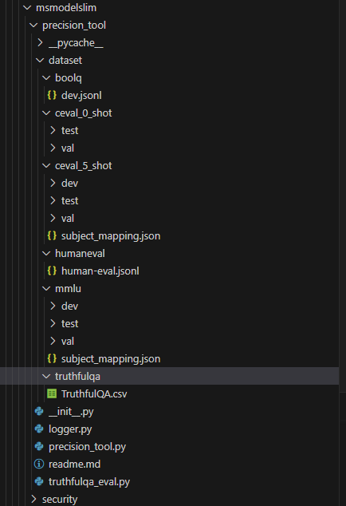

# Precision Tool： 使用方法说明

## Precision Tool为伪量化精度测试工具，在torch_npu路线下进行精度测试。

1. CANN包安装： 安装开发运行环境的昇腾 AI 推理相关驱动、固件、CANN 包，参照 [昇腾文档](https://www.hiascend.com/zh/document)
2. 设置 Python 环境变量
```bash
export PYTHONPATH=${work_dir}/msit/msmodelslim:$PYTHONPATH
```
（可选）如果需要使用NPU多卡并行进行精度测试，需要关闭NPU虚拟内存，设置使用的卡：
```bash
export PYTORCH_NPU_ALLOC_CONF=expandable_segments:False #关闭NPU虚拟内存
export ASCEND_RT_VISIBLE_DEVICES=0,1,2,3 #指定使用的NPU卡
```
3. 编写测试脚本，示例：
```python
from transformers import AutoModel, AutoTokenizer, AutoModelForCausalLM
from precision_tool import PrecisionTest
import torch

if __name__ == '__main__':
    model_path = "meta-llama/Llama-2-7b-chat-hf"
    model = AutoModelForCausalLM.from_pretrained(
        model_path, 
        torch_dtype=torch.float16, 
        device_map="auto", 
        use_safetensors=True, 
        local_files_only=True
        ).eval()
    tokenizer = AutoTokenizer.from_pretrained(model_path, local_files_only=True)
    precision_test = PrecisionTest(model, tokenizer, "truthfulqa", 1, "npu")
    precision_test.test()

```

### 接口介绍
#### 实例创建接口
```python
def __init__(self, model, tokenizer, dataset, batch_size, hardware_type,
             tokenizer_return_type_id=False, shot=5):
    """
    @param model:
        llm to run the test, should be an instance of transformers.PreTrainedModel
    @param dataset:
        dataset to test precision
    @param batch_size:
        batch_size to run inference
    @param hardware_type:
        currently only npu is supported
    @param tokenizer_return_type_id:
        tokenizer return token type id
    @param shot:
        shot to test precision
    """
```
其中
  + model: 待测试模型，需支持使用 Transformers 库进行加载
  + tokenizer: 与 model 配套的 tokenizer
  + dataset: 待测试数据集，当前支持 BoolQ、HumanEval、MMLU、TruthfulQA
  + hardware_type: 当前**仅**支持传入"npu"
  + tokenizer_return_type_id: 当输入 Bert 类型接口时需要传入 True，具体可以根据接口运行的反馈来确定
  + shot: 精度测试时使用的shot值，当前只对MMLU数据集生效
#### 测试结果接口
```python
def test(self):
```

### 使用方法
1. 下载数据集，并修改成如下的样式
```
|-- dataset
    |-- boolq
    |   `-- dev.jsonl
    |-- mmlu
    |   |-- possibly_contaminated_urls.txt
    |   |-- dev
    |   |-- test
    |   `-- val
    |-- truthfulqa
    |   `-- TruthfulQA.csv
    |-- humaneval
    |   `-- human-eval-v2-20210705.jsonl
```
请保持文件夹名称与结构一致  
数据集下载链接：
```
https://storage.cloud.google.com/boolq/dev.jsonl
http://opencompass.oss-cn-shanghai.aliyuncs.com/datasets/data/humaneval.zip
http://opencompass.oss-cn-shanghai.aliyuncs.com/datasets/data/mmlu.zip
https://github.com/sylinrl/TruthfulQA/blob/main/data/v0/TruthfulQA.csv
```
2. 将数据集放到与 precision_tool.py 同一个路径下，如图所示：  
  
3. 如果测试 HumanEval，则需要安装 https://github.com/openai/human-eval 