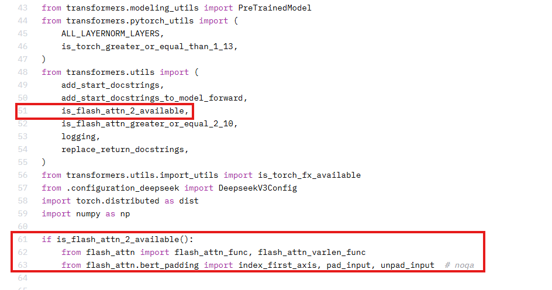
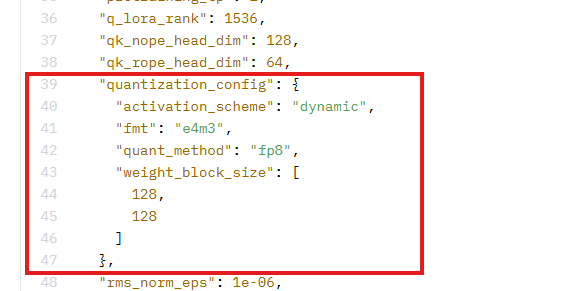

# DeepSeek 量化案例

## 模型介绍

- [DeepSeek-LLM](https://github.com/deepseek-ai/deepseek-LLM) 从包含2T token的中英文混合数据集中，训练得到7B Base、7B
  Chat、67B Base与67B Chat四种模型

- [DeepSeek-V2](https://github.com/deepseek-ai/DeepSeek-V2) 推出了MLA (Multi-head Latent Attention)
  ，其利用低秩键值联合压缩来消除推理时键值缓存的瓶颈，从而支持高效推理；在FFN部分采用了DeepSeekMoE架构，能够以更低的成本训练更强的模型。

- [DeepSeek-Coder](https://github.com/deepseek-ai/DeepSeek-Coder) 由一系列代码语言模型组成，均从头开始在含 87% 代码、 13%
  英文和中文自然语言的 2T 标记上训练，各模型以 16K 窗口大小和额外填空任务在项目级代码语料库预训练以支持项目级代码补全和填充。

- [DeepSeek-V3](https://github.com/deepseek-ai/DeepSeek-V3) 是一款性能卓越的混合专家（MoE）语言模型，整体参数规模达到 6710 亿，其中每个 token 激活的参数量为 37 亿。该模型在架构设计、训练框架、预训练和后训练过程中进行了多项创新和优化。

- [DeepSeek-R1](https://github.com/deepseek-ai/DeepSeek-R1) 通过纯强化学习、真实奖励机制和 GRPO 算法，展示了在无需人类干预的情况下实现复杂任务的能力。具体来说，DeepSeek-R1 通过大规模强化学习技术，仅需少量标注数据即可显著提升模型性能。

#### DeepSeek模型当前已验证的量化方法

- W4A8量化: DeepSeek-R1
- W8A8量化：DeepSeek-V2-Lite-Chat-16B, DeepSeek-V2-Chat-236B, DeepSeek-Coder-33B, DeepSeek-V3
- W8A16量化：DeepSeek-V2-Lite-Chat-16B, DeepSeek-V2-Chat-236B, DeepSeek-Coder-33B
- W8A8C8量化：DeepSeek-Coder-33B

#### 此模型仓已适配的模型版本

- [DeepSeek-V2-Chat](https://huggingface.co/deepseek-ai/DeepSeek-V2-Chat)
- [DeepSeek-V2-Lite-Chat](https://huggingface.co/deepseek-ai/DeepSeek-V2-Lite-Chat)
- [DeepSeek-Coder-33B](https://huggingface.co/deepseek-ai/deepseek-coder-33b-instruct)
- [DeepSeek-V3](https://huggingface.co/deepseek-ai/DeepSeek-V3)
- [DeepSeek-R1](https://huggingface.co/deepseek-ai/DeepSeek-R1)

## 环境配置

- 环境配置请参考[使用说明](https://gitcode.com/Ascend/msit/blob/master/msmodelslim/README.md)

## 量化权重生成

- 量化权重可使用[quant_deepseek.py](./quant_deepseek.py)、[quant_deepseek_w8a8.py](./quant_deepseek_w8a8.py)和[quant_deepseek_w4a8.py](./quant_deepseek_w4a8.py)
  脚本生成，以下提供DeepSeek模型量化权重生成快速启动命令。

#### quant_deepseek.py 量化参数说明

| 参数名               | 含义                   | 默认值                         | 使用方法                                                                                                                    | 
|-------------------|----------------------|-----------------------------|-------------------------------------------------------------------------------------------------------------------------| 
| model_path        | 浮点权重路径               | 无默认值                        | 必选参数；<br>输入DeepSeek权重目录路径。                                                                                              |
| save_directory    | 量化权重路径               | 无默认值                        | 必选参数；<br>输出量化结果目录路径。                                                                                                    |
| part_file_size    | 生成量化权重文件大小，单位是GB               | 5                        | 可选参数；<br>生成量化权重文件大小，默认5GB。                                                                                                    |
| calib_texts       | 量化校准数据               | 无默认值                        | 可选参数；<br>校准数据集。                                                                                                    |
| calib_file        | 量化校准数据               | teacher_qualification.jsonl | 可选参数；<br>存放校准数据的json文件。                                                                                                    |
| w_bit             | 权重量化bit              | 8                           | 大模型量化场景下，可配置为8或16； <br>大模型稀疏量化场景下，需配置为4。                                                                                |
| a_bit             | 激活值量化bit             | 8                           | 大模型量化场景下，可配置为8或16； <br>大模型稀疏量化场景下，需配置为8。                                                                                |
| disable_names     | 手动回退的量化层名称           | 默认回退所有down_proj层            | 用户可根据精度要求手动设置，默认回退隐藏层的降维投影层。                                                                                            |
| device_type       | device类型             | cpu                         | 可选值：['cpu', 'npu']。                                                                                                      |
| fraction          | 模型权重稀疏量化过程中被保护的异常值占比 | 0.01                        | 取值范围[0.01,0.1]。                                                                                                          |
| act_method        | 激活值量化方法              | 1                           | (1) 1代表Label-Free场景的min-max量化方式。 <br>(2) 2代表Label-Free场景的histogram量化方式。 <br>(3) 3代表Label-Free场景的自动混合量化方式，LLM大模型场景下推荐使用。 |
| co_sparse         | 是否开启稀疏量化功能           | False                       | True: 使用稀疏量化功能；<br>False: 不使用稀疏量化功能。                                                                                    |
| anti_method       | 离群值抑制参数              | 无默认值                        | 'm1': SmoothQuant算法。<br>'m2': SmoothQuant加强版算法，推荐使用。<br>'m3': AWQ算法。<br>'m4': smooth优化算法 。<br>'m5': CBQ量化算法。<br>默认为m2。  |
| disable_level     | L自动回退等级              | L0                          | 配置示例如下：<br>'L0'：默认值，不执行回退。<br>'L1'：回退1层。<br>'L2'：回退2层。<br>'L3'：回退3层。<br>'L4'：回退4层。<br>'L5'：回退5层。                        |
| do_smooth         | 是否启动smooth量化功能          | False                       | True: 开启smooth量化功能；<br>False: 不开启smooth量化功能。                                                                                  |
| use_sigma         | 是否启动sigma功能          | False                       | True: 开启sigma功能；<br>False: 不开启sigma功能。                                                                                  |
| use_reduce_quant  | 权重量化是否是lccl all reduce量化 | False | 用于MindIE推理的标识。 |
| tp_size           | 模拟多卡量化时的卡数 | 1 | 数据取值范围为[1,2,4,8,16]，默认值为1，不启用模拟多卡量化。<br>设置为2、4、8、16时，对于通信层的linear会进行模拟多卡，每张卡使用不同的scale和offset进行量化。 |
| sigma_factor      | sigma功能中sigma的系数 | 3.0 | 数据类型为float，默认值为3.0，取值范围为[1.0, 3.0]。<br>说明：仅当use_sigma为True时生效。 |
| is_lowbit         | 是否开启lowbit量化功能       | False                       | (1) 当w_bit=4，a_bit=8时，为大模型稀疏量化场景，表示开启lowbit稀疏量化功能。<br>(2) 其他场景为大模型量化场景，会开启量化自动精度调优功能。<br>当前量化自动精度调优框架支持W8A8，W8A16量化。    |
| mm_tensor         | 是否开启mm_tensor量化功能      | True                       | True: 开启mm_tensor量化功能；<br>False: 不开启mm_tensor量化功能。                                                                          |
| w_sym             | 是否开启w_sym量化功能      | True                       | True: 开启w_sym量化功能；<br>False: 不开启w_sym量化功能。                                                                          |
| use_kvcache_quant | 是否使用kvcache量化功能      | False                       | True: 使用kvcache量化功能；<br>False: 不使用kvcache量化功能。                                                                          |
| use_fa_quant      | 是否使用FA3量化 | False | True: 使用FA3量化类型；<br>False: 不使用FA3量化类型。|
| fa_amp            | FA3量化场景下的自动回退的layer数量 | 0 | 数据类型为int，默认值为0。数据取值范围是大于等于0，并且小于等于模型layer数量，如果超出模型的layer数量将会取模型的最大layer数量为回退层数。 |
| open_outlier      | 是否开启权重异常值划分 | True | True：开启权重异常值划分。<br>False：关闭权重异常值划分。<br>说明：(1)仅在lowbit设置为True时生效。(2)per_group量化场景下，需协同设置is_lowbit为True，open_outlier为False。|
| group_size        | per_group量化中group的大小 | 64 | 默认值为64，支持配置为32，64，128。<br>说明:仅适用于per_group量化场景，需协同设置is_lowbit为True，open_outlier为False。|
| is_dynamic        | 是否使用per-token动态量化功能  | False                       | True: 使用per-token动态量化；<br>False: 不使用per-token动态量化。                                                                      |
| input_ids_name | 指定分词结果中输入 ID 对应的键名 | input_ids | 无 |
| attention_mask_name | 指定分词结果中注意力掩码对应的键名 | attention_mask | 无 |
| tokenizer_args | 加载自定义tokenizer时传入的自定义参数 | 无 | 以字典方式传入。 |
| disable_last_linear | 是否回退最后linear层 | True | True：回退最后linear层。<br>False：不回退最后linear层。 |
| model_name | 模型名称，可选参数 | None | 用于控制异常值抑制参数。 |
| trust_remote_code | 是否信任自定义代码 | False | 指定`trust_remote_code=True`让修改后的自定义代码文件能够正确的被加载。(请确保加载的自定义代码文件的安全性)。 |
| mindie_format | 非多模态模型量化后的权重配置文件是否兼容MindIE现有版本 | False | 开启`mindie_format`时保存的量化权重格式能够兼容MindIE 2.1.RC1及之前的版本。 |

注：在量化脚本里面通过transformers库对模型进行加载时，调用`from_pretrained`函数时会指定`trust_remote_code=True`让修改后的modeling文件能够正确的被加载。(请确保加载的modeling文件的安全性)

#### quant_deepseek_w8a8.py/quant_deepseek_w4a8.py 量化参数说明

| 参数名           | 含义           | 默认值  | 使用方法                          |
|---------------|--------------|------|-------------------------------|
| model_path    | 浮点权重路径       | 无默认值 | 必选参数；<br>输入DeepSeek权重目录路径。    |
| save_path     | 量化权重路径       | 无默认值 | 必选参数；<br>输出量化结果目录路径。          |
| layer_count   | 量化权重路径       | 无默认值 | 可选参数；<br>用于调试，实际量化的层数。        |
| anti_dataset  | 量化权重路径       | 无默认值 | 可选参数；<br>离群值抑制校准集路径。          |
| calib_dataset | 量化权重路径       | 无默认值 | 可选参数；<br>量化校准集路径。             |
| batch_size     | 输入batch size | 4(quant_deepseek_w8a8.py)<br>1(quant_deepseek_w4a8.py)  | 可选参数；<br>生成量化校准数据时使用的batch size。batch size越大，校准速度越快，但也要求更多的显存和内存，如资源受限，请降低batch size。  |
| from_fp8      | 指定原模型为FP8权重  | 不开启  | 可选参数；<br>开启即指定，不可与from_bf16共存。 |
| from_bf16     | 指定原模型为BF16权重 | 不开启  | 可选参数；<br>开启即指定，不可与from_fp8共存。  |
| mindie_format | 非多模态模型量化后的权重配置文件是否兼容MindIE现有版本 | False | 开启`mindie_format`时保存的量化权重格式能够兼容MindIE 2.1.RC1及之前的版本。 |
| quant_mtp | 指定量化模式 | none | 可选参数；<br>none: 不保存mtp权重；<br>float: 保存mtp浮点权重；<br>mix: 保存mtp混合量化权重。|

#### quant_deepseek_w8a8.py 额外量化参数

| 参数名          | 含义      | 默认值 | 使用方法                 |
|--------------|---------|----|----------------------|
| fa_quant     | 指定FA量化  | 不开启 | 可选参数；<br>开启即指定。      |
| dynamic      | 指定动态量化  | 不开启 | 可选参数；<br/>开启即指定。     |
| disable_anti | 关闭异常值抑制 | 不开启 | 可选参数；<br/>开启即指定。     |
| anti_method  | 离群值抑制方法 | m4 | 可选参数；<br/> 可选项：m4,m6 |
| rot |开启基于旋转矩阵的预处理 | 不开启 | 可选参数；<br>开启即指定。      |
注：在量化脚本里面通过transformers库对模型进行加载时，调用`from_pretrained`函数时会指定`trust_remote_code=True`让修改后的modeling文件能够正确的被加载。(请确保加载的modeling文件的安全性)


更多参数配置要求，请参考量化过程中配置的参数 [QuantConfig](https://gitcode.com/Ascend/msit/blob/dev/msmodelslim/docs/Python-API接口说明/大模型压缩接口/大模型量化接口/PyTorch/QuantConfig.md)
以及量化参数配置类 [Calibrator](https://gitcode.com/Ascend/msit/blob/dev/msmodelslim/docs/Python-API接口说明/大模型压缩接口/大模型量化接口/PyTorch/Calibrator.md)

### 使用案例

- 请将{浮点权重路径}和{量化权重路径}替换为用户实际路径。
- 如果需要使用npu多卡量化，请先配置环境变量，支持多卡量化：
  ```shell
  export ASCEND_RT_VISIBLE_DEVICES=0,1,2,3,4,5,6,7
  export PYTORCH_NPU_ALLOC_CONF=expandable_segments:False
  ```

#### DeepSeek-V2

##### DeepSeek-V2 W8A16量化

- 生成DeepSeek-V2模型W8A16量化权重，使用histogram量化方式，在CPU上进行运算
  ```shell
  python3 quant_deepseek.py --model_path {浮点权重路径} --save_directory {W8A16量化权重路径} --device_type cpu --act_method 2 --w_bit 8 --a_bit 16
  ```
- 若加载自定义模型，调用`from_pretrained`函数时要指定`trust_remote_code=True`让修改后的自定义代码文件能够正确的被加载。(请确保加载的自定义代码文件的安全性)

##### DeepSeek-V2 w8a8 dynamic量化

- 生成DeepSeek-V2模型w8a8 dynamic量化权重，使用histogram量化方式，在CPU上进行运算
  ```shell
  python3 quant_deepseek.py --model_path {浮点权重路径} --save_directory {W8A8量化权重路径} --device_type cpu --act_method 2 --w_bit 8 --a_bit 8  --is_dynamic True
  ```

#### DeepSeek-Coder-33B模型量化

##### DeepSeek-Coder-33B w8a8量化

- 生成DeepSeek-Coder-33B模型w8a8量化权重，使用自动混合min-max和histogram的激活值量化方式，SmoothQuant加强版算法，在NPU上进行运算
  ```shell
  python3 quant_deepseek.py --model_path {浮点权重路径} --save_directory {W8A8量化权重路径} --device_type npu --act_method 3 --anti_method m2 --w_bit 8 --a_bit 8 --model_name deepseek_coder
  ```

##### DeepSeek-Coder-33B W8A16量化

- 生成DeepSeek-Coder-33B模型w8a16量化权重，使用AWQ算法，在NPU上进行运算
  ```shell
  python3 quant_deepseek.py --model_path {浮点权重路径} --save_directory {W8A16量化权重路径} --device_type npu --anti_method m3 --w_bit 8 --a_bit 16 --model_name deepseek_coder
  ```

##### DeepSeek-Coder-33B w8a8c8量化

- 生成DeepSeek-Coder-33B模型w8a8c8量化权重，使用histogram激活值量化方式，SmoothQuant加强版算法，在NPU上进行运算
  ```shell
  python3 quant_deepseek.py --model_path {浮点权重路径} --save_directory {W8A8C8量化权重路径} --device_type npu --act_method 2 --anti_method m2 --w_bit 8 --a_bit 8 --use_kvcache_quant True --model_name deepseek_coder
  ```

#### DeepSeek-V3/R1

##### 运行前必检

DeepSeekV3/R1模型较大，且存在需要手动适配的点，为了避免浪费时间，还请在运行脚本前，请根据以下必检项对相关内容进行更改。

- 1、昇腾不支持flash_attn库，运行时需要注释掉权重文件夹中modeling_deepseek.py中的部分代码
- 
- 2、需安装4.48.2版本的transformers
- 3、当前transformers不支持FP8量化格式加载，需要将权重文件夹中config.json中的以下字段删除：
- 

##### DeepSeek-V3 w8a8 混合量化(MLA:w8a8量化，MOE:w8a8 dynamic量化)

注：脚本内置FP8反量化逻辑，当前量化支持输入DeepSeek官方FP8模型权重和通过官方脚本转换得到的BF16模型权重
1. 单次量化时，直接量化FP8权重较先用官方脚本转BF16再量化耗时更短，还能节省BF16权重1.3T硬盘空间
2. 多次量化时，先用官方脚本持久化BF16权重，后复用BF16权重进行量化，省略冗余的FP8反量化过程更高效

- 生成DeepSeek-V3/R1模型 w8a8 混合量化权重
  ```shell
  python3 quant_deepseek_w8a8.py --model_path {浮点权重路径} --save_path {W8A8量化权重路径} --batch_size 4
  ```

- 生成DeepSeek-V3/R1模型 w8a8 + fa3 混合量化权重
  ```shell
  python3 quant_deepseek_w8a8.py --model_path {浮点权重路径} --save_path {W8A8量化权重路径} --batch_size 4 --fa_quant
  ```

##### DeepSeek-R1 w4a8 混合量化(前三层 mlp：w8a8 dynamic 量化，MLA&共享专家:w8a8量化，路由专家:w4a8 dynamic量化)

注：脚本内置FP8反量化逻辑，当前量化支持输入DeepSeek官方FP8模型权重和通过官方脚本转换得到的BF16模型权重
1. 单次量化时，直接量化FP8权重较先用官方脚本转BF16再量化耗时更短，还能节省BF16权重1.3T硬盘空间
2. 多次量化时，先用官方脚本持久化BF16权重，后复用BF16权重进行量化，省略冗余的FP8反量化过程更高效
3. 若存在推理时tp数大于16的情况，请在量化时添加参数 "--mindie_format"

- 生成DeepSeek-R1模型 w4a8 混合量化权重
  ```shell
  # 下面命令默认使用 10 条校准集
  python3 quant_deepseek_w4a8.py --model_path {浮点权重路径} --save_path {W4A8量化权重路径} 
  
  # 如果想要获取更高的精度，可以使用 50 条校准集，如果显存够用可以尝试 16 batch_size 加载校准集
  python3 quant_deepseek_w4a8.py --model_path {浮点权重路径} --save_path {W4A8量化权重路径} --anti_dataset ./anti_prompt_50.json --calib_dataset ./calib_prompt_50.json  --batch_size 16
  ```

##### DeepSeek-R1 w8a8 动态量化

注：当前 pertoken 量化若进行离群值抑制可能会导致精度异常，建议配合 --disable_anti 参数使用。

```shell
# 使用 disable_anti 参数可以减少量化所需时间
python3 quant_deepseek_w8a8.py --model_path {浮点权重路径} --save_path {W8A8量化权重路径} --dynamic --disable_anti
```
##### DeepSeek-R1 w8a8 混合量化 + mtp 量化
- 生成DeepSeek-R1模型 w8a8 mtp 量化权重（V3 系列 mtp 量化暂未适配）
  ```shell
  python3 quant_deepseek_w8a8.py --model_path {浮点权重路径} --save_path {W8A8量化权重路径} --batch_size 4 --quant_mtp mix
  ```

##### DeepSeek-R1 0528 w8a8 混合量化 + mtp 量化
- 生成DeepSeek-R1 0528模型 w8a8 混合量化 + mtp 量化（V3 系列 mtp 量化暂未适配）
  ```shell
  python3 quant_deepseek_w8a8.py \
  --model_path {浮点权重路径} \
  --save_path {W8A8量化权重路径} \
  --batch_size 8 \
  --anti_dataset ./calib_prompt_0528.json \
  --calib_dataset ./calib_prompt_0528.json \
  --anti_method m4 \
  --quant_mtp mix \
  --rot
  ```

##### DeepSeek-v3.1 w8a8 混合量化 + mtp 量化
- 生成DeepSeek-v3.1 w8a8 混合量化 + mtp 量化
  ```shell
  python3 quant_deepseek_w8a8.py \
  --model_path {浮点权重路径} \
  --save_path {W8A8量化权重路径} \
  --batch_size 8 \
  --anti_dataset ./anti_prompt_50_v3_1.json \
  --calib_dataset ./calib_prompt_50_v3_1.json \
  --anti_method m4 \
  --quant_mtp mix \
  --rot
  ```

##### DeepSeek-v3.1 w8a8c8 混合量化 + mtp 量化
- 生成DeepSeek-v3.1 w8a8c8 混合量化 + mtp 量化
  ```shell
  python3 quant_deepseek_w8a8.py \
  --model_path {浮点权重路径} \
  --save_path {W8A8量化权重路径} \
  --batch_size 8 \
  --anti_dataset ./anti_prompt_50_v3_1.json \
  --calib_dataset ./calib_prompt_50_v3_1.json \
  --anti_method m4 \
  --quant_mtp mix \
  --rot \
  --fa_quant
  ```

##### 生成DeepSeek-v3.1模型 w4a8 混合量化权重
   ```shell
   python3 quant_deepseek_w4a8.py --model_path {浮点权重路径} --save_path {W4A8量化权重路径} --anti_dataset ./anti_prompt_50_v3_1.json --calib_dataset ././calib_prompt_50_v3_1.json --quant_mtp mix  --batch_size 16
   ```


##### DeepSeek-V3/R1量化QA

- Q：报错 This modeling file requires the following packages that were not found in your environment： flash_attn. Run '
  pip install flash_attn'
- A: 当前环境中缺少flash_attn库且昇腾不支持该库，运行时需要注释掉权重文件夹中modeling_deepseek.py中的部分代码
- 
- Q：modeling_utils.py报错 if metadata.get("format") not in ["pt", "tf", "flax", "mix"]: AttributeError: "NoneType"
  object has no attribute 'get';
- A：说明输入的权重中缺少metadata字段，需安装4.48.2版本的transformers
- Q：报错 Unknown quantization type， got fp8 - supported types
  are:['awq', 'bitsandbytes_4bit', 'bitsandbytes_8bit', 'gptq', 'aqlm', 'quanto', 'eetq', 'hqq', 'fbgemm_fp8']
- A: 由于当前transformers不支持FP8量化格式加载，需要将权重文件夹中config.json中的以下字段删除：
- 
- Q: 量化后保存的 description 文件中多出了 61 层的信息，且量化类型为 float
- A: 61层为MTP层，目前支持进行量化
