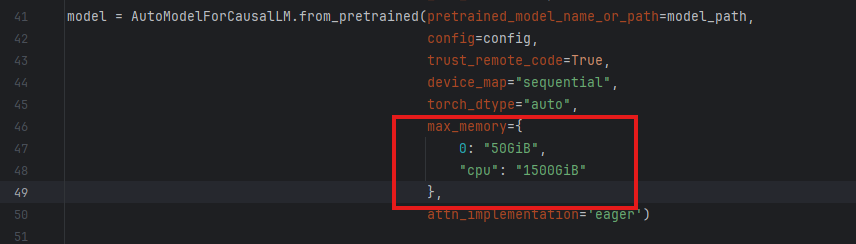

# DeepSeek 量化案例

## 模型介绍
- [DeepSeek-LLM](https://github.com/deepseek-ai/deepseek-LLM)从包含2T token的中英文混合数据集中，训练得到7B Base、7B Chat、67B Base与67B Chat四种模型

- [DeepSeek-V2](https://github.com/deepseek-ai/DeepSeek-V2)推出了MLA (Multi-head Latent Attention)，其利用低秩键值联合压缩来消除推理时键值缓存的瓶颈，从而支持高效推理；在FFN部分采用了DeepSeekMoE架构，能够以更低的成本训练更强的模型。

- [DeepSeek-Coder](https://github.com/deepseek-ai/DeepSeek-Coder) 由一系列代码语言模型组成，均从头开始在含 87% 代码、 13% 英文和中文自然语言的 2T 标记上训练，各模型以 16K 窗口大小和额外填空任务在项目级代码语料库预训练以支持项目级代码补全和填充。

#### DeepSeek模型当前已验证的量化方法
- W8A8量化：DeepSeek-V2-Lite-Chat-16B, DeepSeek-V2-Chat-236B, DeepSeek-Coder-33B, DeepSeek-V3
- W8A16量化：DeepSeek-V2-Lite-Chat-16B, DeepSeek-V2-Chat-236B, DeepSeek-Coder-33B
- W8A8C8量化：DeepSeek-Coder-33B
 
#### 此模型仓已适配的模型版本
- [Deepseek-V2-Chat](https://huggingface.co/deepseek-ai/DeepSeek-V2-Chat)
- [Deepseek-V2-Lite-Chat](https://huggingface.co/deepseek-ai/DeepSeek-V2-Lite-Chat)
- [DeepSeek-Coder-33B](https://huggingface.co/deepseek-ai/deepseek-coder-33b-instruct)
- [Deepseek-V3](https://huggingface.co/deepseek-ai/DeepSeek-V3)

## 环境配置

- 环境配置请参考[使用说明](https://gitee.com/ascend/msit/blob/master/msmodelslim/README.md)

## 量化权重生成

- 量化权重可使用[quant_deepseek.py](./quant_deepseek.py)和[quant_deepseek_w8a8.py](./quant_deepseek_w8a8.py)脚本生成，以下提供DeepSeek模型量化权重生成快速启动命令。

#### quant_deepseek.py 量化参数说明
| 参数名 | 含义 | 默认值 | 使用方法 | 
| ------ | ---- | --- | -------- | 
| model_path | 浮点权重路径 | 无默认值 | 必选参数；<br>输入DeepSeek权重目录路径。 |
| save_directory | 量化权重路径 | 无默认值 | 必选参数；<br>输出量化结果目录路径。 |
| a_bit | 激活值量化bit | 8 |大模型量化场景下，可配置为8或16； <br>大模型稀疏量化场景下，需配置为8。 |
| w_bit | 权重量化bit | 8 | 大模型量化场景下，可配置为8或16； <br>大模型稀疏量化场景下，需配置为4。 |
| device_type | device类型 | cpu | 可选值：['cpu', 'npu'] |
| calib_file | 量化校准数据 | teacher_qualification.jsonl | 存放校准数据的json文件。 |
| disable_names | 手动回退的量化层名称 | 默认回退所有down_proj层 | 用户可根据精度要求手动设置，默认回退隐藏层的降维投影层。 |
| disable_level | L自动回退等级 | L0 | 配置示例如下：<br>'L0'：默认值，不执行回退。<br>'L1'：回退1层。<br>'L2'：回退2层。<br>'L3'：回退3层。<br>'L4'：回退4层。<br>'L5'：回退5层。|
| act_method | 激活值量化方法 | 1 |(1) 1代表Label-Free场景的min-max量化方式。 <br>(2) 2代表Label-Free场景的histogram量化方式。 <br>(3) 3代表Label-Free场景的自动混合量化方式，LLM大模型场景下推荐使用。|
| anti_method | 离群值抑制参数 | 无默认值 |'m1': SmoothQuant算法。<br>'m2': SmoothQuant加强版算法，推荐使用。<br>'m3': AWQ算法。<br>'m4': smooth优化算法 。<br>'m5': CBQ量化算法。<br>默认为m2。|
| co_sparse	| 是否开启稀疏量化功能 | False | True: 使用稀疏量化功能；<br>False: 不使用稀疏量化功能。 |
| fraction | 模型权重稀疏量化过程中被保护的异常值占比  |0.01| 取值范围[0.01,0.1]|
| use_sigma | 是否启动sigma功能 | False|True: 开启sigma功能；<br>False: 不开启sigma功能。 |
| is_lowbit | 是否开启lowbit量化功能 | False|(1) 当w_bit=4，a_bit=8时，为大模型稀疏量化场景，表示开启lowbit稀疏量化功能。<br>(2) 其他场景为大模型量化场景，会开启量化自动精度调优功能。<br>当前量化自动精度调优框架支持W8A8，W8A16量化。|
| part_file_size | 量化权重文件大小 | 无限制 | 单个量化权重文件大小不超过xGB。|
| use_kvcache_quant | 是否使用kvcache量化功能 | False | True: 使用kvcache量化功能；<br>False: 不使用kvcache量化功能。|
| is_dynamic | 是否使用per-token动态量化功能 | False | True: 使用per-token动态量化；<br>False: 不使用per-token动态量化。 |

#### quant_deepseek_w8a8.py 量化参数说明
| 参数名        | 含义 | 默认值 | 使用方法                       | 
|------------| ---- | --- |----------------------------| 
| model_path | 浮点权重路径 | 无默认值 | 必选参数；<br>输入DeepSeek权重目录路径。 |
| save_path  | 量化权重路径 | 无默认值 | 必选参数；<br>输出量化结果目录路径。       |
| layer_count  | 量化权重路径 | 无默认值 | 可选参数；<br>用于调试，实际量化的层数。     |
| anti_dataset  | 量化权重路径 | 无默认值 | 可选参数；<br>离群值抑制校准集路径。       |
| calib_dataset  | 量化权重路径 | 无默认值 | 可选参数；<br>量化校准集路径。          |

- 更多参数配置要求，请参考量化过程中配置的参数 [QuantConfig](https://gitee.com/ascend/msit/blob/dev/msmodelslim/docs/Python-API接口说明/大模型压缩接口/大模型量化接口/PyTorch/QuantConfig.md)
  以及量化参数配置类 [Calibrator](https://gitee.com/ascend/msit/blob/dev/msmodelslim/docs/Python-API接口说明/大模型压缩接口/大模型量化接口/PyTorch/Calibrator.md)


### 使用案例
- 请将{浮点权重路径}和{量化权重路径}替换为用户实际路径。
- 如果需要使用npu多卡量化，请先配置环境变量，支持多卡量化：
  ```shell
  export ASCEND_RT_VISIBLE_DEVICES=0,1,2,3,4,5,6,7
  export PYTORCH_NPU_ALLOC_CONF=expandable_segments:False
  ```

#### DeepSeek-V2
##### DeepSeek-V2 w8a16量化
- 生成DeepSeek-V2模型w8a16量化权重，使用histogram量化方式，在CPU上进行运算
  ```shell
  python3 quant_deepseek.py --model_path {浮点权重路径} --save_directory {W8A16量化权重路径} --device_type cpu --act_method 2 --w_bit 8 --a_bit 16
  ```

##### DeepSeek-V2 w8a8 dynamic量化
- 生成DeepSeek-V2模型w8a8 dynamic量化权重，使用histogram量化方式，在CPU上进行运算
  ```shell
  python3 quant_deepseek.py --model_path {浮点权重路径} --save_directory {W8A8量化权重路径} --device_type cpu --act_method 2 --w_bit 8 --a_bit 8  --is_dynamic True
  ```

#### DeepSeek-Coder-33B模型量化
##### DeepSeek-Coder-33B w8a8量化
- 生成DeepSeek-Coder-33B模型w8a8量化权重，使用自动混合min-max和histogram的激活值量化方式，SmoothQuant加强版算法，在NPU上进行运算
  ```shell
  python3 quant_deepseek.py --model_path {浮点权重路径} --save_directory {W8A8量化权重路径} --device_type npu --act_method 3 --anti_method m2 --w_bit 8 --a_bit 8 --model_name deepseek_coder
  ```

##### DeepSeek-Coder-33B w8a16量化
- 生成DeepSeek-Coder-33B模型w8a16量化权重，使用AWQ算法，在NPU上进行运算
  ```shell
  python3 quant_deepseek.py --model_path {浮点权重路径} --save_directory {W8A16量化权重路径} --device_type npu --anti_method m3 --w_bit 8 --a_bit 16 --model_name deepseek_coder
  ```

##### DeepSeek-Coder-33B w8a8c8量化
- 生成DeepSeek-Coder-33B模型w8a8c8量化权重，使用histogram激活值量化方式，SmoothQuant加强版算法，在NPU上进行运算
  ```shell
  python3 quant_deepseek.py --model_path {浮点权重路径} --save_directory {W8A8C8量化权重路径} --device_type npu --act_method 2 --anti_method m2 --w_bit 8 --a_bit 8 --use_kvcache_quant True --model_name deepseek_coder
  ```

#### DeepSeek-V3

##### 运行前必检
DeepSeekV3模型较大，且存在需要手动适配的点，为了避免浪费时间，还请在运行脚本前，请根据以下必检项对相关内容进行更改。

- 1、昇腾不支持flash_attn库，运行时需要注释掉权重文件夹中modeling_deepseek.py中的部分代码
- 
- 2、需安装更新transformers版本（>=4.48.2）
- 3、当前昇腾设备不支持FP8格式加载，需要将权重文件夹中config.json中的以下字段删除：
- 
- 4、修改quant_deepseek_w8a8.py脚本，增加卡数，eg: max_memory={0: "50GiB", 1: "50GiB", "cpu": "1500GiB"}, 可以根据自己的卡数以及显存情况设置，以防OOM显存不够报错。
- 

##### DeepSeek-V3 w8a8 混合量化(MLA:w8a8量化，MOE:w8a8 dynamic量化)
注：当前量化只支持输入bfloat16格式模型
- 生成DeepSeek-V2/V3/R1模型 w8a8 混合量化权重
  ```shell
  python3 quant_deepseek_w8a8.py --model_path {浮点权重路径} --save_path {W8A8量化权重路径} 
  ```
##### DeepSeek-V3量化QA
- Q：报错 This modeling file requires the following packages that were not found in your environment： flash_attn. Run 'pip install flash_attn'
- A: 当前环境中缺少flash_attn库且昇腾不支持该库，运行时需要注释掉权重文件夹中modeling_deepseek.py中的部分代码
- 
- Q：modeling_utils.py报错 if metadata.get("format") not in ["pt", "tf", "flax", "mix"]: AttributeError: "NoneType" object has no attribute 'get';
- A：说明输入的的权重中缺少metadata字段，需安装更新transformers版本（>=4.48.2）
- Q：报错 Unknown quantization type， got fp8 - supported types are：['awq', 'bitsandbytes_4bit', 'bitsandbytes_8bit', 'gptq', 'aqlm', 'quanto', 'eetq', 'hqq', 'fbgemm_fp8']
- A: 由于当前昇腾设备不支持FP8格式加载，需要将权重文件夹中config.json中的以下字段删除：
- 
- Q: 遇到OOM显存不够报错
- A：修改quant_deepseek_w8a8.py脚本，增加卡数，eg: max_memory={0: "50GiB", 1: "50GiB", "cpu": "1500GiB"}, 可以根据自己的卡数以及显存情况设置。
- 