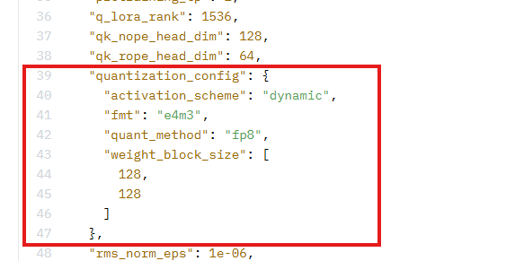

# Kimi 量化案例

## 模型介绍

Kimi-K2-Instruct-0905是月之暗面（Moonshot AI）开发的高效指令遵循语言模型。它基于Kimi Chat 1.0架构优化，专注于准确理解和执行复杂的人类指令。该模型在代码生成、多轮对话、逻辑推理及中文处理方面表现突出，具备强大的上下文处理能力。其设计注重响应质量与实用性，适合作为智能助手、内容创作及开发者工具等多种场景下的核心AI引擎。

## 环境配置

- 环境配置请参考[安装指南](../../docs/安装指南.md)。
- 对于Kimi系列模型，由于模型比较大，请先完成"
  运行前必检"（[Kimi运行前必检](#运行前必检)）。
- 由于模型量化（Model Quantization）对显存要求较高，请确保在单卡显存不低于64G的环境下执行。

## 支持的模型版本与量化策略

| 模型系列                  | 模型版本              | HuggingFace链接                                              | W8A8 | W8A16 | W4A8 | W8A8C8 | W4A8C8 | 稀疏量化 | KV Cache | Attention | FA3量化 | MTP量化 | 量化命令                                |
| ------------------------- | --------------------- | ------------------------------------------------------------ | ---- | ----- | ---- | ------ | ------ | -------- | -------- | --------- | ------- | ------- | --------------------------------------- |
| **Kimi K2-Instruct-0905** | Kimi K2-Instruct-0905 | [Kimi-K2-Instruct-0905](https://huggingface.co/moonshotai/Kimi-K2-Instruct-0905) | ✅    |       |      |        |        |          |          |           |         |         | [W8A8](#Kimi-K2-Instruct-0905-w8a8量化) |

**说明：**

- ✅ 表示该量化策略已通过msModelSlim官方验证，功能完整、性能稳定，建议优先采用。
- 空格表示该量化策略暂未通过msModelSlim官方验证，用户可根据实际需求进行配置尝试，但量化效果和功能稳定性无法得到官方保证。
- 点击量化命令列中的链接可跳转到对应的具体量化命令。

## 量化权重生成

### 使用案例

请将`${model_path}`和`${save_path}`替换为用户实际路径。

#### Kimi-K2-Instruct系列

##### 运行前必检

Kimi-K2-Instruct-0905模型较大，且存在需要手动适配的点，为了避免浪费时间，还请在运行脚本前，请根据以下必检项对相关内容进行更改。

1、昇腾（Ascend）不支持flash_attn库，运行时需要注释掉权重文件夹中modeling_deepseek.py中的部分代码


2、需安装4.48.2版本的transformers

3、当前transformers不支持FP8量化格式加载，需要将权重文件夹中config.json中的以下字段删除：



##### <span id="Kimi-K2-Instruct-0905-w8a8量化">Kimi-K2-Instruct-0905 W8A8量化</span>

- 生成Kimi-K2-Instruct-0905模型W8A8量化权重，使用自动混合min-max和histogram的激活值量化方式，SmoothQuant加强版算法，在NPU上进行运算

  ```shell
  msmodelslim quant --model_path ${model_path} --save_path ${save_path} --device npu --model_type Kimi-K2-Instruct-0905 --quant_type w8a8 --trust_remote_code True
  ```
