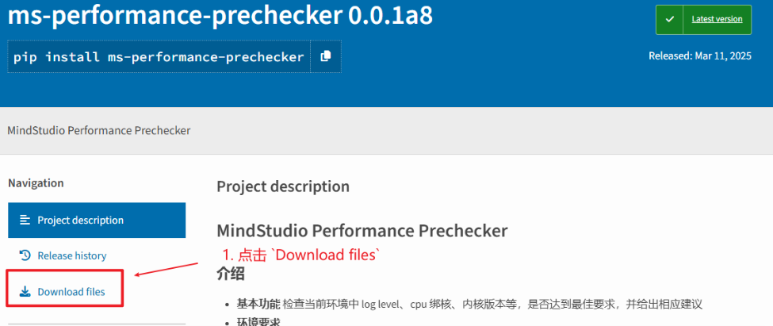
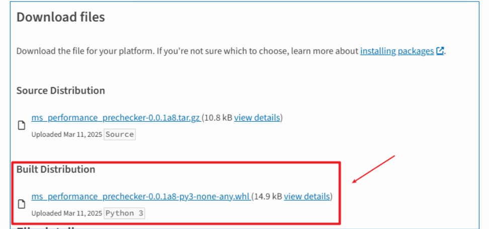
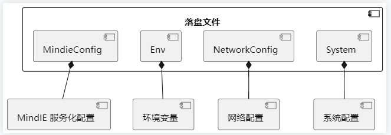

# 1. 安装

## 1.1 Python 版本支持

支持 Python > 3.8

## 1.2 安装性能预检工具

### 1.2.1 PyPI 安装（推荐）

```sh
pip install msprechecker
```

### 1.2.2 源码使用

性能预检工具的源码已开源，位于开源网站 gitee 的 [msIT](https://gitee.com/ascend/msit/tree/master/msit) 仓内的。您可以使用下列步骤直接使用工具

1. 代码仓获取（二选一）
   
   <details>
    <summary>git 获取 </summary>
   
   ```sh
   git clone https://gitee.com/ascend/msit.git
   ```
   
   </details>
   
   <details>
    <summary>打包下载 </summary>
   
   1. 点击 [链接](https://gitee.com/ascend/msit/blob/master) 跳转
   2. 确保分支位于 master
   3. 点击右上角橘黄色 '克隆/下载' 按钮即可下载到本地
   4. 解压
   
   </details>
2. 进入工具环境

```sh
cd msit/msprechecker
```

3. 验证是否可使用

```sh
python -m msprechecker --help
```

### 1.2.3 离线安装

1. 在能够访问网络的机器上，访问 [PyPI 官方源](https://pypi.org/project/msprechecker/#files)
2. 左侧点击 `Download files`，随后点击 `Built Distribution` 下方链接进行下载，如下图所示：
   
   
3. 下载完成后，上传到服务器中
4. 假设 wheel 包存放路径为 `whl_path`，输入下列命令进行安装

```bash
pip install whl_path
```

5. 终端输入 `msprechecker` 校验是否安装成功

## 1.3 处理运行报错

如果当前用户不是 root，在安装时可能会出现如下 **警告字样**：

```bash
WARNING: The script msprechecker is installed in '/home/user/.local/bin' which is not on PATH.
```

这 **并不** 代表安装失败，但是直接使用 `msprechecker` 来运行工具时，会报错。解决方案（二选一即可）：

- 将 `/home/user/.local/bin` 添加到 `PATH` 中，随后可以直接在终端使用
- 改为在终端输入 `python3 -m msprechecker` 使用工具

# 2 单机预检

预检功能用于检测用户当前推理环境中，影响推理性能的环境变量有没有被设置，提升推理性能的环境变量有没有被开启

## 2.1 快速使用

使用预检功能只需在终端中输入

```bash
msprechecker precheck
```

随后会在终端出现打屏信息，在当前目录下生成名为 `msprechecker_env.sh` 的文件。

## 2.2 字段介绍

以下是打屏信息中，部分字段的详细解释。如果您已经熟练使用工具，请跳过。

<!-- 示例一 -->

<!-- 背景 -->

<div style="background:rgba(223, 223, 223, 0.07);    padding: 1.5rem;    border-radius: 8px;    margin: 1rem 0; font-size: 1rem;">

<!-- 问题 -->

<details>
<summary> 示例一</summary>

<!-- 展开背景 -->

<div style="background:rgba(112, 69, 69, 0.32); padding: 1.5rem;    border-radius: 8px;    margin: 1rem 0;">

当终端出现如下信息 <a id="示例一"></a>

```bash
- env [NOK] CPU_AFFINITY_CONF
  * export CPU_AFFINITY_CONF=2
  * 开启CPU细粒度绑核，可以优化算子下发。
```

第一行，为环境变量介绍，`env` 是 `environment` 的缩写，表明为环境变量相关。`CPU_AFFINITY_CONF` 为具体环境变量名称，`[NOK]` 表示该环境变量并没有被正确配置，要么没有配置，要么错误配置。
第二行，为修改操作，为了正确配置这个环境变量已提高推理性能，用户需要 `export CPU_AFFINITY_CONF=2`
第三行，为修改原因，`export CPU_AFFINITY_CONF=2` 的作用是开启CPU细粒度绑核，可以优化算子下发。

</div>
</details>
</div>

<!-- 示例二-->

<!-- 背景 -->

<div style="background:rgba(223, 223, 223, 0.07);    padding: 1.5rem;    border-radius: 8px;    margin: 1rem 0; font-size: 1rem;">

<!-- 问题 -->

<details>
<summary> 示例二 </summary>

<!-- 展开背景 -->

<div style="background:rgba(255, 255, 255, 0.33); padding: 1.5rem;    border-radius: 8px;    margin: 1rem 0;">

当终端出现如下信息

```bash
- env [OK] MINDIE_LOG_LEVEL
```

表明当前环境中，环境变量 `MINDIE_LOG_LEVEL` 的设置没有问题，不会影响性能或已是最优配置

</div>
</details>
</div>

<!-- 示例三-->

<!-- 背景 -->

<div style="background:rgba(223, 223, 223, 0.07);    padding: 1.5rem;    border-radius: 8px;    margin: 1rem 0; font-size: 1rem;">

<!-- 问题 -->

<details>
<summary> 示例三 </summary>

<!-- 展开背景 -->

<div style="background:rgba(255, 255, 255, 0.33); padding: 1.5rem;    border-radius: 8px;    margin: 1rem 0;">

当终端出现如下信息 <a id="示例三"></a>

```bash
- env [使能环境变量配置：source /msprechecker_env.sh]
- env [恢复环境变量配置：source /msprechecker_env.sh 0]
```

表明，如果您想要一键将环境变量配置为最优，在终端中输入 `source /msprechecker_env.sh` 即可；如果修改之后，想要回滚到最初的环境变量，在终端中输入 `source /msprechecker_env.sh 0` 即可

<div style="background: #f0f8ff;   border-left: 4px solid #2196f3;   padding: 12px 20px;   margin: 16px 0;   border-radius: 4px;">

<div style="color: #2196f3;     font-weight: 600;     margin-bottom: 8px;"> Note </div>

如果您只在终端中运行 `msprechecker` ，工具 **并不会** 自动修改当前环境变量。如需修改，您必须在终端 `source` 工具生成的环境变量 shell 脚本方可修改。
在使用环境变量 shell 脚本进行环境变量回滚时，只会回退到工具生成改文件之前，不会储存多次记录。如，用户先执行性能预检工具，然后自己 source 了 CANN，atb 等其他组件的 set_env.sh，之后回滚时，只会回滚到执行性能预检工具前的状态。因此强烈建议用户，在其他环境配置结束后，再执行性能预检工具。

</div>

</div>
</details>
</div>

<!-- 示例四-->

<!-- 背景 -->

<div style="background:rgba(223, 223, 223, 0.07);    padding: 1.5rem;    border-radius: 8px;    margin: 1rem 0; font-size: 1rem;">

<!-- 问题 -->

<details>
<summary> 示例四 </summary>

<!-- 展开背景 -->

<div style="background:rgba(255, 255, 255, 0.33); padding: 1.5rem;    border-radius: 8px;    margin: 1rem 0;">
当终端出现如下信息

```bash
- env [None env related needs to save] ENV FILE
```

表明当前环境变量配置已经是最优，工具没有任何更优的设置，因此 **不会** 生成环境变量修改脚本

</div>
</details>
</div>

<!-- 示例五-->

<!-- 背景 -->

<div style="background:rgba(223, 223, 223, 0.07);    padding: 1.5rem;    border-radius: 8px;    margin: 1rem 0; font-size: 1rem;">

<!-- 问题 -->

<details>
<summary> 示例五 </summary>
<!-- 展开背景 -->

<div style="background:rgba(255, 255, 255, 0.33); padding: 1.5rem;    border-radius: 8px;    margin: 1rem 0;">

当终端出现如下信息

```bash
- system [NOK] 驱动版本
  * 升级到 24.1.0 以上
  * 建议升级到最新的版本的驱动，性能会有提升
```

表明是 **系统** 相关配置可能会影响性能，每行介绍的逻辑请参考 [示例一](#示例一)

</div>
</details>
</div>

## 2.3 一键配置环境变量

在执行预检结束后，终端会提示如何一键修改环境变量，更详细的介绍请参考 [示例三](#示例三)。您只需要在终端输入

```sh
source msprechecker_env.sh
```

即可一键配置环境变量到性能最优推荐。终端会出现 `ENABLE=1` 字样。

```bash
本示例中，`msprechecker_env.sh` 为默认保存路径，如您已经修改环境变量 shell 脚本路径，请更改为实际保存路径
```

随后，再次运行预检工具，检测环境变量是否配置成功。如终端打屏信息中，所有 `env` 字样的字段均为绿色 `[OK]`，则证明配置成功。示例如下：

```bash
$ msprechecker
- env [OK] CPU_AFFINITY_CONF
- env [OK] NPU_MEMORY_FRACTION
- env [OK] TASK_QUEUE_ENABLE
- env [OK] HCCL_OP_EXPANSION_MODE
- env [OK] HCCL_DETERMINISTIC
- env [OK] HCCL_RDMA_PCIE_DIRECT_POST_NOSTRICT
- env [OK] MINDIE_LOG_LEVEL
- env [OK] ASCEND_GLOBAL_LOG_LEVEL
- env [OK] ASCEND_LAUNCH_BLOCKING
- env [OK] ATB_WORKSPACE_MEM_ALLOC_ALG_TYPE
- env [OK] ATB_WORKSPACE_MEM_ALLOC_GLOBAL
- env [OK] PYTORCH_NPU_ALLOC_CONF
- env [None env related needs to save] ENV FILE
# 以下内容省略
``` 

#### Note
```bash
环境变量 shell 脚本 **只会** 修改环境变量，并不会修改系统配置。因此 `system` 相关字段不会改变，只会改变 `env` 相关字段。
```

回滚环境变量只需运行 `source msprechecker_env.sh 0` 即可，终端会出现 `ENABLE=0` 字样。随后再次运行预检工具，打屏信息与最初一致。

# 3. 多机预检

多机环境预检用于检测用户服务器不同节点之间环境变量的差异性，助力用户快速部署多节点通信环境。

## 3.1 快速使用

在 **每台机器** 上分别运行：

```bash
msprechecker distribute_compare
```

其中，`distribute_compare` 表明我们使用多机环境比对功能。主节点运行之后，会进行同步状态，等待子节点运行

#### WARNING
使用该功能之前，请 **务必** 准备好 rank table file，上述功能假设以下两种情况任一满足：
1. 环境变量 RANKFILETABLE 已正确配置
2. 通过 `msprechecker distribute_compare` 的 `-ranktable` 或者 `--rankfiletable` 参数进行指定 rank file table 的路径
   否则功能 **无法** 正常运行

也可不使用多机配置文件，手动配置 `master` 节点和 `LOCAL_RANK` 信息，以双机场景为例，`master` 节点运行：

```bash
msprechecker distribute_compare -ip 12.34.56.78 -port 10000 -rank 0 -size 2
```

`slaver` 节点运行：

```bash
msprechecker distribute_compare -ip 12.34.56.78 -port 10000 -rank 1 -size 2
```

`-ip` 是 `--master_ip` 的缩写，代表 `master` 节点的IP地址;

`-port` 代表节点间通信的端口。

`-rank` 是 `--local_rank` 的缩写, 代表不同节点的 `rank` 值;

`-size` 是 `--world_size` 的缩写, 代表节点的个数;


#### WARNING
工具会默认使用服务化 `config.json` 的 `port` 作为通信端口，如端口已被占用，请通过 `--port` 更换端口

## 3.2 运行结果

如果不同服务器间环境配置没有差异，则会在终端出现如下打屏信息：

```bash
msprechecker_logger - INFO - local_ip: 12.34.56.78., interface: abcd123qwe
msprechecker_logger - INFO - DistributeCollector: master_ip=12.34.56.78, master_port=1025, rank=0, world_size=2
msprechecker_logger - INFO - No difference found
msprechecker_logger - INFO - == compare end ==
```

如果不同服务器环境配置存在差异，则会在终端展示差异项。比如，展示内容为：

```bash
- key .Env.ASDOPS_LOG_TO_FILE diffs
  * 12.34.56.78:
    1
  * 12.34.56.79:
    0
- key .Env.LCCL_PARALLEL diffs
  * 12.34.56.78:
    type <str> : 0
  * 12.34.56.79:
    type <NoneType> : None
```

则表明，环境变量 `ASDOPS_LOG_TO_FILE` 和 `LCCL_PARALLEL` 在`master` 节点 `12.34.56.78` 和 `slaver` 节点 `12.34.56.79` 之间存在差异。

# 4. 落盘和比对

推理过程中，如果出现 **异常** 或者 ​**性能不及预期**​，可以使用 ​**落盘** 功能​，将环境相关信息进行落盘，方便后续比对。推理结束后，性能预检工具支持比对推理中落盘的环境变量和配置项，帮助您快速发现可能影响性能的差异点，实现问题快速定位。

## 4.1 落盘快速使用

使用落盘功能只需在终端中输入

```bash
msprechecker dump
```

其中 `dump` 表明我们使用落盘功能。随后会在终端出现打屏信息

```bash
msprechecker_logger - INFO - dump file saved to: /tmp/msprechecker_dump_20250316_094536.json
```

文件默认落盘在 `/tmp` 下。

## 4.2 落盘路径修改

您可以自定义修改落盘文件路径，通过 `--dump_file_path` 或缩写 `-d` 参数进行落盘路径选择，如：

```bash
msprechecker dump -d b
```

终端会显示

```bash
msprechecker_logger - INFO - dump file saved to: b
```

且会在当前目录下落盘环境变量信息文件 `b`。

## 4.3 落盘文件介绍

落盘文件内容结构如下：



- 第一块为 MindIE 服务化配置，即当前环境 MindIE 服务化 config.json 参数
- 第二块为环境变量，为当前终端所有环境变量值
- 第三块为网络配置，包括 hccl 连通校验的信息
- 第四块为系统配置，包括系统信息、内核发行版、CANN 驱动信息、是否为虚拟机以及是否开启 CPU 高性能。

## 4.3 比对快速入门

在进行比对前，请确保使用预检工具落盘两个或多个文件，单个文件无法比对。以下示例假设存在两个落盘文件，路径为 `path_a` 和 `path_b`，则您可以使用如下命令进行比对

```bash
msprechecker compare -d path_a path_b
```

其中 `compare` 表明我们使用比对功能，`-d` 为参数 `--dump_file_path` 的缩写，也可以使用 `--dump_file_path` 进行比对，后接两个或多个文件路径，性能预检工具会一起执行比对，展示差异。

如果两个或多个落盘文件没有差异，则会在终端出现如下打屏信息：

```bash
msprechecker_logger - INFO - == compare start ==
msprechecker_logger - INFO - No difference found
msprechecker_logger - INFO - == compare end ==
```

如果两个或多个落盘文件存在差异，则会在终端展示差异项。比如，展示内容为：

```bash
- key .Env.CPU_AFFINITY_CONF diffs
  * b:
    type<NoneType> : None
  * c:
    type<str> : 2
  * d:
    type<str> : 2
  * e:
    type<str> : 2
```

则表明，环境变量 `CPU_AFFINITY_CONF` 在四个文件 `b`, `c`, `d`, `e` 中存在差异。其中 `b` 文件中，该环境变量的值为 `None`，即没有设置该环境变量；而 `c`, `d`, `e` 均设置为 2。


# 5. 自定义配置

预检工具除了提供内置的环境变量检测之外，还可以自定义配置用户需要检测的环境变量。

YAML内容可分为五类：

1. `environment_variables`：环境变量基线
2. `mindie_config`：服务化配置基线
3. `ranktable`：ranktable基线
4. `model_config`：模型配置基线
5. `user_config`：启动配置基线

五类配置中任何一类下均支持以下7种属性描述词：

1. `name`：字段名
2. `value`：基线取值
3. `reason`：原因提示
4. `suggestions`：场景描述部分
5. `condition`：建议（或不建议）的具体场景
6. `suggested`：建议场景部分
7. `not_suggested`：不建议场景部分

以上4~7为拓展配置，用于说明value在不同场景下的取值reason。

**name**
支持嵌套，用于确定待配置的配置变量名，每向下一级就增加一个冒号，如：
`features:experimental:enabled`

在ranktable、user_config基线配置中，由于`server_list`等为列表，因此也支持以`0`数字作为一个级别，如：
`BackendConfig:ModelDeployConfig:ModelConfig:0:tp`
对应的user_config配置文件如下（注意列表顺序用`0、1、2...`表示）：
```
BackendConfig" : {
"interNodeTLSEnabled" : false,
"ModelDeployConfig" :
    {
        "truncation" : false,
        "ModelConfig" : [
            {
                "tp": 1,
...

```

**value**
一般value直接配置值，如：
* `value: 'localhost'`或`value: false`

如有特殊需要也可以用计算符号配合比较符号进行限制或赋值，value中支持的表达式包括：
* 支持的计算符号：`"+", "-", "\*", "/", "//"`
* 支持的比较符号：`'>=', '<=', '!=', '=', '>', '<'`

另外，`=`开头可以接上自定义的规则，如
* `value: = 1+1`
* `value: = 1 + server_list:0:device:0:rank_id`(通过与其他name的value计算来确定取值)
* `value: = =1`(与`value: 1`效果相同)
* `value: = >1`
* `value: = >=1`

value还支持分号`;`对多个表达式进行分割，如：
* `value: = 1 + server_list:0:device:0:rank_id ; < 5`
代表`value`在等于`server_list:0:device:0:rank_id`的前提下，还需要满足`value < 5`

value也可以为空
* 为空时仅检查该配置项存在性。

value也支持列表形式：
```
value:
- 2
- 3
- >9
```