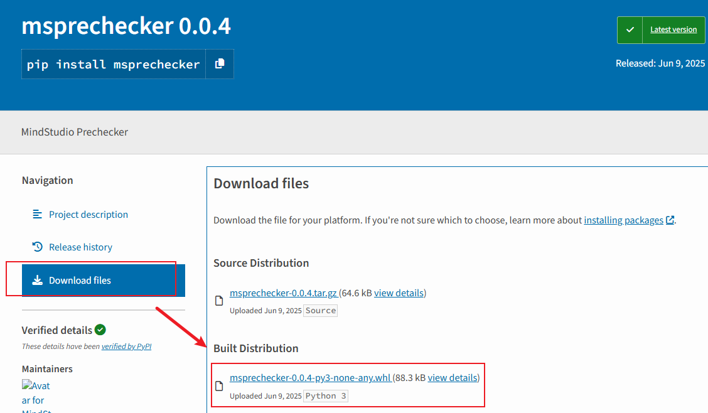

# MS Prechecker
- [MS Prechecker](#ms-prechecker)
- [基本功能](#基本功能)
- [环境要求](#环境要求)
- [安装性能预检工具](#安装性能预检工具)
- [预检](#预检)
  - [预检快速使用](#预检快速使用)
- [落盘和比对](#落盘和比对)
  - [落盘快速使用](#落盘快速使用)
  - [落盘文件介绍](#落盘文件介绍)
  - [比对快速使用](#比对快速使用)
  - [比对结果说明](#比对结果说明)
- [自定义检查项配置](#自定义检查项配置)
  - [自定义检查项配置使用说明](#自定义检查项配置使用说明)
    - [字段引用](#字段引用)
    - [版本引用](#版本引用)
- [参数列表](#参数列表)
  - [通用参数](#通用参数)
  - [precheck 额外参数](#precheck-额外参数)
  - [dump 额外参数](#dump-额外参数)
  - [compare 参数](#compare-参数)

# 基本功能
  预检工具是一个帮助用户快速部署服务，快速复现基线，快速定位问题的工具。能提供推理前预检，推理中落盘和推理后比对的功能。
  - [**预检**](#预检快速使用)：检测各种可能会影响服务部署或者性能的组件，包括但不限于：
    - 通用检查：检测 CPU 高性能是否开启，透明大页状态，是否为虚拟机，内核版本或昇腾驱动版本是否过低等
    - PD 混部场景：检测环境变量，检测部署服务的 config.json 字段是否合理，检测均通过百分百可以部署成功
    - PD 分离场景：检测 `user_config.json` 和 `mindie_env.json` 字段是否合理，检测均通过百分百可以部署成功
    - 模型权重检查：检测权重数量、权重哈希、以及 config.json 中的 `transformers_version` 字段是否小于当前机器的 `transformers` 版本
    - 网络检查：根据 `rank table`，检测各机器芯片之间的连通性，检测各机器相互之间能否 ping 通等
  - [**落盘**](#落盘和比对)：收集各种环境结果并保存到指定路径中，包括但不限于：
    - `env`：环境变量信息
    - `conf`：配置文件字段全量收集，如 `user_config.json` 等
    - `sys`：系统信息收集，如内核版本等
  - [**比对**](#落盘和比对)：根据不同机器落盘结果进行比对，便于快速发现差异点

# 环境要求
  - Python 版本要求 >= 3.7
  - 第三方依赖包括：`psutil`, `pyyaml` 和 `importlib_metadata`
  - 相关检测项支持：`800I A2`, `800I A3` 和 `G8600`

# 安装性能预检工具
**以下方式选择一种即可**
  - **PyPI 安装（推荐）**
    ```sh
    pip install msprechecker
    ```
  - **离线安装**
    - 在能够访问网络的机器上，访问 [PyPI 官方源](https://pypi.org/project/msprechecker/#files)
    - 左侧点击 `Download files`，随后点击 `Built Distribution` 下方链接进行下载，如下图所示：

      
    - 下载完成后，上传到服务器中
    - 假设 wheel 包存放路径为 `whl_path`，输入下列命令进行安装
      ```bash
      pip install whl_path
      ```
    - 终端输入 `msprechecker` 校验是否安装成功

# 预检
## 预检快速使用
  - 默认进行环境变量、系统配置的校验
    ```sh
    msprechecker precheck
    ```
    随后会在终端出现打印信息，如果有环境变量的检查项，则在当前目录下生成配置建议环境变量的 `msprechecker_env.sh` 文件
  - K8S 部署时指定 user_config.json 检查和 mindie_env.json 的检查
    ```sh
    msprechecker precheck -user user_config.json --mindie_env_config_path mindie_env.json
    ```
  - 双机 DS model 检查
    ```sh
    msprechecker precheck -ch model --weight_dir <权重路径>
    ```
  - 双机 DS hccl 检查
    ```sh
    msprechecker precheck -ch hccl --ranktable <rank table 路径>
    ```
  - cpu 和 npu 压测
    ```sh
    msprechecker precheck -ch hardware
    ```
  - cpu 和 npu 压测，以及多机网络连接状态检查
    ```sh
    msprechecker precheck -ch hardware --ranktable <rank table 路径>
    ```

# 落盘和比对
## 落盘快速使用
  - 推理过程中，如果出现 **异常** 或者 ​**性能不及预期**​，可以使用 ​**落盘** 功能​，将环境相关信息进行落盘，方便后续比对。推理结束后，性能预检工具支持比对推理中落盘的环境变量和配置项，帮助快速发现可能影响性能的差异点，实现问题快速定位
  - 使用落盘功能只需在终端中输入
    ```bash
    msprechecker dump -d abc
    # msprechecker_logger - INFO - dump file saved to: abc
    ```
    其中 `dump` 表明我们使用落盘功能。通过 `--dump_file_path` 或缩写 `-d` 参数指定自定义落盘文件路径。运行结束后会在当前目录下落盘环境变量信息文件 `abc`

## 落盘文件介绍
  - 落盘文件内容结构如下：

    

    - 第一块为 MindIE 服务化配置，即当前环境 MindIE 服务化 config.json 参数
    - 第二块为环境变量，为当前终端所有环境变量值
    - 第三块为网络配置，包括 HCCL 连通校验的信息
    - 第四块为系统配置，包括系统信息、内核发行版、CANN 驱动信息、是否为虚拟机以及是否开启 CPU 高性能
## 比对快速使用
  - 在进行比对前，请确保使用预检工具落盘两个或多个文件，单个文件无法比对。以下示例假设存在两个落盘文件，路径为 `path_a` 和 `path_b`，则您可以使用如下命令进行比对
    ```bash
    msprechecker compare -d path_a path_b
    ```
    其中 `compare` 表明我们使用比对功能，`-d` 为参数 `--dump_file_path` 的缩写，也可以使用 `--dump_file_path` 进行比对，后接两个或多个文件路径，性能预检工具会一起执行比对，展示差异
## 比对结果说明
  - 如果两个或多个落盘文件没有差异，则会在终端出现如下打印信息：
    ```bash
    msprechecker_logger - INFO - == compare start ==
    msprechecker_logger - INFO - No difference found
    msprechecker_logger - INFO - == compare end ==
    ```
  - 如果两个或多个落盘文件存在差异，则会在终端展示差异项。比如，展示内容为：
    ```bash
    - key .Env.CPU_AFFINITY_CONF diffs
      * b:
        type<NoneType> : None
      * c:
        type<str> : 2
      * d:
        type<str> : 2
      * e:
        type<str> : 2
    ```
    表明环境变量 `CPU_AFFINITY_CONF` 在四个文件 `b`, `c`, `d`, `e` 中存在差异。其中 `b` 文件中，该环境变量的值为 `None`，即没有设置该环境变量；而 `c`, `d`, `e` 均设置为 2
***

# 自定义检查项配置
## 自定义检查项配置使用说明
在进行 precheck 预检时，支持自定义配置校验项。目前仅支持 `user_config.json` 和 `mindie_env.json` 的配置校验，后续开放环境变量的自定义校验。
假设需要校验 `a.b` 的值是否符合要求，那么自定义配置语法如下
```sh
a:
  b:
    expected:
      type: eq
      value: 1 + 2
    reason: a.b 的值应该等于 3
    severity: high
```
上述配置表示，`a.b` 的值应该等于 3，其严重程度为 high，如果该字段不符合预期，会显示 `[NOK]`

目前，
- `type` 支持：`eq`, `lt`, `le`, `gt`, `ge`, `ne` 或者 `==`, `<`, `<=`, `>`, `>=`, `!=`
- `value` 支持：`+`, `-`, `*`, `/`, `//`, `**`, `()`，还支持字段引用 `${}`, 版本符号 `Version{}` 以及权限符号 `FilePerm{}`
- `reason` 支持任意字符串
- `severity` 支持：`low`, `medium`, `high`，不填写默认 `high`。其中，`low` 显示为 `[RECOMMEND]`；`medium` 显示为 `[WARNING]`；`high` 显示为 `[NOK]`

### 字段引用
对于比较嵌套较深的配置文件，遇到不同字段相互关联的场景时，创建校验规则是一个挑战。预检工具支持 **字段引用** 语法，允许用户通过 `${}` 的语法来引用其他位置的字段值。比如，有如下配置文件
```json
{
  "a": {
    "b": "value of b",
    "c": "value of c"
  }
}
```
如果希望 `a.b` 的值和 `a.c` 的值相等，则校验规则如下：
```yaml
a:
  b:
    expected:
      type: eq
      value: ${.c}
    reason: a.b 的值等于 a.c
    severity: high
  c:
  expected:
      type: eq
      value: ${a.b}
    reason: a.c 的值等于 a.b
    severity: high
```
其中 `${.c}` 是相对引用, `${a.b}` 是绝对引用；对于大型嵌套的配置文件尤其好用。

### 版本引用
如果校验涉及到版本比较，比如低于多少版本时会导致有问题，可以使用版本引用。比如 `transformers_version` 版本需要大于 `4.33`，则可以写为
```yaml
transformers_version:
  expected:
    type: gt
    value: Version{4.33}
  reason: xx
  severity: xx
```
内置了 `Version` 的比较规则，目前是 `8.0.0 > 8.0.rc2 > 8.0.rc1 > 8.0.rc1.b020`。对于 T 版本暂不支持校验，因为 T 版本没有规律

# 参数列表
  - 子功能包括 `precheck` / `dump` / `compare`
  - 通过 `msprechecker -h` 获取子功能列表，以及 `msprechecker {子功能} -h` 获取对应子功能的参数列表
## 通用参数
<a id="1"></a>
以下通用参数适用于 `msprechecker precheck` 和 `msprechecker dump`，不适用于 `msprechecker compare`
  | 参数名                          | 参数描述                                                                                        | 是否必选                                    |
  | ------------------------------- | ----------------------------------------------------------------------------------------------- | ------------------------------------------- |
  | -ch {...}, --checkers {...}     | *字符串列表值，可选值 basic,hccl,model,hardware,all，指定检查项，可指定多个，all 表示全部        | 否，默认值 basic                            |
  | -service, --service_config_path | 字符串值，MINDIE service 路径或 config json 文件路径，优先级高于环境变量的 MIES_INSTALL_PATH 值 | 否，默认使用环境变量的 MIES_INSTALL_PATH 值 |
  | -user, --user_config_path       | 字符串值，json 文件，k8s user_config.json 文件，不指定则不检查                                    | 否，默认 None                               |
  | --mindie_env_config_path        | 字符串值，json 文件，k8s mindie_env.json 文件，不指定则不检查                                     | 否，默认 None                               |
  | -ranktable, --ranktable_file    | 字符串值，json 文件，手动指定 ranktable 文件，优先级高于环境变量的 RANKFILETABLE                | 否，默认使用环境变量的 RANKFILETABLE 值     |
  | --weight_dir   |  模型权重目录路径        | 否，默认使用 config.json 中的 `modelWeightPath` 字段路径   |
  | -blocknum, --sha256_blocknum    | int 值，计算模型权重 sha256sum 值时的采样块数，值越大采样越多，计算速度越慢                     | 否，默认 1000                               |
  | -add, --additional_checks_yaml  | 字符串值，yaml 文件，额外的自定义配置项，指定后将覆盖默认检查项中的值                           | 否，默认 None                               |
  | -l {...}, --log_level {...}     | 日志级别，可选值 debug,info,warning,error,fatal,critical                                        | 否，默认 info                               |

  - `basic` 表示检查环境变量以及基本系统信息
  - `hccl` 表示检查 NPU 之间通过 hccl 连接的状态
  - `model` 表示检查或比对模型大小以及 sha256sum 值
  - `hardware` 表示检查 CPU / NPU 计算能力，以及网络连接状态
  - `all` 表示检查全部
## precheck 额外参数
  | 参数名         | 参数描述                                             | 是否必选                       |
  | -------------- | ---------------------------------------------------- | ------------------------------ |
  | -s, --save_env | 字符串值，指定环境变量需要优化时，输出的 sh 文件路径 | 否，默认为 msprechecker_env.sh |
## dump 额外参数
  | 参数名               | 参数描述                           | 是否必选                                            |
  | -------------------- | ---------------------------------- | --------------------------------------------------- |
  | -d, --dump_file_path | 字符串值，指定 dump 数据的保存路径 | 否，默认为 /tmp/msprechecker_dump_{time_stamp}.json |
## compare 参数
  | 参数名                      | 参数描述                                                 | 是否必选       |
  | --------------------------- | -------------------------------------------------------- | -------------- |
  | dump_file_paths             | **位置参数**，字符串列表值，指定 dump 的多份数据         | 是，且应为多个 |
  | -l {...}, --log_level {...} | 日志级别，可选值 debug,info,warning,error,fatal,critical | 否，默认 info  |
